# Assignment 1: Network Attack Detection

## Part 1: Packet Sniffer Extension

* ### Implementation Details
    The packet sniffer was built using Python's socket and struct modules to capture and unpack raw network frames at the byte level. THis specifically filters for IPv4 traffic, and extracts the timestamp, source IP, destination IP, etc.

    To handle the high volumes of traffic effectively, the script utilizes a deque to keep a sliding window of 10 minute's worth of packets in the system memory. Additionally, it simulatneously has a dedicated background thread that writes this data to a csv file in 10 second batches. 
* ### Testing Environment
    The sniffer was initialized on the Defense VM using the given command line arguments, and the traffic was generated from the attack VM target the MS-2 target VM. 
* ### Test Results and Screenshots
  * * **Test Case 1: Basic Ping (ICMP Traffic)**

  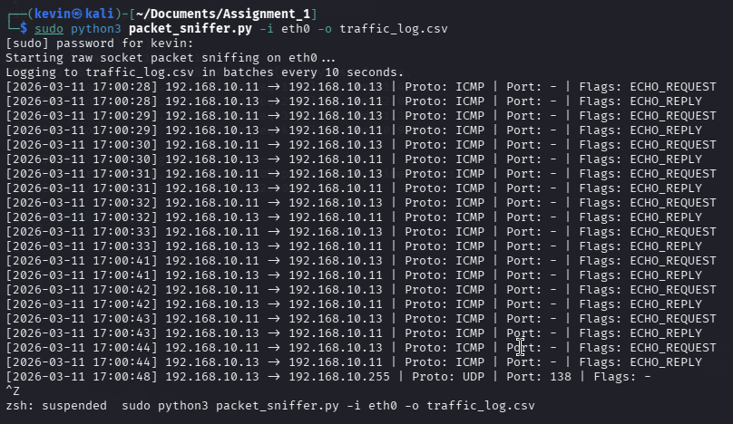

  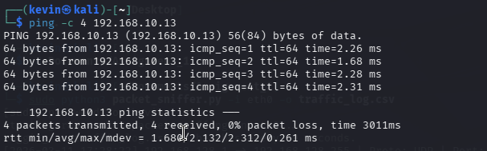

  * * **Test Case 2: Port Scan Detection**

  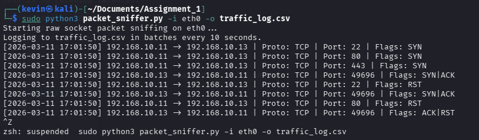

  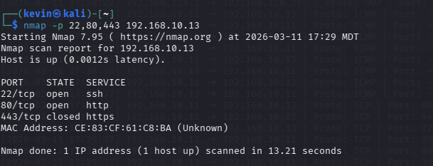

  * * **Test Case 3: SYN Flood Attack Simulation**

  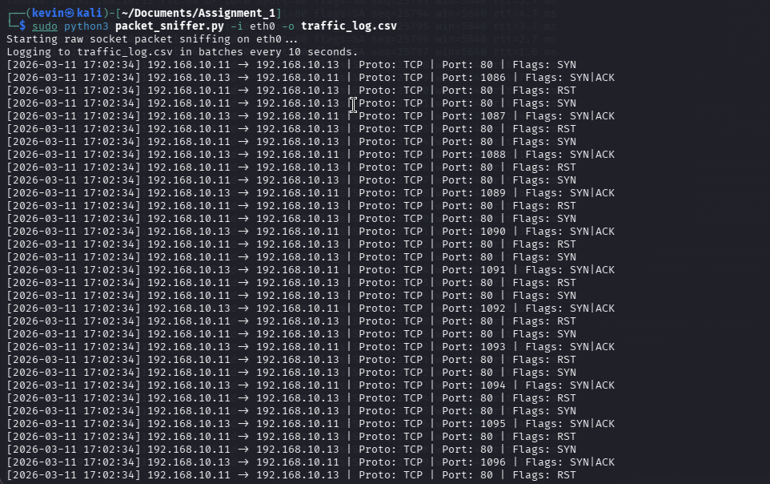

  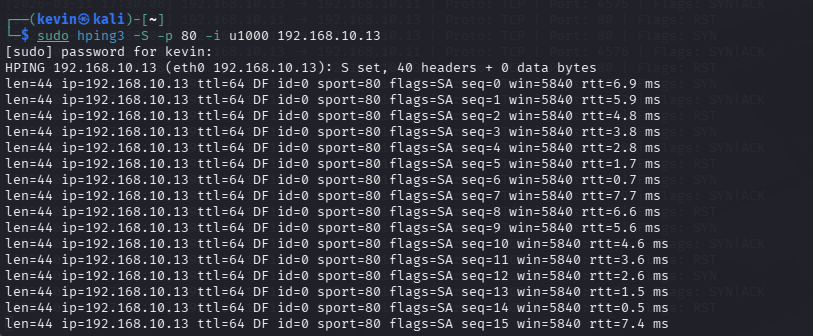

  * ### Results and Analysis

    The implmentation proved to be highly efficient, and logs the data every 10 seconds as intended. The sniffer was responsive during the flood, and operated exactly as intended. 
* ---

## Part 2: ICMP Flood Detection

* ### Implementation Details
    The script monitors network traffic at the raw socket level filtering specifically for ICMP packets. It uses a python dictionary to maintain tha real time count of requests that originates from each unique source IP address. In order to identify a malicious flood, the script requires a soruce IP to send more than 50 ICMP requests per second. To filter out temporary netowrk spies, this specified rate must be sustained for atleast 3 seconds. Once triggered, the script executes a historical check using the csv file to verfiy if that same IP address has launched an ICMP flood within the past 30 mins. 
* ### Testing Environment
    The sniffer was initialized on the Defense VM using the given command line arguments, and the traffic was generated from the attack VM target the MS-2 target VM. 
* ### Test Results and Screenshots
  * * **Test Case 1: Normal Ping**

   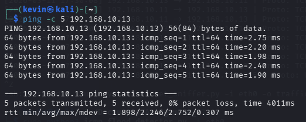

  * * **Test Case 2: ICMP Flood Attack**

  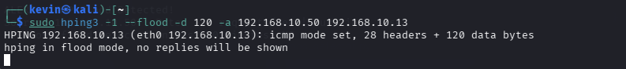

  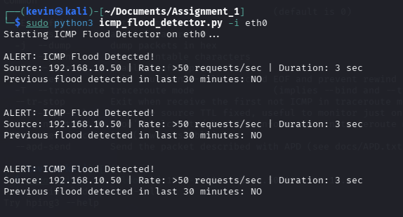

  * ### Results and Analysis
  The detector performed as expected, correctly identifying a flood when I triggered it manually. No false positives were recorded, and the CSV history integration sucessfully verified repeated offenders. 
* ---

## Part 3: SYN Flood Detection

* ### Implementation Details
    This script inspects raw packets to indefity TCP traffic, and specifically isolates packets where the SYN flag is True and the ACK flag is False. This ensures that the script is strictly counting intial connection requests rather than established traffic. It stores a dictionary that tracks the volume of these SYN packets per source IP address. If an IP address sends more than 100 SYN packets in a single second and maintains the rate for 3 seconds, then a flood alert is triggered. To catch repeated offenders the script is intended to check the csv file to check if that same IP has initiated a similar flood within the last 30 mins. 
* ### Testing Environment
    The sniffer was initialized on the Defense VM using the given command line arguments, and the traffic was generated from the attack VM target the MS-2 target VM. 
* ### Test Results and Screenshots
  * * **Test Case 1: Normal TCP Connection**

  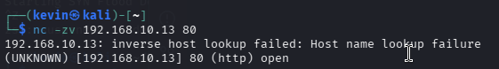

  * * **Test Case 2: SYN Flood Attack**

  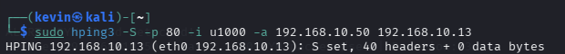

  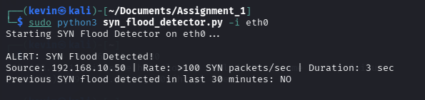
  * * **Test Case 3: Verifying CSV-Based SYN Flood Detection**

  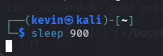

  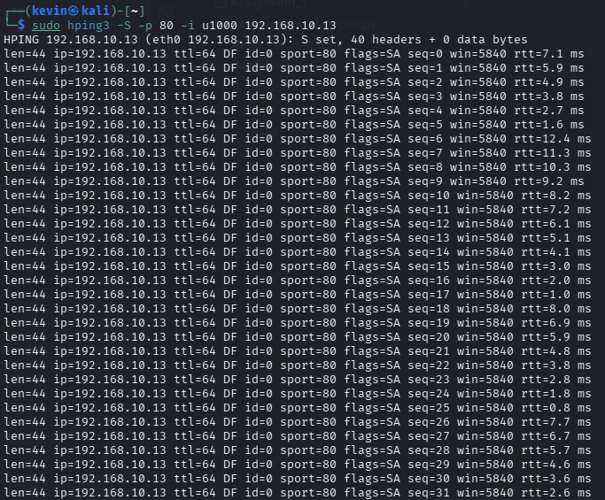
  * * **Test Case 4: SYN Flood with IP Spoofing**

  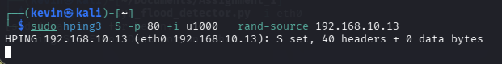

  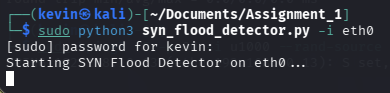

  * ### Results and Analysis
  The detector was able to initially detect a flood, however, (and this might be because I executed it incorrectly) it was not able to detect the same flood after it was given a sleep command. The script was able to successfully pass all the other test cases. 

* ---

## Part 4: Port Scan Detection

* ### Implementation Details
    THe port scanner tracks the rate of network traffic by monitoring how many unique destination ports a single source IP attempts to contact. It specifically isolates TCP connections by filtering for packets with SYN flags as True and ACK flags as false. 
    The detection mechanism uses three different time tiers. An IP is flagged as a scanner if it targets more than 5 unique ports per second, more than 100 per minute, or more than 100 per 5 minutes. If any of those thresholds are bypassed, then the script cross references the csv file to determine if the IP has a history of scanning within the prior 30 minutes. 
* ### Testing Environment
    The sniffer was initialized on the Defense VM using the given command line arguments, and the traffic was generated from the attack VM target the MS-2 target VM. 
* ### Test Results and Screenshots
  * * **Test Case 1: Normal Service Connection**

  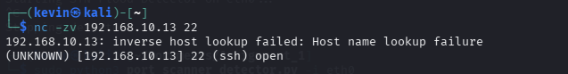

  * * **Test Case 2: Port Scanning with Your Own Scanner**

  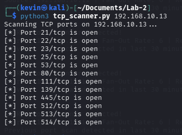

  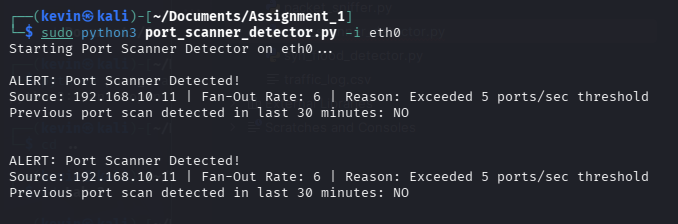
  * * **Test Case 3: Port Scanning with Nmap**

  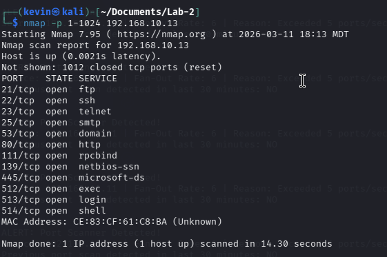

  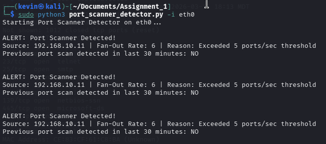

  * ### Results and Analysis
  The detector successfully idenfties the my own scanner from Lab 2, as well as the nmap scan. 
* ---

## Findings and Recommendations
* ### Challenges Faced
    The biggest challenge I faced was writing the code, it was very high level and I had to reference the past Labs as well as get help from some AI and online sources to help me write the code. The high level logic of how each script should work is very difficult to think through. The execution of each part is fairly simple afterwards. 
* ### Suggested Improvements
* **Reducing False Positives:**
    One way to reduce false positives would be to track the SYN floods by specifically targeting incomplete handhsakes and only triggering an alert if a high volume of SYN pakcets is received but the corresponding ACK packets from the client are never completed. 
  * * **Optimizing Performance:**
    Instead of using a dictionary, I could use a set which would drastically reduce lookup times and improve the efficiency of the script. 
  * * **Enhancing Real-World Deployment:**
    Instead of simply priting a message that alerts the terminal of a flood or malicious attack, it could be enhanced by automatically dropping packets and actively blocking the offenders. Furthermore, it could alert an employee and bring it to their attention. 
  * ```
