# **Assignment 2: Exploitations and Vulnerability Analysis**
**Name & Student ID**: [Your Name], [Your ID]

---

### **Task 1: Exploiting UnrealIRCd Backdoor**
#### **Screenshots:**
* [Insert Nmap scan screenshot]

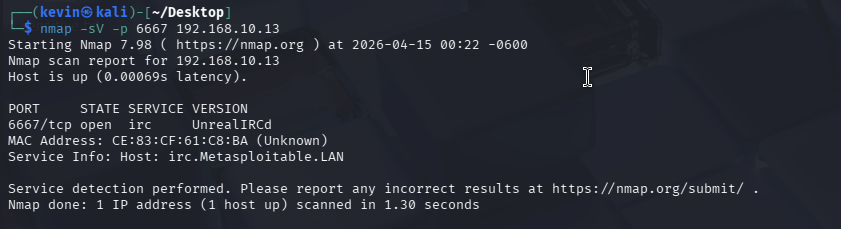

* [Insert Metasploit configuration screenshot]

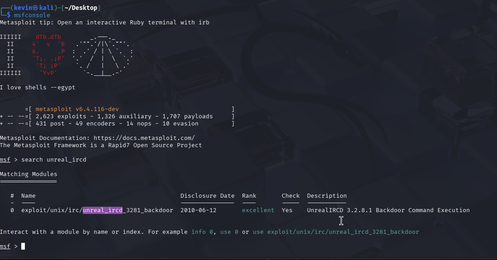

* [Insert successful reverse shell screenshot]

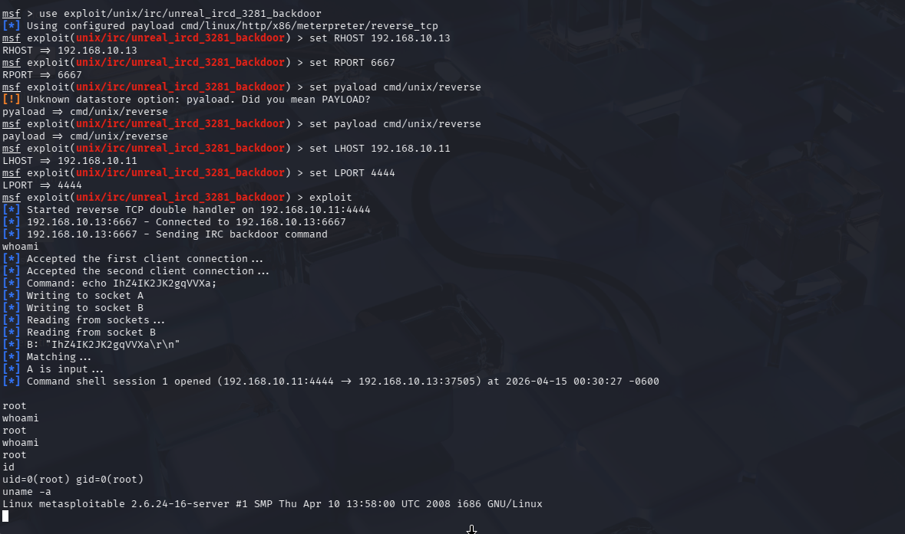

#### **Task 1 Analysis Questions:**

1. Typical software vulnerabilities life buffer overflows are unintentional errors or bugs, but a backdoor is intentionalyl and maliciously left in the software specifically to grant unauthorized remote execution to attackers. 

2. Open source security relies on the peer review of its source code, so if a backdoor is left in the code, an innocent user could be harmed by blindly trusting the authors of the open source project. 

3. The easiest way to prevent backdoor access is to run the code in a contained environment that prevents access to your main system. 

4. Traditional netowrk security assumes that if an application or executable is installed directly by the administrator then the application is trustworthy and acts within expectations. 

5. The MS2 payload that is used requires the target server to initiate a connection back to the attackers listening machine. If the egress filtering was in place to block unauthorized connections then the reverse shell would fail and neutralize the attackers access. 

6. This exploit aligns with the tactics of initial access, it maps to Exploit public facing application (T1190) and since the backdoor passes raw commands directly to teh system shell it also falls under Command via Scripting Interpreter (T1059). 

7. An organization would be able to monitor process trees. For instance, if they see a network daemon suddenly spawn an interactive shell process, that should be flagged as an anamoly and they should respond quickly. IDS can also detect unexpected outbound connections.

8. Admins can reduce the risk by strictly verifying software through checksums and digital signatures before deployment. Furthermore, sticking to the principle pf least privilege limits the damage an attacker can do even if the backdoor is successfully triggered. 

9. This attack proves taht securing the source code repo is not enough. Attackers targeted the supply chain rather than the application logic itself, which successfully pushes malicious code to thousands of users who believed they were downloading safe and trustworthy updates. 

### **Task 2: Exploiting Tomcat Manager Authentication Bypass**

#### **Screenshots:**
* [Insert Nmap scan confirming Tomcat Manager]

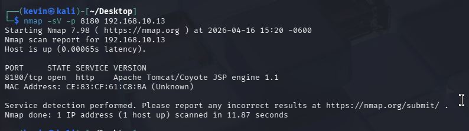

* [Insert successful authentication screenshot]

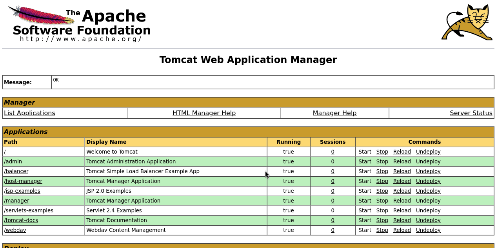

* [Insert Meterpreter/shell access screenshot]

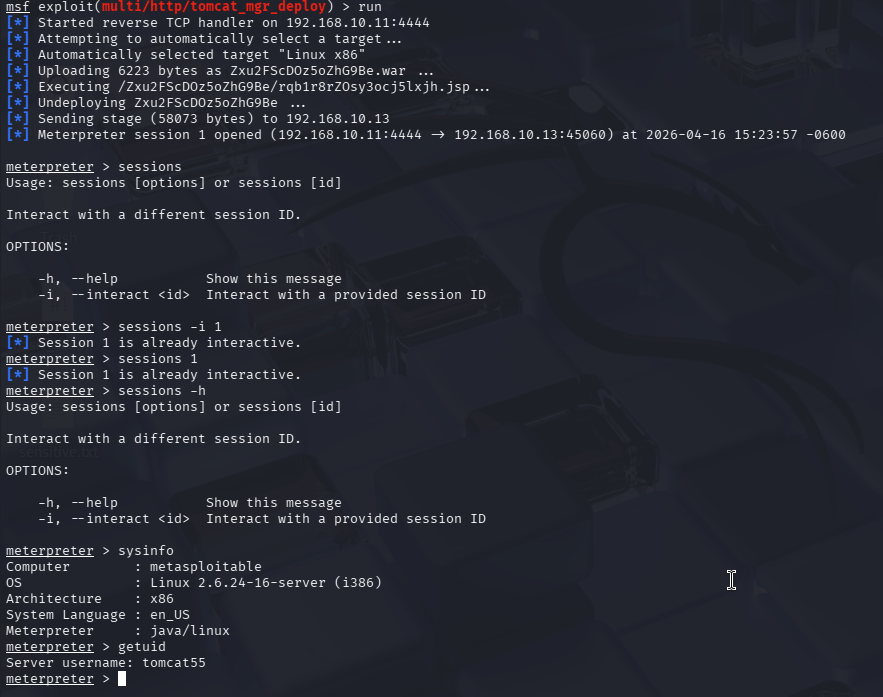

#### **Analysis Questions:**

1. Default credentials violate the principle of least privilege and assume that admins will remember to change them before a system goes live. Attackers and automated scanners constantly search the internet for services that are using known default logins which allows for immediate unauthorized access. 

2. The tomcat manager is an admin interface explicity designed to allow developers to remote deploy and manage web applications, so if it is exposed to public internet with weak access controls, then it provides attackers with a built in mechanism to upload and execute arbitrary code on the server.

3. Tomcat natively uses .war files as its standard format so by wrapping a malicious reverse shell inside a .war file, the attacker is simply using tomcat's intended deployment functionality to unpack and execute their payload. 

4. This vulnerability maps to Initial access via public facing application (T1190), and later maps to Execution via command and scripting interpreter (T1059).

5. Once the attacker gains a meterpreter shell, then can establish persistence by installing hidden backdoors or creating rogue user accounts. They can also use the compromised Tomcat server as a pivot point to perform lateral movement by scanning and expoloiting internal corporate networks. 

6. Firewalls generally allow traffic over standard web ports to ensure that the server functions properly. Furthermore, logging into an admin panel and uploading a .war file over HTTP blends in perfectly with normal admin behavior. Because the payload is devliered via standard web traffic, traditional packet inspection often wont flag it as a malicious exploit. 

7. Admins could implement Multi factor authentication or simply disable the manager interface entirely in production if it is not needed. 

8. Running outdated software means is it vulnerable to known prior exploits that can be used via an automated attacker. It also means it no longer receives patches and leaves it permanently exposed to newly discovered vulnerabilities. 

## **Part 2: Memory Corruption in Native C Applications**

### **Task 1: Compile the Vulnerable Program and Compare Stack Protection**

#### **Screenshots:**
* [Insert screenshot of compilation commands for both versions]

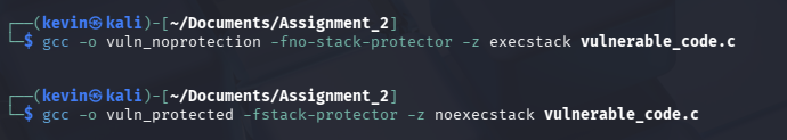

* [Insert screenshot of buffer overflow triggering in each version]

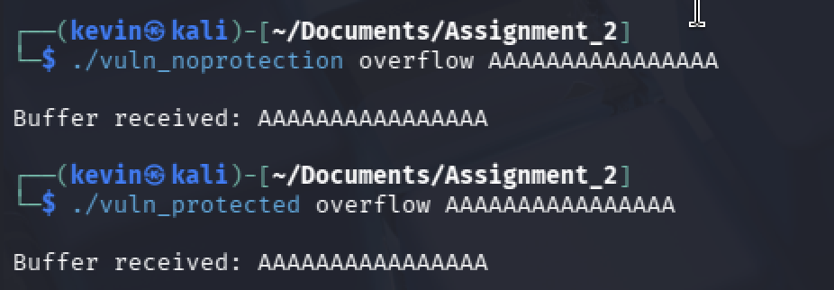

* [Insert screenshot of any error messages or segmentation faults]

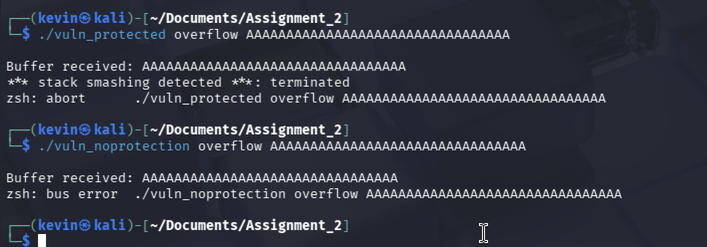

* [Insert screenshot of `dmesg` logs]

#### **Analysis Questions:**

1. Stack canaries are random and known values are placed on the memory stack between the local variables and the functions critical return address. Before a buffer overflow writes data sequentially, an attacker cannot overwrite the return address without first overwriting the canary. So when the system sees the altered canary, it detects the tampering and instnatly stops the program. 

2. Protected was compiled with the stack protector flag which inserts a stack canary. When the buffer overflow is triggered, the programs built in protection mechanism catches the altered canary and safely aborts the program. No protectors lacks this safeguard so when the return address is successfully overwritten with garbage values, then the CPU violently kills the process which results in a seg fault. 

3. -z execstack does not make a visible difference since both an executable and non executable will crash if you overwrite the return pointer with junk data. However, -z execstack is critical for actual explits because without it, modern CPUs will block any injected shellcode from running even if the attacker successfully hijacks the return pointer. 

4. If shellcode were included in the overflow string, then the attacker would pad the buffer and carefully overwrite the return address with a memory pointer. When the vulnerable function attempts to return, it would jump to the shellcode and execute it granting the attacker control. 

5. If stack protection was off, then an attacker has a clear path to hijack the execution flow. They can calculate the exact memory offset needed to reach teh return instruciton pointer. Then they could overwrite it point to their own injected shellcode. 

6. The dmesg command displays kernel level logs, the vuln_noprotection seg faul tis an unhandled illegal memory process. Since the OS kernel must forcefully kill the process, this generates a kernel log in the process which is displayed using the dmesg command. vuln_protected, however, is caught internally by the applications runtime library, since th e application cleanly terminates itself using an abort function call, the kernel does not log the seg fault.  

### **Task 2: Static Analysis with Cppcheck and Flawfinder**

#### **Screenshots:**
* [Insert screenshot of Cppcheck output]

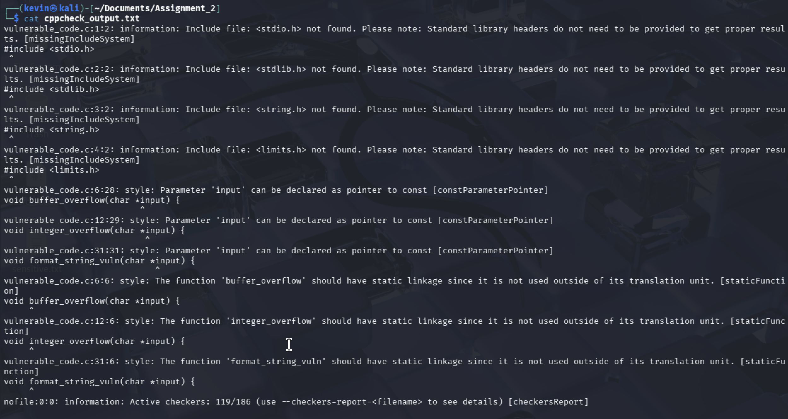

* [Insert screenshot of Flawfinder output]

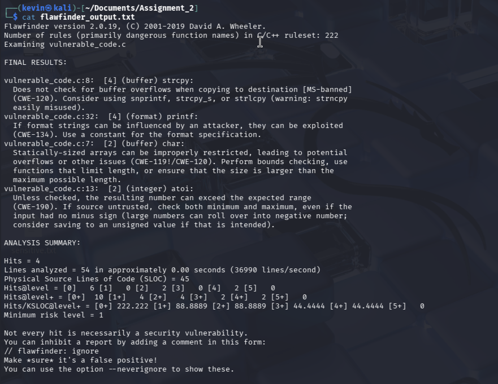

#### **Comparison Table:**

| Vulnerability Description | Detected by Cppcheck? | Detected by Flawfinder? | CWE Tag(s) (Flawfinder) | Risk Level (Flawfinder) | Notes / Observations |
| :--- | :--- | :--- | :--- | :--- | :--- |
| Use of `strcpy()` (buffer overflow) | No | Yes | CWE-120 | 4 | Flawfinder successfully flagged this via lexical analysis. Cppcheck missed it entirely, likely because it couldn't trace a specific, oversized payload being passed to the `input` pointer during its static pass. |
| Use of `atoi()` (integer overflow) | No | Yes | CWE-190 | 2 | Flawfinder flagged the function's lack of bounds checking. Cppcheck completely missed the logical integer overflow, confirming its struggle with mathematical logic flaws. |
| Format string `printf()` | No | Yes | CWE-134 | 4 | Flawfinder easily caught the non-constant format string being passed directly to `printf`. Cppcheck surprisingly failed to flag this standard format string vulnerability. |
| Fixed-size buffer (e.g., `char buffer[10]`) | No | Yes | CWE-119!/CWE-120 | 2 | Flawfinder warned that statically-sized arrays can be improperly restricted. Cppcheck only offered stylistic advice for the surrounding code. |

#### **Analysis Questions:**

1. Flawfinder relies heavily on lexical analysis meaning it scans the text of the source code looking for known dangerous functions. It flags these based on simple pattern matching. Atoi itself is simply a string to integer and since the actual vulnerability is a mathematical error that occurs later when count is multiplied by width, flawfinder cannot detect these logical flaws. 

2. Based on my scan, Cppcheck failed to identify any of the vulnerabilities. Cpp check is a static analysis took and it evaluates code without ecxecuting it so it struggles to find complex logical type casting issues. 

3. It tagged CWE-120, CWE-134, and CWE-190. They are classic buffer overflow, format string vulnerability, and integer overflow. 120 indicates a high explitation risk because it allows an attacker to overwrite adjacent memory. 134 indicates a high risk because it allows an attacker to read/write abitrary memory. 190 is marked as a low risk because it can lead to severe memory corruption when the overflow integer is used for memory allocation. 

4. Automated tools are veyr good for catching low level risks like deprecated functions but manual code review complements this to catch logical flaws, design errors, and complex bugs.

5. To catch deep logic flaws adn integer overflows, deveopmers must incorporate dynamic analysis. This includes compiling the code with runtime memory sanitizers like UBSan and ASan, which can catch overflows the exact moment they mathematically occur during execution. 

### **Task 3: Dynamic Memory Analysis with GCC ASan, UBSan and Valgrind**

#### **Screenshots:**
* [Insert screenshot of ASan output for Buffer Overflow]

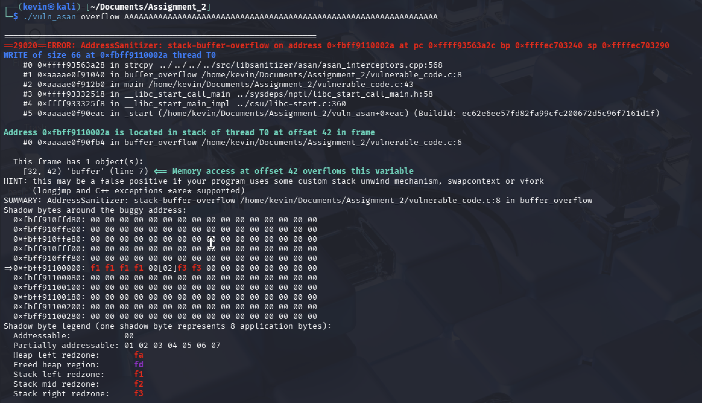

* [Insert screenshot of ASan output for Integer Overflow]

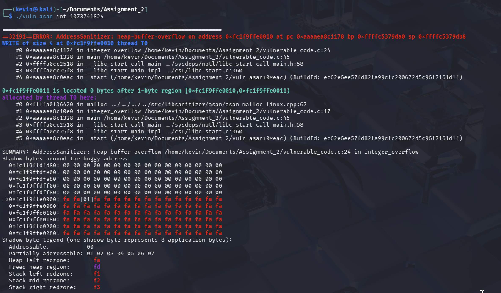

* [Insert screenshot of ASan output for Format String]

* [Insert screenshot of UBSan output for Buffer Overflow]

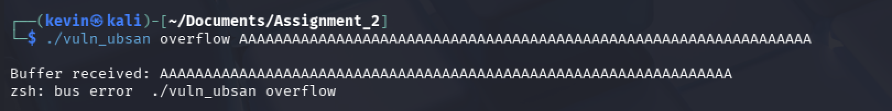

* [Insert screenshot of UBSan output for Integer Overflow]

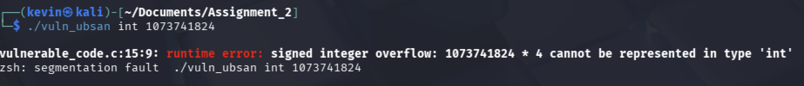

* [Insert screenshot of UBSan output for Format String]

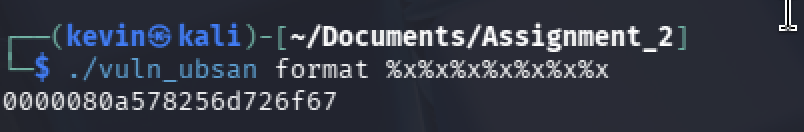

* [Insert screenshot of Valgrind output for Buffer Overflow]

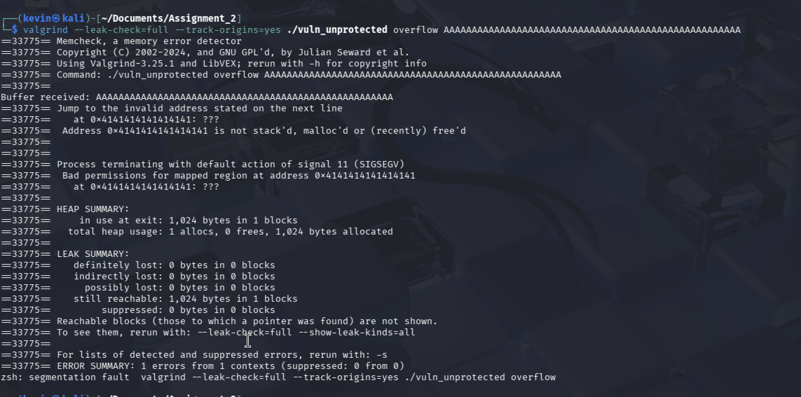

* [Insert screenshot of Valgrind output for Integer Overflow]

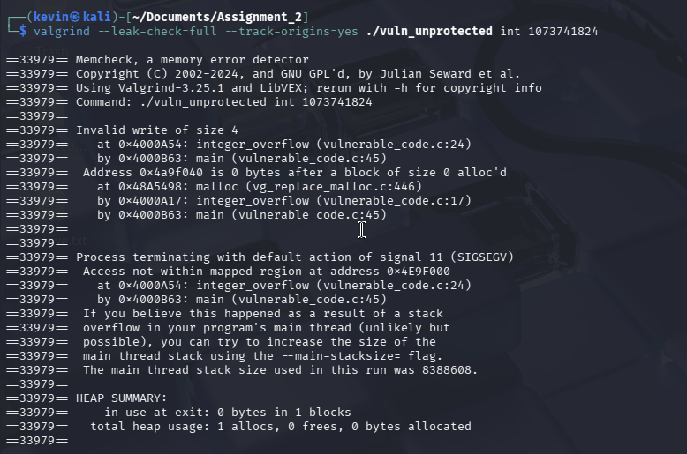

* [Insert screenshot of Valgrind output for Format String]

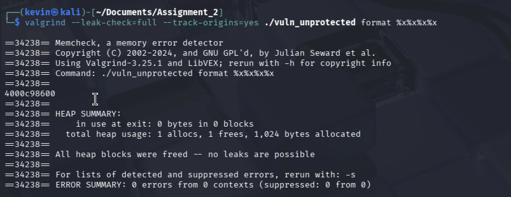

#### **Comparison Table:**

| Vulnerability Type | Detected by ASan? | ASan Message Summary | Detected by UBSan? | UBSan Message Summary | Detected by Valgrind? | Notes / Observations |
| :--- | :--- | :--- | :--- | :--- | :--- | :--- |
| Buffer Overflow (`strcpy`) | Yes | `stack-buffer-overflow` during a WRITE of size 66 | No | N/A (Crashed with a `bus error` but provided no diagnostic message) | No | ASan caught the exact bounds violation. Valgrind completely missed the stack overflow, only catching the resulting crash later when the program tried to jump to the invalid `0x41414141` ('AAAA') address. |
| Integer Overflow (`atoi` + `malloc`) | Yes | `heap-buffer-overflow` pointing out a write outside a tiny allocated region | Yes | `signed integer overflow: 1073741824 * 4 cannot be represented in type 'int'` | Yes | UBSan caught the exact root cause (the math error). ASan and Valgrind both caught the *symptom* of the math error (trying to write a 4-byte integer into a 0-byte allocated heap space). |
| Format String (`printf(input)`) | No | N/A (Just leaked hex memory: `efcb0ac...`) | No | N/A (Just leaked hex memory: `0000080a...`) | No | All three tools failed to detect the format string vulnerability. The program printed the leaked memory and exited normally without triggering any sanitizer or Valgrind errors. |

#### **Analysis Questions:**

1. Answer: UBSan gave the clearest diagnostic for the Integer Overflow by explicitly naming the root mathematical failure ("signed integer overflow"). ASan gave the clearest diagnostic for the Buffer Overflow by pointing out the exact stack-buffer-overflow bounds violation. Valgrind missed the Buffer Overflow entirely because its default Memcheck tool tracks dynamic heap allocations (malloc/free), not static stack variables. All three tools missed the Format String vulnerability.

2. These dynamic tools monitor specific boundaries and behaviors: ASan and Valgrind track memory allocation edges, and UBSan tracks mathematically undefined C operations. A format string vulnerability does not technically violate a memory allocation boundary or perform undefined math; it simply tricks printf into reading or writing valid stack memory using standard variable arguments. Because printf is executing "as designed" without stepping out of the program's overall memory space, the sanitizers remain completely quiet.

3. Yes, ASan proved to be excellent at identifying both heap and stack memory bounds issues, making it highly versatile. Valgrind, however, is heavily specialized for heap analysis and completely ignores static stack variable overflows by default.

4. Yes, they should be used together because they serve complementary purposes in a secure development lifecycle. UBSan catches core logic and math errors early. ASan provides incredibly fast and accurate memory bounds checking during standard unit testing. Valgrind is invaluable for deep, thorough memory leak checking and uninitialized memory tracking, with the added benefit of analyzing compiled binaries without requiring the developer to recompile the source code.

5. Beyond merely preventing a crash, these tools provide highly detailed diagnostic reports that include exact file names, line numbers, and function call stacks. ASan, for example, prints a "shadow memory" map that visually explains the exact memory layout around the crash, telling the developer precisely why the access was invalid. This transforms a vague "Segmentation Fault" into a highly actionable bug report.

### **Task 4: Mitigation Recommendations and Secure Refactoring**

* **Buffer Overflow:**
  * *Explanation:* The `strcpy()` function copies the user-provided string directly into a fixed 10-byte buffer without verifying if the source string will fit.
  * *Vulnerable Logic:* `strcpy(buffer, input);`
  * *Legacy Context:* Functions like `strcpy` and `gets` are remnants of early C standards where developers were fully responsible for memory management and bounds checking to maximize performance. They remain in codebases due to legacy dependencies and lack of developer awareness.
* **Integer Overflow:**
  * *Explanation:* The program uses `atoi()` which provides no error handling for out-of-range inputs. Furthermore, it blindly multiplies `count * sizeof(int)` without checking if the result exceeds the maximum limit of a 32-bit integer, resulting in a wrap-around to a tiny (or negative) allocation size.
  * *Vulnerable Logic:* `int count = atoi(input);` and `int total = count * width;`
  * *Legacy Context:* Developers often assume user input will be reasonable or benign. Writing extensive mathematical boundary checks is tedious, so developers often skip it in performance-critical or prototype code.
* **Format String:**
  * *Explanation:* The program passes the user's raw input directly to `printf()` as the format string argument. If the input contains format specifiers like `%x` or `%n`, `printf` will read or write to memory locations off the stack.
  * *Vulnerable Logic:* `printf(input);`
  * *Legacy Context:* This usually happens due to laziness or a misguided attempt at code optimization (saving a few keystrokes instead of typing `printf("%s", input);`).

#### **Step 2: Safer Alternatives**

  * **Buffer Overflow Alternative:** `snprintf()` or `strncpy()`
  * *Why Safer:* These functions require a `size` parameter, forcing the copy operation to stop once the buffer's maximum capacity is reached, effectively preventing an overflow.
  * *Limitations:* `strncpy()` will not automatically append a null terminator if the source string is longer than the buffer, which can cause reading errors later. `snprintf` is safer but slightly slower.
* **Integer Overflow Alternative:** `strtol()` and Explicit Bounds Checking
  * *Why Safer:* `strtol()` handles conversion errors gracefully and sets `errno` to `ERANGE` if the input is too large. Explicitly checking if `count > (INT_MAX / sizeof(int))` ensures the multiplication will never wrap around.
  * *Limitations:* It adds significant boilerplate code and branching logic, which can marginally impact execution speed and code readability.
* **Format String Alternative:** Hardcoded Format Specifiers
  * *Why Safer:* Using `printf("%s\n", input);` ensures that the user's input is treated strictly as data (a string) rather than executable format instructions.
  * *Limitations:* None. This is the objectively correct way to print a variable string in C; it has no performance or functional downsides for this use case.

#### **Step 4: Defensive Compiler Options**
* **Mitigation 1: Stack Canaries**
  * *Purpose:* Detects contiguous overwrites of the return address on the stack (buffer overflows). It places a randomized value before the return pointer; if the value is altered before the function returns, the program aborts.
  * *Enabled by:* `-fstack-protector` (or `-fstack-protector-all`)
  * *Disabled by:* `-fno-stack-protector`
  * *Limitations:* Only protects the stack, not the heap. Can be bypassed if the attacker finds a way to leak the canary's random value (e.g., using a format string vulnerability) and writes it back during the overflow.
* **Mitigation 2: Non-Executable Stack (NX Bit)**
  * *Purpose:* Prevents the CPU from executing instructions located in the stack memory segment. Defends against classic shellcode injection attacks.
  * *Enabled by:* `-z noexecstack` (Default on modern GCC)
  * *Disabled by:* `-z execstack`
  * *Limitations:* Does not prevent the return address from being overwritten. It simply stops injected code from running. Attackers bypass this using Return-Oriented Programming (ROP), where they hijack the return pointer to execute code that already exists in executable memory (like `libc`).

#### **Analysis Questions:**

1. Languages like Rust and GO enforce strict memory management rules at compile and run time. They are completely free of vulnerabilities like buffer overflows by restricting direct, unchecked memory access which makes it nearly impossible for developers to introduce the bugs I used in this assignment. 

2. C provides unparalleled execution speed and no overhead for memory management. It allows direct interaction with hardware, making it essential for an OS where garbage collection systems used by languages like Go are completely unacceptable. 

3. Secure memory handling enforces the Shift Left philosophy of SSDLC and instead of waiting for a penetration test to find a buffer overflow in production code, an SSDLC requires secure memory design during the planning phase of a project and enforces safe functions during coding standards. 

4. Static analysis tooks act like spellcheck which scans committed code for banned functions like strcpy and flags them before the code is merged into the main branch. Dynamic tools like ASan and UBSan integrate into automated testing suites to catch complex logic flaws. 

## **Part 3: Web Exploitation with Mutillidae**

### **Task 1: SQL Injection**

#### **Screenshots:**
* [Insert screenshot showing successful login bypass using SQLi]

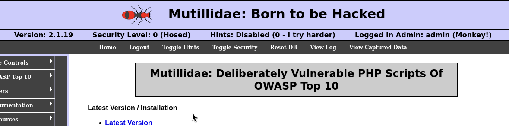

#### **Analysis Questions:**

1. Both fields are injectable in this situation but only the first two queries worked in the username field. 

    The WHERE clause of the query was manipulated before altering the query.
    
    1=1 Always succeeds because 1 always equals 1 which means the database always evaluates this to be True which bypasses the authentication logic when it is paired with the OR operator. 

2. In-Band SQL injection. This payload forces the database to evaluate the boolean condition which typically grants access to the first user record in the database. 

3. The primary sign is an authorization state change without providing valid credentials. In Mutillidae, this redirects to a logged-in dashboard. I can also see that I am logged in as Admin.

4. While it is excellent bypassing login screens, it is severely limited in terms of data extraction. Using a UNION based injection can dump the entire table to the screen. Furthermore, it is easily stopped by basic input sanitization or Firewalls that drop requests containing strings like 1=1.

5. Firstly, you can force the database to compile the SQL query before inserting the user input. By doing this, the input is treated strictly as a string literal and not as an executable SQL code, which completely neutralizes the injection.

    Secondly, you can limit the input fields to only allowing alphanumeric character sfor a username which would ignore SQL characters like ' and -. 

### **Task 2: Command Injection**

#### **Screenshots:**
* [Insert screenshot of the successful command injection payload (e.g., showing the output of `cat /etc/passwd` or `id`)]

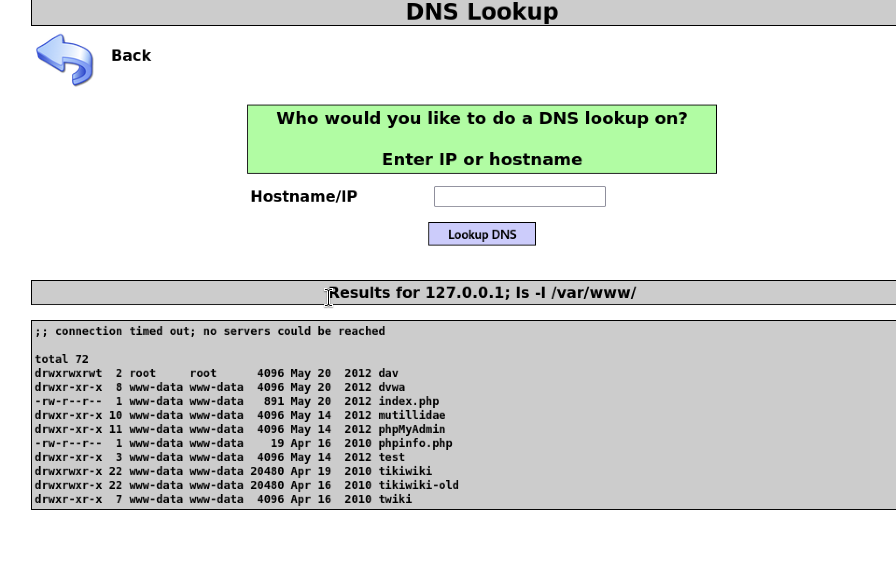

#### **Analysis Questions:**

1. Command injection occurs when an application passes unsanitized user input directly to teh operating system which allows it to execute commands remotely. It is different from SQL injection because it targets the systems backend whereas Command injection targets the OS itself.

2. Attackers can use shell metacharacters to break out of the intended command and start a new one. Command characters include the semicolon to run sequentially, the && operator, ||, and |. 

3. The application appends the input to the underlying system and executes the ping command. Once that is done, the shell starts a new command which is cat /etc/passwd the web app then captures the output of both commands and displays the contents of the systems password file. 

4. The injected command executes with the exact privileges of the web server. This is usually a low privileged restricted user, but it is usually more than enough to read sensitive config files.

5. Avoiding OS calls directly is the best defense to avoid any command injection related vulnerablities. If calling the OS is unavoidable, then devs must strictly validate the input against a precise list of allowed characters. 

### **Task 3: Cross-Site Scripting (XSS) Part A**

#### **Screenshots:**
* [Insert screenshot showing the XSS payload entered into the vulnerable input field]

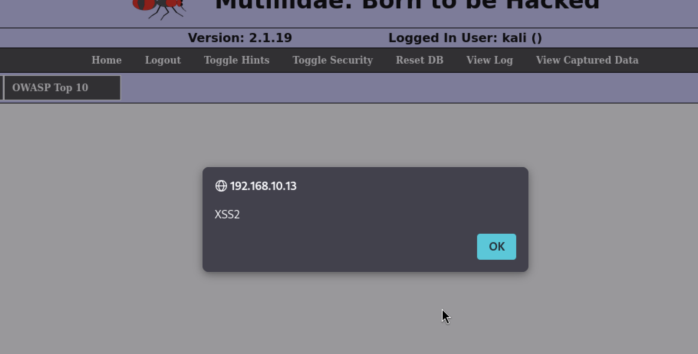

* [Insert screenshot showing the successful execution of the payload (e.g., the pop-up alert box)]

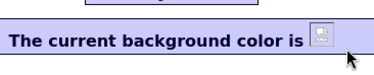

#### **Analysis Questions:**

1. The script was reflected in the background color changing field. 

2. It appeared as a pop up alerting me that the input had gone through, furthermore it also shows it as the current background color. 

3. An attacker could use this XSS vulnerability to steal the victims session cookies, or silently redirect the user to a malicious phishing site designed to steal their credentials. 

### **Task 3: Cross-Site Scripting (XSS) Part B**

#### **Screenshots:**
* [Screenshot showing your payload visible in the blog post or executed automatically.]

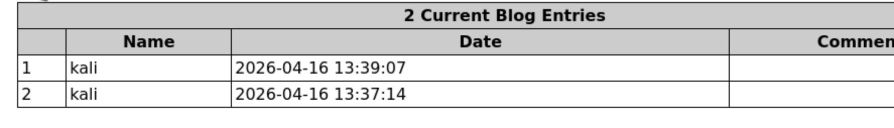

* [📸 Screenshot of the stolen cookie or captured HTTP request in the Kali listener.]

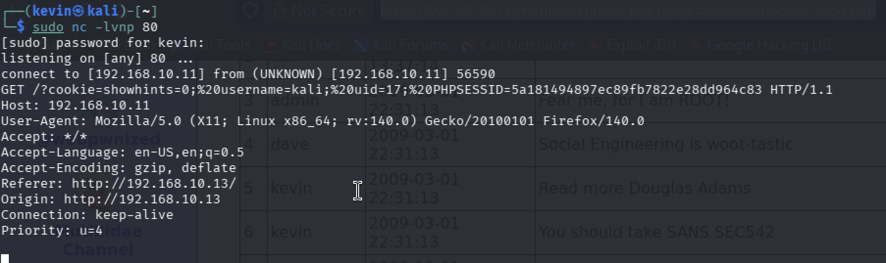

#### **Analysis Questions:**

1. The payload was submitted through the blog form and saved it permanently into the Mutillidae database. Since the application does not sanitize the input before saving it to the database, nor does it encode the output when displaying it, the server feeds teh malicious script tags back to the browser. 

2. With a stolent session cookie, an attacker can perform a session hijack where they can inject the stolen cookie into their own browser, which tricks the web server into believing the attacker is the authenticated victim. From there, the attacker can completely bypass the login screen and do anything that hte victim would be able to do.

3. SameSite=Strict does not actually prevent a XSS payload from stealing the session cookie. It is designed to prevent a CSRF attack by instructing the browser to not send the cookie along with cross domain requests. 

## **Part 4: Vulnerability Scanning and Analysis**

### **Task 1: Vulnerability Scanning with Nmap**
#### **Screenshots:**
* [Insert screenshot of the Nmap port scan output: `nmap -sV -p- -T4 [MS2-IP]`]

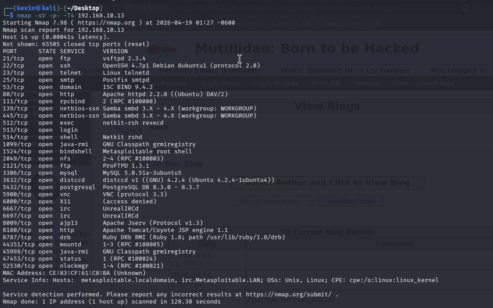

* [Insert screenshot of the Nmap vulnerability script output: `nmap -sV -v --script vuln [MS2-IP]`]

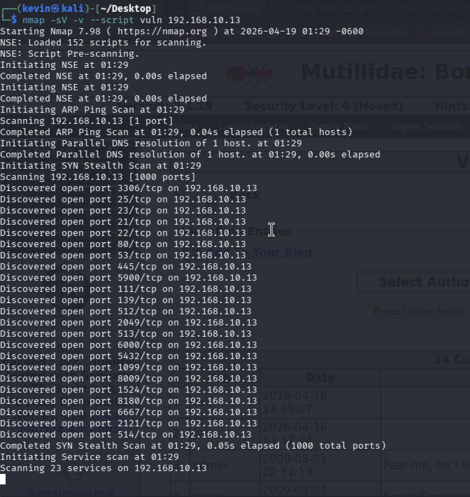

### **NMAP RESULTS** 

    Results are attached in a separate file for sake of readability. See 'nmap.txt'

### **Task 2: Identify and Analyze Five Vulnerabilities**

**1. vsftpd 2.3.4 Backdoor**
* **Service & Port:** vsftpd 2.3.4 on Port 21
* **CVE Details:** * **CVE ID:** CVE-2011-2523
  * **CVSS Score:** 9.8 Critical
  * **Description:** The vsftpd 2.3.4 package downloaded from the official master site was compromised and contained a malicious backdoor. Sending a username ending in a smiley face `:)` triggers a covert root shell listening on port 6200.
* **Exploitability:** Yes, a Metasploit module (`exploit/unix/ftp/vsftpd_234_backdoor`) exists. It grants immediate, unauthenticated root-level remote command execution.
* **Example Exploit Path:** An attacker connects to the FTP service, sends the malicious payload to open port 6200, connects to the new port, and gains full root access to steal files, install persistence mechanisms, or pivot to other network segments.

**2. UnrealIRCd Backdoor**
* **Service & Port:** UnrealIRCd on Port 6667
* **CVE Details:** * **CVE ID:** CVE-2010-2075
  * **CVSS Score:** 9.8 Critical
  * **Description:** Certain distribution archives of UnrealIRCd 3.2.8.1 contained a malicious backdoor. Any data sent to the server following the specific string `AB;` is executed directly as a system command by the underlying OS.
* **Exploitability:** Yes, a Metasploit module (`exploit/unix/irc/unreal_ircd_3281_backdoor`) exists. It grants a shell with the privileges of the user running the IRC service.
* **Example Exploit Path:** The attacker sends the `AB;` trigger containing a reverse-shell payload to the IRC port, catching the shell on their Kali machine to begin local privilege escalation or data exfiltration.

**3. Java RMI Registry Default Configuration RCE**
* **Service & Port:** GNU Classpath grmiregistry on Port 1099
* **CVE Details:** * **CVE ID:** N/A (General Misconfiguration flaw)
  * **CVSS Score:** 9.8 Critical
  * **Description:** The default configuration of the RMI registry allows it to load classes from remote, untrusted URLs. An attacker can bind a malicious object to the registry, causing the target server to download and execute arbitrary Java code.
* **Exploitability:** Yes, a Metasploit module (`exploit/multi/misc/java_rmi_server`) exists. It grants remote code execution.
* **Example Exploit Path:** The attacker sets up a malicious HTTP server hosting a compiled Java payload, points the vulnerable RMI registry to it, and gains execution context on the target host to launch further attacks.

**4. OpenSSL SSL/TLS MITM (CCS Injection)**
* **Service & Port:** PostgreSQL DB on Port 5432 (and SMTP on Port 25)
* **CVE Details:** * **CVE ID:** CVE-2014-0224
  * **CVSS Score:** 7.4 High
  * **Description:** OpenSSL does not properly restrict the processing of ChangeCipherSpec (CCS) messages. This allows attackers to trigger the use of a zero-length master key during a TLS handshake.
* **Exploitability:** Yes, attackers can exploit this to intercept and decrypt secure traffic in real-time. 
* **Example Exploit Path:** An attacker positioned on the local network (e.g., via ARP spoofing) intercepts the TLS handshake, forces the zero-length key, and passively captures database queries and credentials in plaintext.

**5. Slowloris DOS Attack**
* **Service & Port:** Apache httpd 2.2.8 on Port 80
* **CVE Details:** * **CVE ID:** CVE-2007-6750
  * **CVSS Score:** 5.0 Medium
  * **Description:** Slowloris opens multiple connections to the target web server and purposefully sends partial, delayed HTTP requests. By keeping these connections hanging open indefinitely, it starves the Apache server's connection pool.
* **Exploitability:** Yes, widely available scripts and tools easily execute this attack.
* **Example Exploit Path:** The attacker runs a lightweight Python script pointing at Port 80. Within minutes, all available Apache worker threads are consumed, causing the web application to stop responding to legitimate users.

---

### **Task 3: CWE Classification and Impact Analysis**

**1. vsftpd 2.3.4 Backdoor**
* **CWE ID & Description:** **CWE-506: Embedded Malicious Code.** The software package contains intentionally embedded malicious logic (a backdoor) that allows unauthorized remote access.
* **Impact:** Full system compromise. An attacker gains a root-level shell, completely bypassing all standard authentication and resulting in a total loss of confidentiality, integrity, and availability.

**2. UnrealIRCd Backdoor**
* **CWE ID & Description:** **CWE-78: Improper Neutralization of Special Elements used in an OS Command.** The application passes untrusted, unsanitized input directly to the underlying operating system shell.
* **Impact:** Remote Code Execution (RCE). An attacker can execute arbitrary OS commands with the privileges of the IRC service, allowing them to pivot, exfiltrate data, or install malware.

**3. Java RMI Registry Default Configuration**
* **CWE ID & Description:** **CWE-502: Deserialization of Untrusted Data.** The default configuration deserializes untrusted data without sufficiently verifying that the resulting data is safe or valid, allowing malicious remote classes to be loaded.
* **Impact:** Remote Code Execution leading to deep system compromise.

**4. OpenSSL CCS Injection**
* **CWE ID & Description:** **CWE-310: Cryptographic Issues.** The application fails to properly implement or handle the state machine of the TLS cryptographic handshake, allowing the forced use of a zero-length master key.
* **Impact:** Loss of data confidentiality and integrity. An attacker can perform a Man-in-the-Middle (MitM) attack to decrypt, read, and alter secure traffic in transit.

**5. Apache httpd 2.2.8 Slowloris**
* **CWE ID & Description:** **CWE-400: Uncontrolled Resource Consumption.** The web server does not properly restrict the allocation and maintenance of a limited resource (concurrent connection threads) when dealing with severely delayed HTTP requests.
* **Impact:** Complete Denial of Service (DoS). Legitimate users are entirely blocked from accessing the web application.

---

### **Task 4: MITRE ATT&CK Mapping**

**Mapping 1: vsftpd 2.3.4 Backdoor**
* **Tactic:** Initial Access
* **Technique:** T1190 – Exploit Public-Facing Application
* **Real-World Alignment:** In a real-world campaign, an attacker uses automated scanners to trawl the internet for exposed external IP addresses running port 21. Upon finding this specific vsftpd version, they fire the backdoor trigger payload to establish a permanent initial foothold in the victim's network without needing stolen credentials.

**Mapping 2: UnrealIRCd Backdoor**
* **Tactic:** Execution
* **Technique:** T1059.004 – Command and Scripting Interpreter: Unix Shell
* **Real-World Alignment:** Once an attacker realizes the IRC daemon is vulnerable, they abuse the service's input stream to pass arbitrary OS commands. They use this Unix shell execution to download secondary payloads (like a rootkit or crypto-miner) directly onto the compromised server.

---

### **Task 5: Mitigation Strategies**

**1. vsftpd 2.3.4 Backdoor**
* **Technical Control:** Upgrade the vsftpd package to a clean, updated version (e.g., version 3.x) using a trusted package manager. **(Corrective)**
* **Administrative Control:** Implement strict firewall rules and network segmentation to block all external, internet-facing access to Port 21, restricting it to internal VLANs only. **(Preventive)**

**2. UnrealIRCd Backdoor**
* **Technical Control:** Deploy an Intrusion Prevention System (IPS) configured with a signature to detect and automatically drop network packets containing the known `AB;` trigger string. **(Preventive/Detective)**
* **Administrative Control:** Enforce File Integrity Monitoring (FIM) policies that require cryptographic hash verification (SHA-256) on all downloaded open-source software packages before they are approved for deployment. **(Proactive)**

**3. Java RMI Registry Default Configuration**
* **Technical Control:** Configure the Java runtime environment to explicitly restrict remote class loading by setting the property `java.rmi.server.useCodebaseOnly=true`. **(Preventive)**
* **Administrative Control:** Mandate a zero-trust architecture policy that requires port 1099 to be explicitly blocked at the host-based firewall level unless a specific business justification is provided. **(Preventive)**

**4. OpenSSL CCS Injection**
* **Technical Control:** Patch the OpenSSL libraries on the system to a non-vulnerable version  and restart all associated services to flush the vulnerable code from memory. **(Corrective)**
* **Administrative Control:** Implement a strict patch management Service Level Agreement (SLA) requiring all critical cryptographic libraries to be updated within 48 hours of a vendor patch release. **(Proactive)**

**5. Apache httpd 2.2.8 Slowloris**
* **Technical Control:** Install and enable the `mod_reqtimeout` Apache module to forcefully drop connections that fail to send complete requests within a specified timeframe, or place the server behind a reverse proxy (like Nginx) that buffers requests. **(Preventive)**
* **Administrative Control:** Deploy comprehensive network traffic monitoring to alert the Security Operations Center of anomalous, long-hanging connection spikes originating from single IP addresses. **(Detective)**

---

### **Analysis Questions:**

1. Vulnerability scanning systematically finds open ports, outdated services, and unpatched software. By mapping these vulnerabilities you are able to find them before an attacker does and proactively patch them.

2. False positives forces you to investigate fake issues that consume time and resources that could be put towards fixing actual vulnerabilities. False negatives are very dangerous where an actual vulnerability is reported as safe causing the admins to refrain from fixing it, and leaving it as an exploitable option for attackers. 

3. I would deploy a robust, multi-layered approach:
  * **Perimeter Defenses:** Utilize Web Application Firewalls and Next-Gen Firewalls to filter malicious traffic at the edge.
  * **Network Architecture:** Isolate exposed services within a Demilitarized Zone (DMZ) with strict network segmentation, completely decoupling them from internal databases and active directory.
  * **Host Security:** Apply the principle of least privilege to all service accounts, enforce rapid patching schedules, and implement Endpoint Detection and Response agents.
  * **Identity & Monitoring:** Require Multi-Factor Authentication for any administrative interface and forward all logs to a centralized SIEM to quickly detect and alert on anomalous behavior.

