# **Assignment 3: Network Monitoring, Intrusion Detection and Defense**
**Name & Student ID**: [Your Name], [Your ID]

---

## **Part 1: Network Change Monitoring with Bash**

### **Script Explanation**

The script (`network_monitor.sh`) is organized into four functions called by `main`. `scan_network` creates the output directory and runs an nmap SYN scan across `192.168.10.0/24`, saving grepable output to a timestamped file. `parse_scan_results` uses `awk` and `sed` to extract IP-to-port mappings from the raw scan file and writes them to `current_state.txt`. `detect_changes` compares `current_state.txt` against `previous_state.txt` to identify new hosts, offline hosts, and per-host port opens/closes; on the first run it treats the scan as the baseline. `log_changes` writes timestamped entries to `log.txt` then copies `current_state.txt` to `previous_state.txt` to update the baseline for the next run.

---

### **Task 2: Cron Automation**

#### **Screenshots:**
* [Insert screenshot of `sudo crontab -l` showing the scheduled entry]

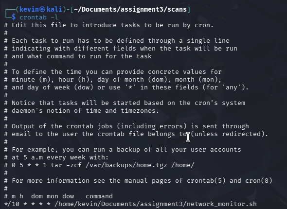

---

### **Task 3: Scenario Detection**

#### **Screenshots:**

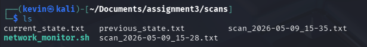

* [Insert screenshot of `log.txt` showing VM-T detected as a new host]

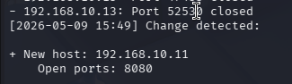

This screenshot shows both the new Host and Port 8080. 

### **Scenario Summary**

The monitoring script successfully detected every staged network event across the six steps. On the first run it logged the baseline with only VM-D visible on the subnet. When VM-T was powered on, the next scan caught it as a new host and listed all of its open ports, including FTP on 21 and HTTP on 80. VM-A was then detected the same way when it came online. Once a web server was started on VM-A, the script picked up port 8080 opening on that host. The most significant detection came when the VSFTPD exploit was run from VM-A — the backdoor port 6200 appeared on VM-T within the next scan cycle, exactly as expected. Finally, when the web server on VM-A was stopped, the script correctly logged port 8080 as closed. The script had no false positives throughout the scenario and the log entries were clean and easy to read.

---

## **Part 2: Network Defense Using IPTables on VM-D**

### **Task 1: Launch Services on VM-D**

#### **Screenshots:**
* [Insert screenshot of the Python web server running on port 80]

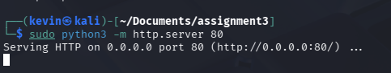

* [Insert screenshot of `sudo systemctl status ssh` showing the service as active]

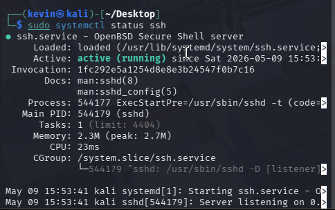

---

### **Task 2: Firewall Ruleset**

#### **Screenshots:**
* [Insert screenshot of `sudo iptables -L -v -n` showing the full ruleset]

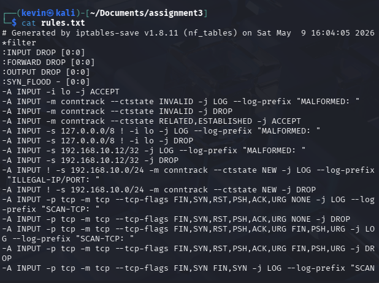

---

### **Task 3: Firewall Testing**

#### **Test A: ICMP Behavior**

#### **Screenshots:**
* [Insert screenshot of ping flood from VM-A to VM-D]

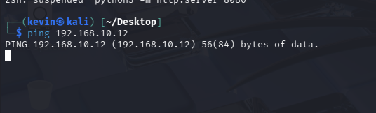

* [Insert screenshot of normal ping from VM-T to VM-D]

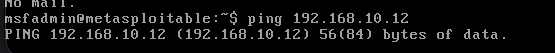

* [Insert screenshot of ping from VM-D to VM-A and VM-T]

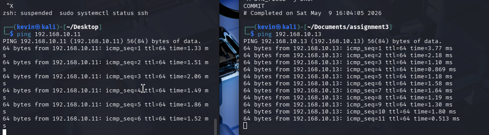

---

#### **Test B: TCP SYN Flood Detection**

#### **Screenshots:**
* [Insert screenshot of SYN flood from VM-A with real IP]

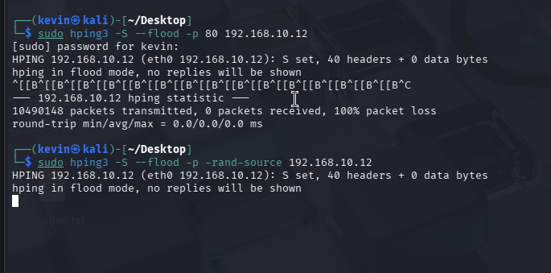
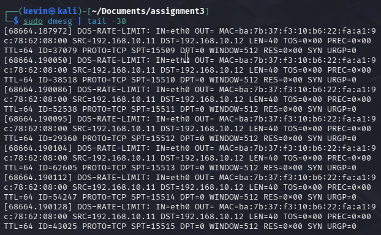

---

#### **Test C: Port Scan Resistance**

#### **Screenshots:**
* [Insert screenshot of TCP Connect Scan (`nmap -sT`) results]

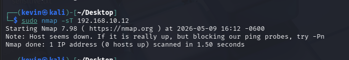

* [Insert screenshot of SYN Scan (`nmap -sS`) results]

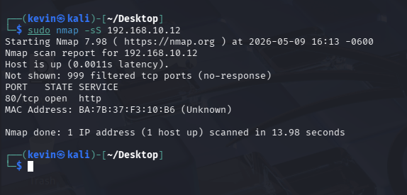

* [Insert screenshot of FIN Scan (`nmap -sF`) results]

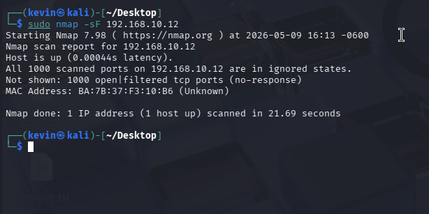

* [Insert screenshot of Xmas Scan (`nmap -sX`) results]

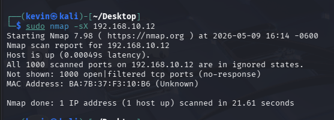

* [Insert screenshot of NULL Scan (`nmap -sN`) results]

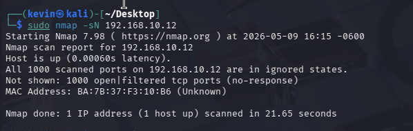

* [Insert screenshot of `dmesg` showing `SCAN-TCP` log entries]

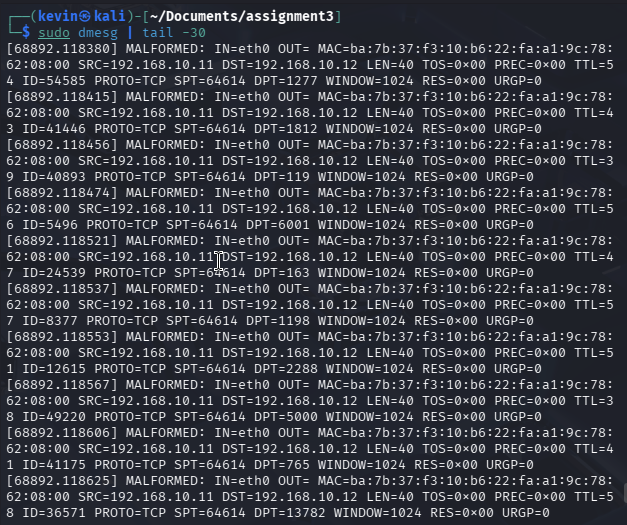

---

#### **Test D: Spoofed Packet Rejection**

#### **Screenshots:**
* [Insert screenshot of `hping3` sending packets with reserved source IPs]

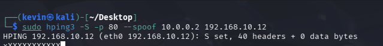

* [Insert screenshot of `hping3` sending a packet with VM-D's own IP as source]

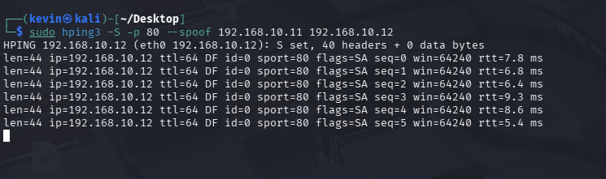

* [Insert screenshot of `dmesg` showing `MALFORMED` and `ILLEGAL-IP/PORT` log entries]

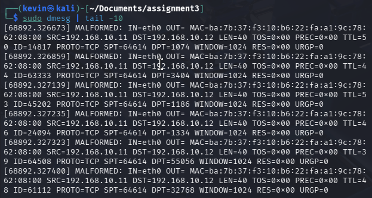

---

#### **Test E: Invalid State Packet Handling**

#### **Screenshots:**
* [Insert screenshot of `hping3` sending ACK-only packets without a prior session]

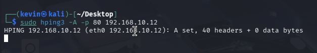

* [Insert screenshot of `dmesg` confirming INVALID state drops]

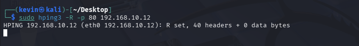

---

#### **Test F: Loopback Enforcement**

#### **Screenshots:**
* [Insert screenshot of `hping3` from VM-A crafting a packet with source IP `127.0.0.1`]

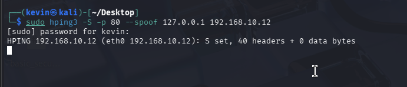

* [Insert screenshot of `dmesg` confirming the packet was dropped]

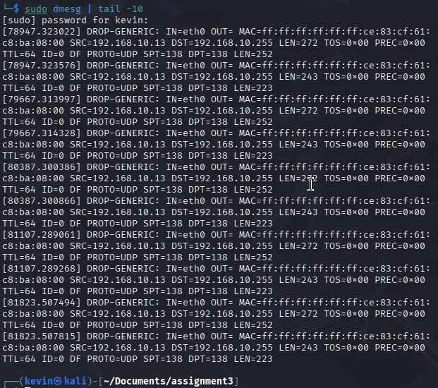

---

#### **Test G: UDP Behavior**

#### **Screenshots:**
* [Insert screenshot of UDP packets sent from VM-A to VM-D]

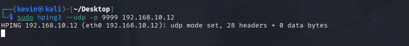

---

#### **Test H: SSH Access Control**

#### **Screenshots:**
* [Insert screenshot of SSH attempt from VM-A (untrusted, blocked)]

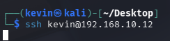

* [Insert screenshot of SSH from VM-T (trusted, allowed)]

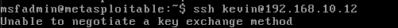

* [Insert screenshot of SSH rate-limit triggered after three quick attempts from VM-T]

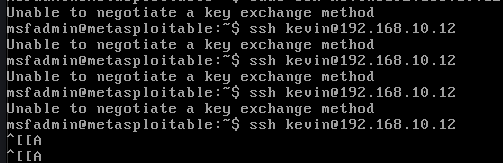

---

#### **Test I: HTTP Access and Flood Protection**

#### **Screenshots:**
* [Insert screenshot of `curl http://<VM-D-IP>:80/` from VM-A succeeding]

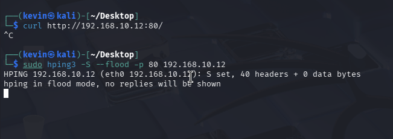

---

### **Analysis**

The ruleset follows a default-deny approach where everything is blocked unless explicitly allowed. This made the most sense for a server that only needs to serve HTTP and accept SSH from one trusted machine.

The base rules handle the obvious stuff first — loopback is always allowed, INVALID state packets are dropped immediately, and ESTABLISHED/RELATED connections are accepted early so that outbound replies like DNS responses aren't blocked on the way back in.

The anti-spoofing rules drop three categories of obviously fake traffic: packets claiming to be from the loopback range but not arriving on lo, packets using VM-D's own IP as their source, and anything coming from outside the 192.168.10.0/24 subnet. These all get logged with MALFORMED or ILLEGAL-IP/PORT prefixes depending on the type of violation.

Scan detection covers the classic nmap flag combinations — NULL, Xmas, SYN-FIN, and ACK-only on new connections. These flag combinations don't appear in legitimate traffic so they can be dropped and logged as SCAN-TCP without any risk of false positives.

The SYN flood chain runs before the service rules. Anything within the 5/s rate limit gets passed back to the INPUT chain for normal processing, while anything over the limit is logged as DOS-RATE-LIMIT and dropped. This way flood protection doesn't interfere with legitimate traffic getting through to HTTP and SSH.

SSH is locked down to VM-T only with a rate limit of 3 new connections per minute. HTTP allows any internal host but caps concurrent sessions at 20 per IP and new connections at 10/s. The DROP-GENERIC rule at the end catches anything that slipped through, which was mostly UDP traffic during testing.

**Log Analysis:**

The dmesg output confirmed everything worked as expected. SCAN-TCP showed up for the FIN, Xmas, and NULL scans. MALFORMED caught the spoofed loopback and own-IP packets. ILLEGAL-IP/PORT fired for the SSH attempt from VM-A. DOS-RATE-LIMIT appeared during the SYN and HTTP floods. DROP-GENERIC picked up the UDP test packets. Filtering by prefix with grep made it easy to isolate each category during testing.

## **Part 3: Web Application Intrusion Detection with Snort**

### **Task 1: Snort Configuration**

#### **Screenshots:**
* [Insert screenshot of `snort -V` output confirming version]

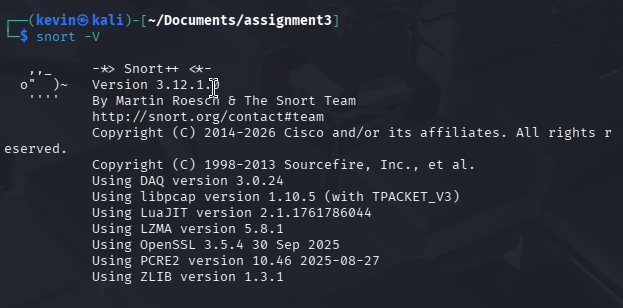

* [Insert screenshot of the modified `HOME_NET` and `EXTERNAL_NET` lines in `snort.lua`]

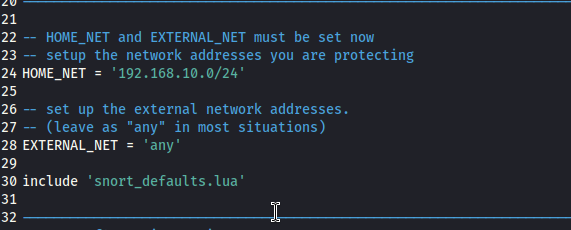

* [Insert screenshot of the `ips` block in `snort.lua` showing `local.rules` included]

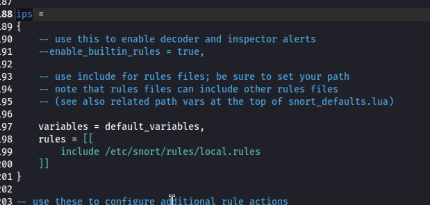

* [Insert screenshot of Snort startup output showing rules loaded and listening on eth0]

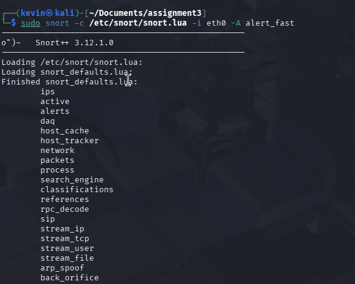

### **Task 2: Attack Detection**

#### **Baseline: No Attack**

#### **Screenshots:**
* [Insert screenshot of normal `curl` from VM-A with no Snort alerts on VM-D]

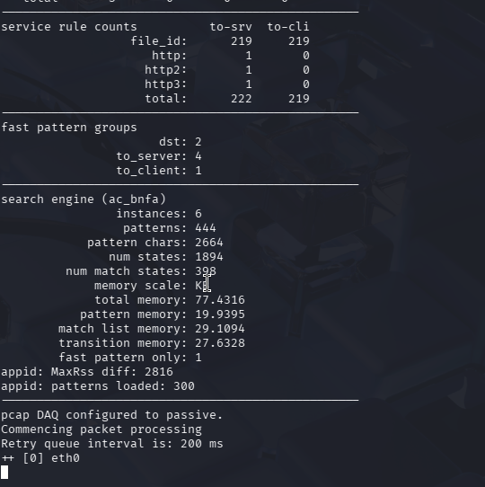

---

#### **Attack 1: SQL Injection (sid:200001)**

#### **Screenshots:**
* [Insert screenshot of the SQL injection payload submitted in DVWA on VM-A]

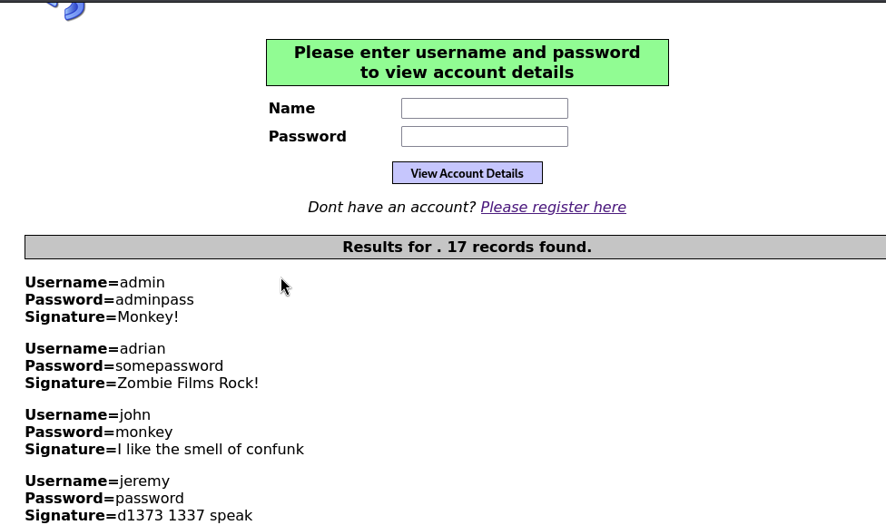

* [Insert screenshot of Snort `alert_fast` output showing the SQLi alert on VM-D]

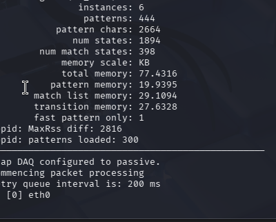

---

#### **Attack 2: XSS (sid:200002)**

#### **Screenshots:**
* [Insert screenshot of the XSS payload submitted on VM-A]

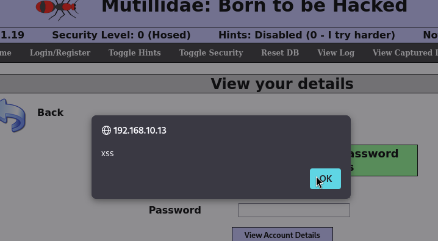

* [Insert screenshot of Snort `alert_fast` output showing the XSS alert on VM-D]

---

#### **Attack 3: LFI (sid:200003)**

#### **Screenshots:**
* [Insert screenshot of the LFI URL (`../../../../etc/passwd`) in the browser on VM-A]

* [Insert screenshot of Snort `alert_fast` output showing the LFI alert on VM-D]

---

#### **Attack 4: CSRF (sid:200004)**

#### **Screenshots:**
* [Insert screenshot of `csrf_attack.html` and the Python server serving it on VM-A]

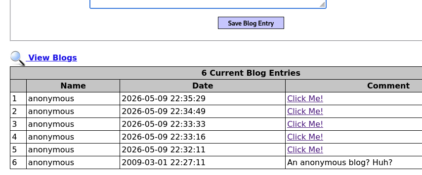

