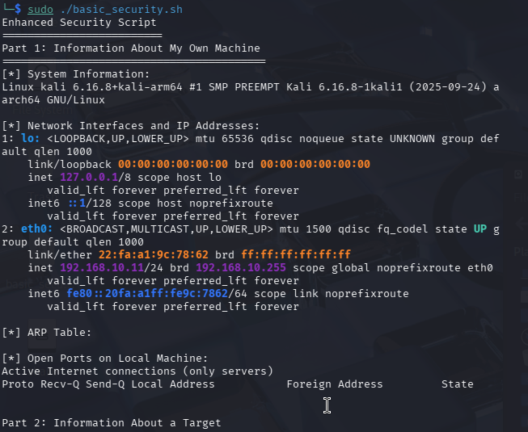
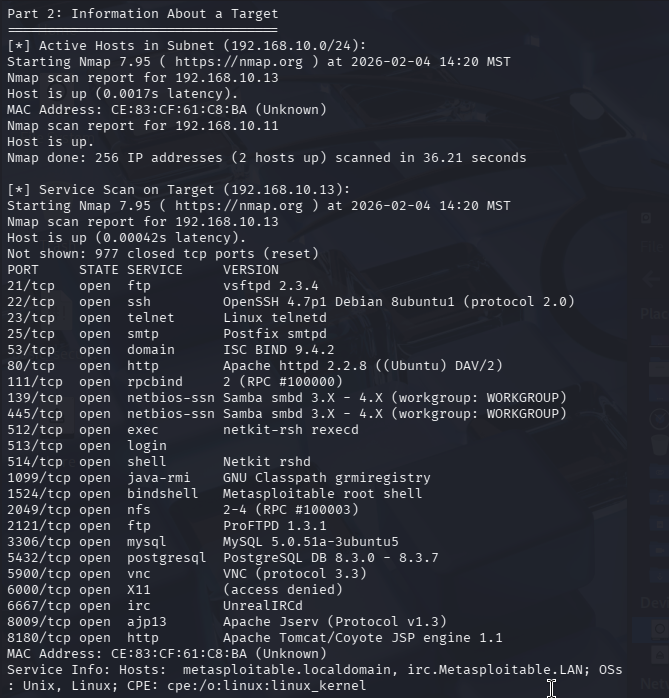

## **Lab 1 Report**
#### CSCI 5742: Cybersecurity Programming and Analytics, Spring 2026

 

**Name & Student ID**: Kevin Jacob, 109750578

---

## **Part 1: Linux and Bash**

### **Screenshots**:
 

[list of screenshots with descriptive titles and description]

### **Summary and Analysis**

##### 1. **Purpose of the Script**: The primary obejctive of the script is to provide an automated and efficient method of conduting a network reconnaissance and vulnerability assessment of a given network using a Linux environment. It is very useful for discovering hidden devices in a lab or a corporate environment without performing an intrusive full port scan on every possible IP, which allows you to discover any potential attackers in a network. Furthermore, the nmap function also identifies any open TCP/UDP ports that could be exploited. 
   
##### 2. **Challenges Faced**: The primary challenges I faced were during the setup of the testbed. It was difficult trying to get the correct version of everyting installed for my particular machine and also debug certain issues like the black screen, MS-2 Graphical issues, etc. While this is more about convenience, I also had some issues trying to get the shared clipboard feature to work on my VM. The script was quite long and I did not want to type it all out or make any mistakes in copying it over manually, so I had to enable a shared directory and write the script on my local machine and then copy it over to the VM. 
   
##### 3. **Extensions Added**: I did not add any extensions to my setup sicne everything worked as intended. 

---

## **Part 2: CTI Training with MITRE ATT&CK**

### Mapping (5 Behaviors)

#### **Behavior 1**
- **Behavior**:  
   The attackers combined a series of vulerabilities to gain access without a password. 
- **Mapping Process**:
  1. **Tactic**: Initial Access 
     - Objective: The goal is to bypass the exisitng authentication controls and gain access to the application. 
  2. **Technique**: Exploit public facing application (T1190) 
     - Sub-Technique: N/A
  3. **Justification**:  
      I chose this because this is the intial process of how the attacker gained their access into the target environment, essentially this is how the attack started. The behavior aligns with Initial Access because it is the first successful breach of the network, and all subsequent actions of the attack followed after this. It fits exploit public-facing application beacause the Ivanti VPN was an internet accessible gateway that was vulnerable due to unpatched software issues. 

#### **Behavior 2**
- **Behavior**: Modifying scripts to host web shells 
- **Mapping Process**:
1. **Tactic**: Persistence
     - Objective: They modified legitimate system files to ensure that the backdoor is always enabled when the service runs. 
  2. **Technique**: Server Software Component (T1505)
     - Sub-Technique: Web Shell (.003)
  3. **Justification**: I chose this becuase the modification of the system scripts allows the attacker to maintain their presence in the target regardless of patching the initial exploit. 
      

#### **Behavior 3**
- **Behavior**:  Embedding WARPWIRE JavaScript into the application's login page
- **Mapping Process**:
1. **Tactic**:  Credential Access
     - Objective: They wanted to harvest the usernames and passwords from legitimate users so they can have access to their accounts 
  2. **Technique**: Input capture (T1056)
     - Sub-Technique: Web Portal Capture (.003)
  3. **Justification**: I chose this because the attacker was able to steal the logins of users, which can pose a great threat since users tend to reuse their usernames and passwords for multiple applications. This could lead to security leaks across multiple services. The report specifies that WARPWIRE was embedded into a legitimate file on Ivanti to steal login deatils during the login process. 
      
#### **Behavior 4**
- **Behavior**: After the initial access, the attackers used stolen credentials to connect to internal Windows Systems.
- **Mapping Process**:
1. **Tactic**: Lateral movement
     - Objective: They wanted to use the compromised VPN application to move deeper into the company's network and access workstations, servers, etc.
  2. **Technique**: Remote Services (T1021)
     - Sub-Technique: Remote Desktop Protocol (.001)
  3. **Justification**: I chose this technique because the attack moved beyond just the target application and used that vulnerability to gain greater access to the company's private files and internal environment. The report specifically says that the windows sytems were accessed using RDP, which aligns perfectly with T1021.001. 
      
#### **Behavior 5**
- **Behavior**:  Modifying the integrity checker to exclude scanning of malicious files
- **Mapping Process**:
1. **Tactic**: Defense evasion
     - Objective:  The objective of this is to stay hidden within the target enviornment to ensure that their web shells and modified scripts remain undetected during routine security checks.
  2. **Technique**: Impair Defenses (T1562)
     - Sub-Technique: Disbale of Modify tools (.001)
  3. **Justification**:  I chose this becuse the attacker specifically target the security measures of the environment to prevent detection. This is a clear care of Defense evasion because the attack is specifically designed to keep their malicious content hidden. It also classifies impair defenses because teh attacker modified an internal srcurity tool (ICT) to create a blind spot in its routine checks. 
      

### **Summary and Analysis**

##### 1. **Key Adversarial Behaviors**: This was a high degree of technical sophistication with a focus on maintaining long term access to high value tagrets. THe most significant behavior was observed with the inital attack that chained together multiple zero-day vulnerabilities. Once they gained access to the target environment, the attackers took two courses of action to maintain their presence in the system. They displayed a high degree of defense evasion by altering the applications built-in ICT to make sure their malicious files were excluded from routine checks. Then they also made sure to use native tools in order to blend in with legitimate administrative traffic, making detection extremely difficult for security tools.
   
##### 2. **Challenges in Mapping Behaviors**: The main issue I faced during the mapping process was tactic ambiguity. It was very difficult to differentiate between two similar tactics for a given behavior and narrow it down to one. Furthermore, the sheer number of tactocs, techniques, sub-techniques was very overwhelming it took a while to familiarize myself with them so I could even have a general idea of what category a behavior would belong to. I was able to resolve these issues by cross referencing what I found in the report with the descriptions on the MITRE website. 
   
##### 3. **Insights and Lessons Learned**: Mapping these behaviors has given me a much better understanding of all the various techniques and tactics. This process has also taught me how attackers operate and what measures they take to gain and maintain control. Being able to assign a certain attack/behavior to a certain technique would help a defender take the most effective action in order to resolve the vulernability. 

