## **Lab 2 Report**
##### CSCI 5742: Cybersecurity Programming and Analytics, Spring 2026

 

**Name & Student ID**: Kevin Jacob, 109750578

---

## **Part 1: Comprehensive Nmap Scanning**

### **Task 1: Basic Network Discovery (Ping Scan)**

#### **Screenshot**:  

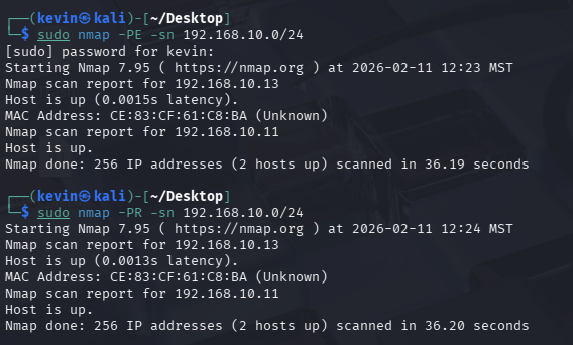

#### **Active Hosts and IP Addresses**:  There are 2 hosts up and their IP addresses are 192.168.10.13 and 192.168.10.11. A ping scan asks the network whether a certain IP address is active, whereas an ARP scan basically asks everyone on the network who has that particular IP. Since devices must answer that to talk on the network, it is much harder to hide from the ARP scan than the ping scan.
---

### **Task 2: SYN Scan (Stealth Scan)**

#### **Screenshot**:  
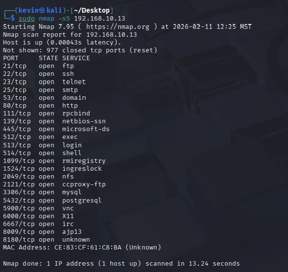

#### **Open Ports Detected**:  21,22,23,25,53,80,111,139,445,512,513,514,1099,1524,2049,2121,3306,5432,5900,6000,6667,8009,8180

#### **Explanation of SYN Scan's Stealth Advantage**:  This scan performs a half open connection where the scanner sends a SYN packet, and if the port is open then the target sends SYN-ACK. However, instead of sending the final ACK the scanner sends a reset which means the connection is never fully established and the target application does not log the connection which makes it harder to detect and therefore "stealthy.
---

### **Task 3: TCP Connect Scan**

#### **Screenshot**:  
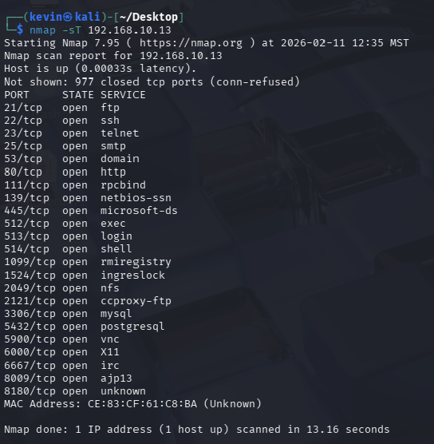
#### **Comparison with SYN Scan**:  TCP scans complete a three way handshake. This scan actually sends the final ACK packet instead of sending the reset like the SYN scan. This is much noisier than SYN scan because the application logs the connection. 
---

### **Task 4: Service Detection**

#### **Screenshot**:  
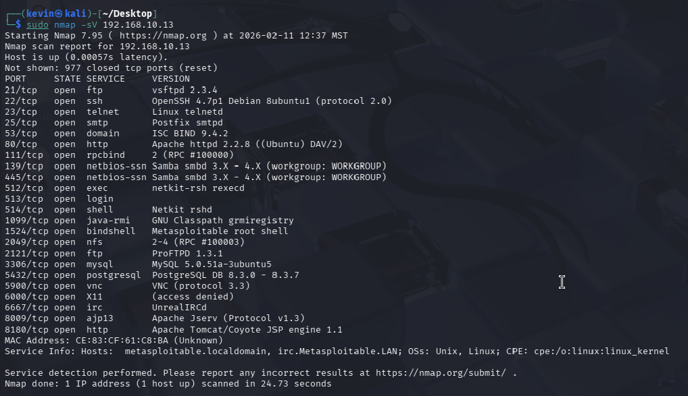

#### **Detected Services and Versions**:  ftp, ssh, telenet, stmp, domain, http, login, shell, etc. The versions are included in the screenshot. 

---

### **Task 5: OS Detection**

#### **Screenshot**:  
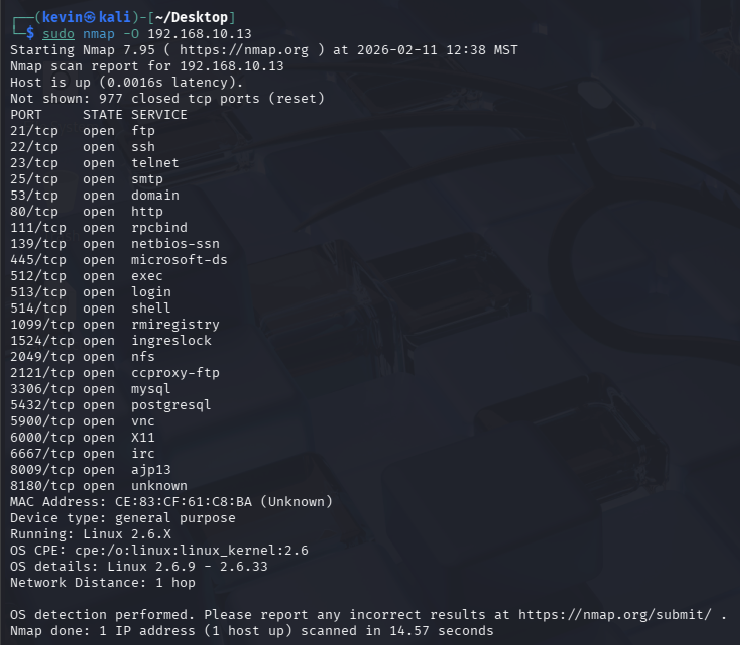
#### **Detected OS and Accuracy**:  The detected OS is linux version 2.6.X ranging anywhere from 2.6.9-2.6.33. And this is accurate since the Target VM version is 2.6.24
---

### **Task 6: Timing Profiles**

#### **Screenshot for T1 (Paranoid Mode)**:  
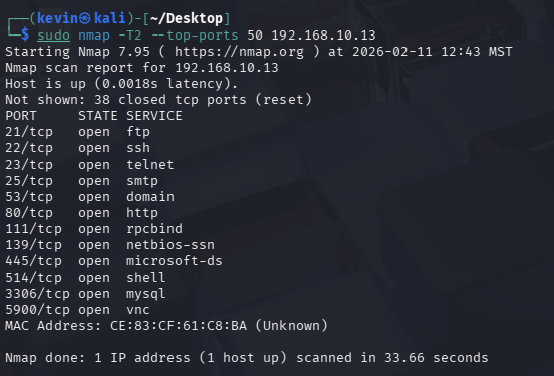
#### **Screenshot for T3 (Normal Mode)**:  
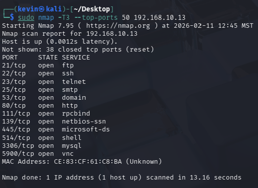
#### **Analysis of Timing Profiles**:  The stealthy timing profile took 20 seconds longer to execute and delivered the same results. 
---

### **Task 7: UDP Scan**

#### **Screenshot**:  
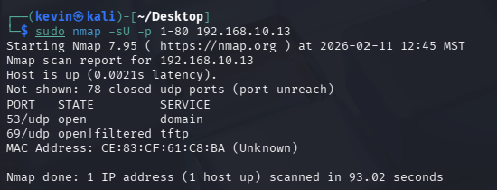
#### **Open UDP Ports**:  Ports 53 and 69 are both listed as open UDP ports. 

---

### **Task 8: Vulnerability Scan**

#### **8.1 General Vulnerability Scan (`--script vuln`)**
##### **Screenshot**:  
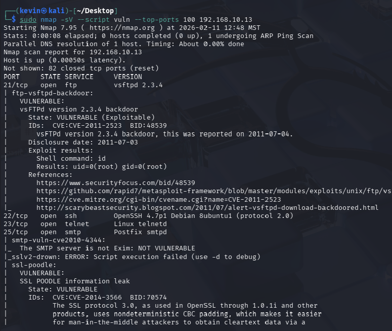
##### **Summary**:  The vulnerability scan shoes which services have an exploitable backdoor. There are services such as ftp-vsftpd, ssl-poodle that are vulnerable along with other services that are also listed as highly vulnerable. 
##### **Answer to Questions**:  The 2 most vulnerable backdoors are the backdoor in vsftpd and Samba. The vsftpd is very critical becuase it allowsa immediate remote root access without the valid credentials. Samba is also a critical vulnerability because it allows remote code execution through the use of a malicious packet.  
---
#### **8.2 Vulners Vulnerability Scan (`--script vulners`)**
##### **Screenshot**:  
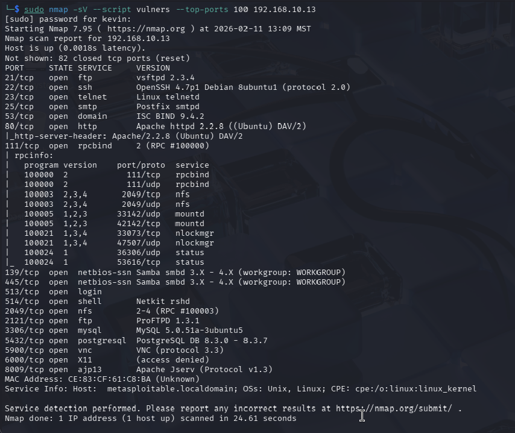
##### **Summary**: My vulners scan only returned the open ports and their versions. Since I am using the host-only network, the terminal is not able to do a passive scan on the internet to find bugs for that specific service. Here are the top 3 CVEs that are tied to the open ports:

##### **Answer to Questions**:  
1. CVE-2007-2447: This is dirrectly related to teh Samba vulnerability where an attacker can execute shell commands remotely 
2. CVE-2011-2523: The vsftpd backdoor has a backdoor that allows an attacker to login without the authorized credentials. 
3. CVE-2004-2687: The distccd port allows remote command execution without authentication. 

#### Vuln and Vulners differ in the sense that vulners performs a database lookup and goes online to check for a list of bugs of that version. Vuln performs active testing, where it sends actual malicious packets to the target to see if it breaks or reponds incorrectly. 
---

#### **8.3 SMB Checks (139/445)**
##### **Screenshot**:  
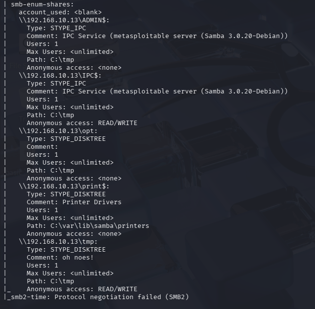
##### **Summary**:  This script revelated that the target is using an outdated version of Samba. It also discovered that anonymous access is allowed on certain directions such as the tmp share. 
##### **Answer to Questions**:  The scan confirmed that the host is Linux due to the Debian tag. Yes the ICP, tmp, ADMIN, opt, and print shares were listed with their permissions. This is risky because tmpt allows anonymous read write access. The IPC share allows attackers to query the system for information. 
---

#### **8.4 FTP Checks (21)**
##### **Screenshot**:  
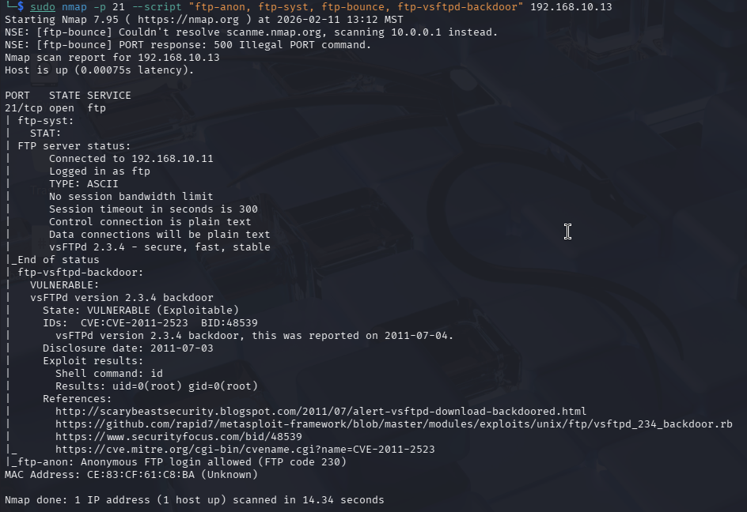
##### **Summary**: The scan on port 21 showed FTP service as vsFTPd 2.3.4 and the scan results were very critical. The scan shows that there is a backdoor detected and this was detected by executing the id command. 
##### **Answer to Questions**:   Yes anonymous login was allowed, and this is proved by the scan which explicitly states "Ananoymous FTP login allowed (FTP code 230)". The banner reveals that the software version is vsFTPd 2.3.4. This is important because diclosing the xact version of the software allows an attacker to search for specific exploits. 
---

#### **8.5 SSH Configuration Checks (22)**
##### **Screenshot**:  
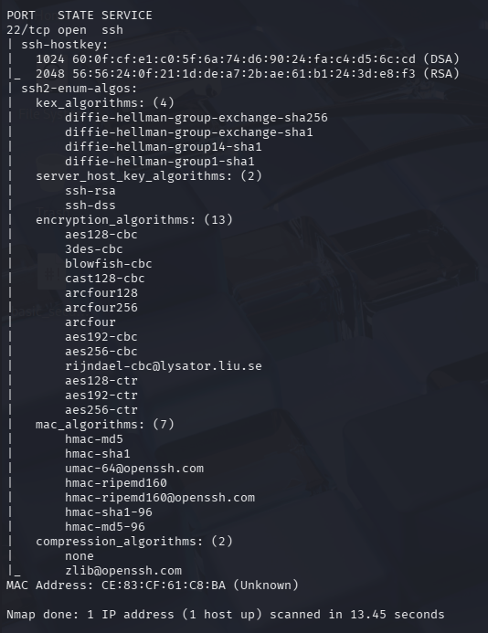
##### **Summary**:  The scan on port 22 listed the supported algorithms for the SSH service. This scan showed that the server is configured to support numerous obsolete algorithms. Specifically supports ciphers that are considered cryptographically weak, and also supports weak hashing algorithsm for message authentication. 
##### **Answer to Questions**:   The arcfour cipher indicates a weak configuration since it is known to be weak compared to modern ciphers. Supporting older algorithms enables downgrade attack. So even if a user has a modern client capable of a strong encryption, an attacker can perform a man in the middle attack to force both the server and the client to agree upon a weaker algorithm. 
---

#### **8.6 Web Server Enumeration (80)**
##### **Screenshot**:  
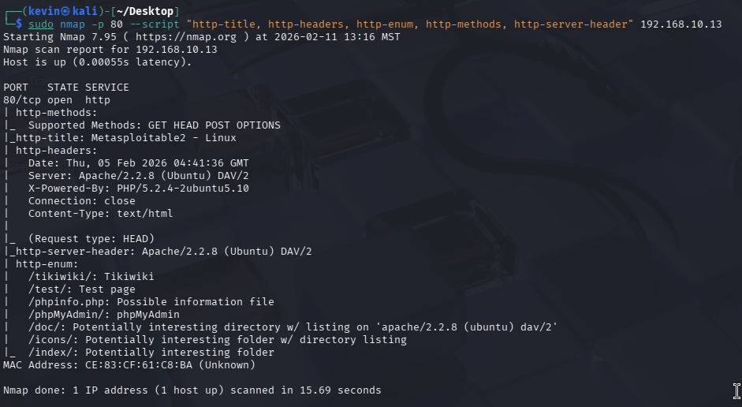
##### **Summary**: The scan of port 80 successfully enumerated the web server, and it identified the server software as Apache 2.2.9 running PHP 5.2.4. 
##### **Answer to Questions**: The script found several critical paths such as phpMyAdmin, phpinfo, tikiwiki, and directories such as doc, icons, and index which have directory listing enabled. The allowed methods are GET, HEAD, POST, and OPTIONS. This is important because standard methods like OPTIONS is useful for attackers because it lets the server know what else they can do. For instance, if methods like PUT or DELETE were enabled then attackers could upload malicious files or delete content directly. The header that contains the Apache/2.2.8 is a critical leak because this tells the attacker exactly which version is running which allows them to find a specific exploit for that version. 

---

#### **8.7 HTTP Auth / Default Accounts (80)**
##### **Screenshot**:
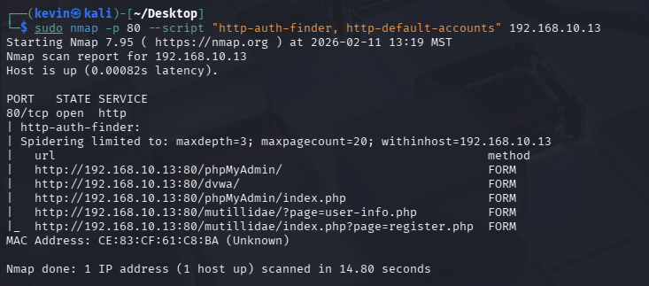
##### **Summary**: This scan of port 80 identified multiple authentication endpoints that could likely be accessed using default credentials. 
##### **Answer to Questions**:  Yes it shows endpoints at phpMyAdmin, dwva, and mutillidae. This is critical because it shows exactly where the attacker needs to direct their attack or try default credentials. Default credentials are risky because they were known to the public, and attackers and attackers normally have an automated list of default passwords that they can use to easily bypass these endpoints. Even if a servce is internal, it could be at risk due to employee liabilty, a simple mistake or intentional leak from an employee can put the entire system at risk. 

---

### **Task 9: Banner Grabbing**

#### **Screenshot**:  
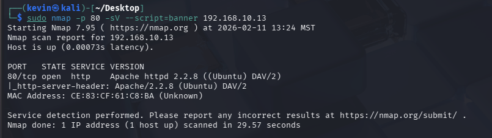
#### **Extracted Banner**: The banner script retrieved the http header and revealed that the target is running Apache httpd 2.2.8 with DAV/2. This is significant because this banner leaks the exactly software version and the underlying OS that is being used. Using this information, an attacker owuld be able to check for known exploits. This particular version is open to XSS and DDoS attacks. The DAV/2 tag indicates that WebDAV is enabled which could prove to be a vulnerability which allows attackers to upload or modify files remotely. 

---

### **Part 1 Summary and Analysis**
This lab performed many comprehensive Nmap scans on the target server using various different tags and scanning methods. Initially we started with just a basic scan which confirmed that the host was active. Then we dove into deeper scans to sniff out services, as well as detecting the OS. This lab also demonstrated trade offs between different scanning methods. For instance, ARP scans proved to be the fastest and most reliable for scanning a local network, however, the SYN scan operates in a much stealthier manner. One of my key challenges during this lab was the installation of python. I had some trouble switching my network mode back so that I could successfully install Python and pycharm. Debugging that was a nightmare and I kept facing inconsistencies that did not make sense but were fixed with just a reboot of the VM. The key take away from this lab is the critical importance of managing your software versions and abstraction of your network server. Allowing information such as version number is what allows attackers to easily find specialized exploits. Allowing outdated software to remain on your system also enables attackers to find more vulnerabilities. 

---

## **Part 2: Python Port Scanner Development**

### **Task 1: TCP Scanner**

#### **Screenshot**:  
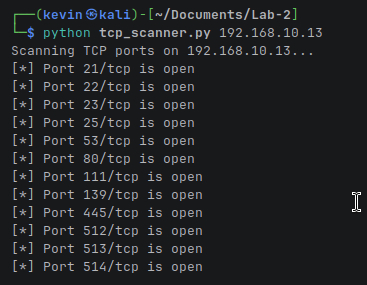

#### **Answers to Questions**:  
1. AF_INET specifies the IPv4 address whereas SOCK_STREAM specifies that we want a TCP connection.
2. settimeout puts a 1 second time limit on the connection attempt to prevent the script from getting stuck because the port was closed/filtered. 
3. ConnectionRefusedError might occur if the port is closed, socket.timeout error may occur if the port is filtered and there is no response within 1 second.
4. If it weren't for exception handling the script would either get caught in an infinite loop or crash the moment it was met with a closed/filtered port. Handling exceptions allows the script to run past any closed ports and continue to check other ports. 
5. Using len(sys.argv) ensures that the user actually provided the required amount of arguments, specifically the target IP address. 
6. If the script is not given any arguments it will exit safety with an error code. 
7. We loop through ports 1-1024 because ports within that range are standard practice and well known ports for most critical services. 
8. Using this script does not require sudo. Establishing a TCP connection uses standard prvilieges that is allowed for any user and does not craft any raw packets that would require escalted permissions. 
---

### **Task 2: UDP DNS Port Scanner**

#### **Screenshot**:  
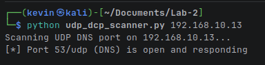

#### **Answers to Questions**:  
1. SOCK_DGRAM createa a UDP socket. 
2. The timeout prevents an infinite loop by setting a 2 second time limit on a connection attempt. 
3. The query variable contains a valid DNS request which forces the DNS server to reply. Since there is no handshake to initiate on a UDP, this is the best way to make the service understand what we are sending. 
4. recvfrom(512) read 512 bytes of incoming data. 512 is the tradiational maximum packet size for a standard DNS response. 
5. Timeout exception is likely on UDP because packets are often dropping without an error message, and if the packet is dropped the script just continues to wait until it gets a response that it will never actually get. 
6. Closing the socket ensures that the system resources are released properly even if an error occurs during the scan. 
7. sys.argv captures the target IP address provided by the user in the command line. 
8. Input validation is important because it prevents the script from crashing if the user forgets to provide a valid IP address. 
9. No sending UDP datagrams can be done using standard user permissions and does not require escalated privilege. 
---

### **Part 2 Summary and Analysis**
This section covered the development of custom network scannig tools using Python's socket library which allows you to replicate the functionality of the nmap command. I developed a TCP scanner which establishes a full 3-way handshake with the target, and I also implemented a UDP DNS Scanner. The TCP scanner used SOCK_STREAM and relied on the OS's handshake mechanism to confirm availability which is far more reliable than the connectionless nature of the UDP connection. UDP used SOCK_DGRAM which required its own mechanism to verify the service. The major challenge I faced during this section was debugging some network issues I had when I had changed from the Host-Shared network and switching back into it. The script was stuck and was not sending any error messages at all so I was very confused what had gone wrong, but then I noticed that the IP address I used to reactivate the connection was incorrect and that seemed to remedy the issue. Implementing this code myself gave me a very good insight into how these protocols differ and having to comment through the code had me think about how each component worked. 

---

## **Part 3: Wireshark Analysis of Scanning Traffic**

### **Task 1: Setup Wireshark for Packet Capture**

#### **Screenshot**:  
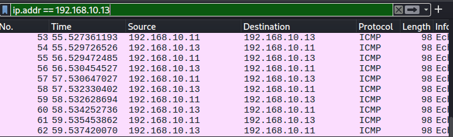

---

### **Task 2: Analyze SYN Scan Traffic**

#### **Screenshot (SYN Packets)**:  
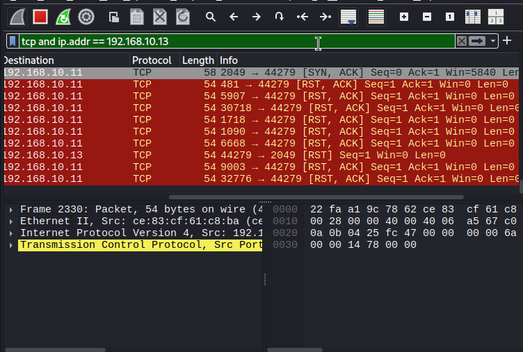
#### **Screenshot (SYN-ACK and RST Responses)**:  

#### **Answers to Questions**:  
1. Open ports respond with a [SYN, ACK] packet on the wireshark, whereas a closed port responds with a [RST, ACK] packet.  
2. A SYN scan uses a half open handshake where it sends a request, the target sends a [SYN, ACK] packet but then the scanner just sends a reset instead of the final ACK which prevents the application from logging the interaction, hence making it stealthy. 
---

### **Task 3: Inspect UDP DNS Scanning Traffic**

#### **Screenshot (UDP Packets)**:  
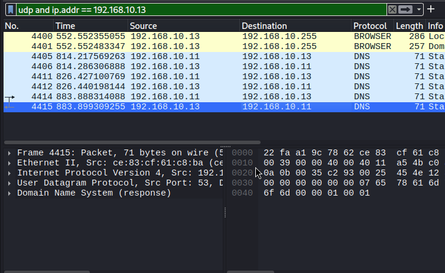
#### **Screenshot (DNS Responses/ICMP Errors)**:  
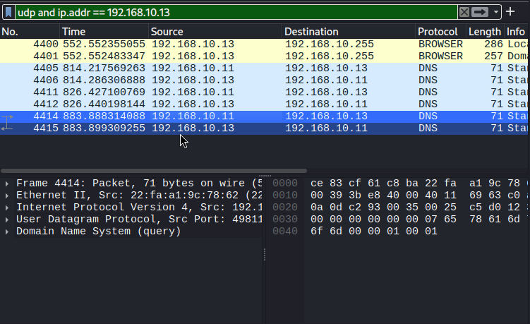
#### **Answers to Questions**:  
This was harder to notice than the syn scan since it was very clear when a port was open or closed. Here I had to go into the responses and read the message to know when a packet had a destination unreachable error. 
---
### **Task 4: Inspect HTTP Traffic**

#### **Screenshot 1 (POST capture)**:  
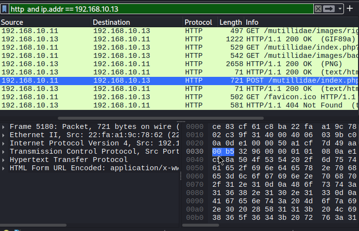
#### **Screenshot 2 (TCP Stream capture)**:  
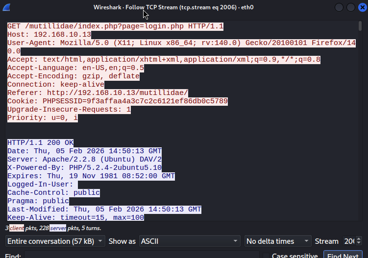
#### **Answers to Questions**:  
1. HTTP does not use any encryption unlike HTTPS so there are no algorithms to scramble the data. A sniffer like wireshark can read the payload field of the HTTP requests. 
2. HTTPS uses an encryption algorithm and the payload is encrypted using a session key. A sniffer can still see the connection but the contents of the packet and the payload are shown as random characters that cannot be decrypted without the key.
---

### **Part 3 Summary and Analysis**
In this section of the lab I learned to utilize wireshark to visualize the network traffic generated by scans that we used in part 1 and 2. Capturing the SYN scans showed the stealth mechanism of the SYN scan. Additionally, the analysis of the UDP traffic showed its true nature where closed ports could only be identified by the ICMP Port Unreachable error messages that you can only see upon further inspection of the packet. The primary challenge I faced during this section was combing through all the packets and make sense of what I was looking at. Being able to apply the filters to wireshark helped a lot and let me hone in on the specific type of packet I was analyzing for each section. I got a lot of insight into HTTP requests, and how unsecure paylods are when using HTTP rather than HTTPS. This shows why HTTPS is necessary for everyday use and mandatory for network defense. Passive sniffers are very easy to use and anyone would be able to intercept network traffic and perform malicious acts. 
---

## **Part 4: Web Scanning with Nikto (Extra Credit)**

### **Task 1: Nikto Scan**

#### **Screenshot**:  
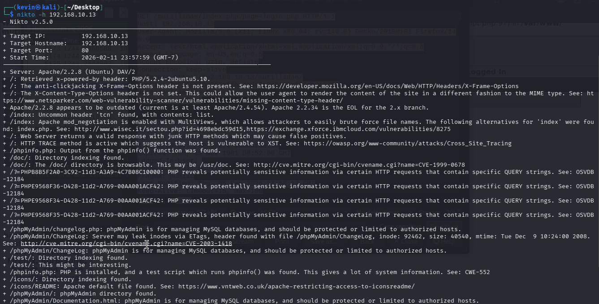
#### **Significance of Output**:  
1. The scan reveals that the target is running on Apache/2.2.8 and also goes on to reveal information about specific directories. For instance, the doc and icons directories have been marked with "Directory Indexing found". the phpMyAdmin shows the presence of a MySQL database tool. Exposed directories are concerning because anyone could access and browse the contents of the files over the web. The software is also very outdated, which as we learned before is subject to an attack that lowers the version and security of the target. Furthermore, highlighting the specific version of the software leaves the target vulernable to specific known exploits for that software version. 
2. Exp
---

### **Task 2: Nikto vs. Nmap HTTP Scans**

#### **Screenshot (Nmap HTTP Script)**:  
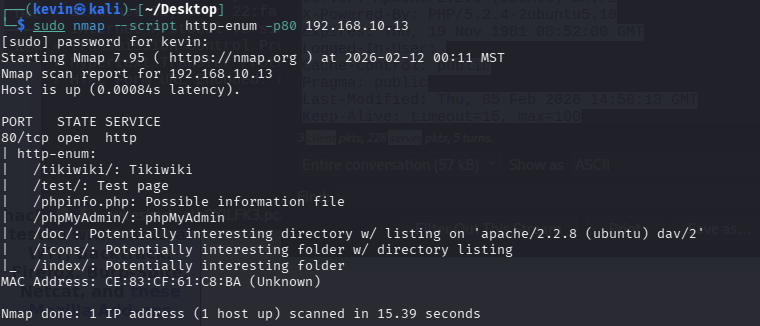
#### **Comparison Summary**:  
Immediately it is apparent that this HTTP script is much more readable but much less comprehesnive. The nikto script provided a deeper analysis of the web directories whereas the HTTP script provides just basic names of directories, software version, and services. Nikto was also able to specifically highlight security headers and vulnerabilities. However, both serve their own distinct purpose for reconnaissance. Nmap gives you a broad analysis of the netowrk and identifies any open web port, and once you have located the open port, nikto will give you a deep application layer analysis for the target's vulnerabilities.         
---

### **Part 4 Summary and Analysis**
While the rest of the lab focused on broad network reconnaissance using various scanning methods, part 4 uses Nikto, a specialized application layer vulnerability scanning tool. The nikto scan specifically outlines that the target is using outdated software and goes on to give the version numbers as well. Nikto was also able to identify any missing hTTP security headers and notes which HTTP methods pose a threat to the safety of the target. Furthermore, nikto was able to iterate through the web structure and locate high risk endpoints and highlight what is wrong with them. Ultimately, both these methods should be used in tandem for network reconnaissance. Intially, you should start with a Nmap scan of the network to get a broad idea of what is going on in the network and to locate any open ports that could be exploited. Then once you have located the open port, you should move on to a Nikto scan which will do an application layer scan of the target and provide you with further vulnerabilities that you could exploit. 
