## **Lab 3 Report**
##### CSCI 5742: Cybersecurity Programming and Analytics, Spring 2026

**Name & Student ID**: Kevin Jacob, 109750578

## **Part 1: Developing a Network Sniffer with Python**

### **Task 1: Capturing Raw Packets**
**Goal:** Capture raw Ethernet frames using `PF_PACKET` + `SOCK_RAW`.

#### **Screenshot**:
*(Insert screenshot of terminal output showing raw bytes from `recvfrom()` while traffic is generated.)*
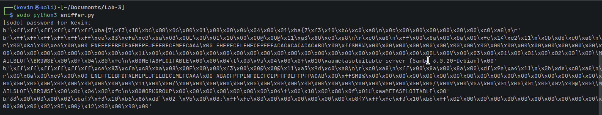

#### **Answer to Questions**:
- **Explain why we need `sudo` to run the program:**
  *(Provide answer here.)*

  Most of the functions we are using with socket require root access in order to execute. For example, SOCK_RAW requires root access in order to create a raw packet. PF_PACKET requires access to the Data Link layer in order to read the ethernet frames. 

---

### **Task 2: Dissecting Ethernet Frames**
**Goal:** Parse destination/source MAC addresses and EtherType from the Ethernet header.

#### **Screenshot**:
*(Insert screenshot showing parsed MAC addresses and EtherType, during active traffic.)*
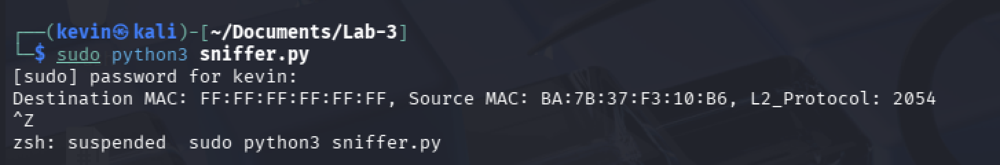

#### **Answer to Questions**:
1. **What does the `!6s6sH` format in `struct.unpack` signify?**  
   *(Provide answer here.)*  
   This tells the script how to interpret the result. The ! implies that the network data is in big-endian format. Then the 6s signifies that there is a 6 byte string, this is used twice because the first 6 byte string is for the destination address and the second is for the source address. Finally, the H signifies the EtherType. 

   *(Optional but recommended: briefly explain how you formatted MAC addresses.)*
   The addresses are dissected using the dissect function then strung back together using a generic join method by joining together every hexademical pair. 

---

### **Task 3: Decoding IPv4 Headers**
**Goal:** Parse IPv4 header fields (source/destination IP, protocol, header length/IHL).

#### **Screenshot**:
*(Insert screenshot showing parsed IPv4 fields during Nmap/ping traffic.)*
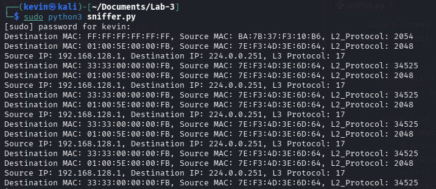

#### **Answer to Questions**:
1. **What does the `!BBHHHBBH4s4s` format in `struct.unpack` represent?**  
   *(Provide answer here.)*  
   The ! signifies the big-endian format of the network data. The BB represents two unsigned chars, the H represents one unsigned short, the HH represents two byte shorts, BB represets two more chars, the H is another 2 byte short, and the 4s4s represents two 4 byte strings.
2. **What does the `0x0800` value signify in Ethernet protocol?**  
   *(Provide answer here.)*
   The 0x0800 represents a IPv4 packet in the payload. This tells the sniffer that the data should be parsed using IPv4 decoding logic. 
---

### **Task 4: Parsing Transport Layers (TCP/UDP)**
**Goal:** Parse TCP and UDP headers, print ports, and for TCP print header length + flags.

#### **Screenshot**:
*(Insert screenshot showing TCP and UDP outputs, including ports and TCP flags.)*
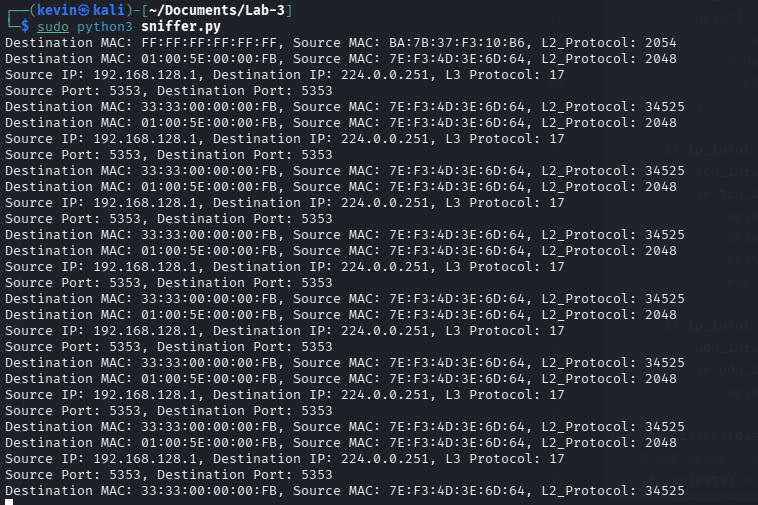

#### **Answer to Questions**:
1. **How is the TCP header length calculated from the offset field?**  
   *(Provide answer here.)*  
   The value of the header is multiplied by 4 to obtain the offset, then we can extract the payload. 
2. **Why is the UDP header simpler than TCP?**  
   *(Provide answer here.)*  
   UCD header is simpler because it is a connectionless protocol whereas the TCP has complex tracking mechanisms. 
3. **What are the differences between TCP and UDP in terms of packet structure and reliability?**  
   *(Provide answer here.)*
   TCP has a variable length header whereas UDP has a fixed length header of 8 bytes. TCP is also connection oriented and reliable, it ensures data delivery through a 3 way handshake. UDP is unreliable and sends data without establishing a connection and does not provide any verification that the data has been received. 
---

### **Task 5: Dissecting ICMP Packets**
**Goal:** Parse ICMP type, code, checksum and show output during ping traffic.

#### **Screenshot**:
*(Insert screenshot showing ICMP type/code for echo request and echo reply packets.)*
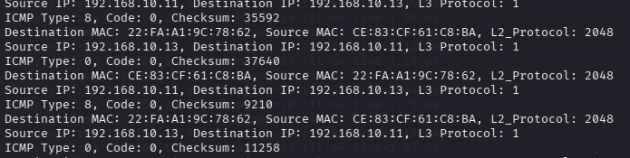

#### **Answer to Questions**:
1. **What are common types of ICMP messages, and how are they used?**  
   *(Provide answer here.)*  
   Some common types of ICMP messages are echo requests which is sent by the ping command to check connectivity. Echo reply is sent in response to echo response. Destination unreachable means that the host or network is unreachable. 

2. **Why is the checksum field critical in ICMP packets?**  
   *(Provide answer here.)*  
   The checksum is a critical error checking mechanism that ensures the integrity of the ICMP header. 
3. **How can analyzing ICMP traffic help in network diagnostics and security?**  
   *(Provide answer here.)*
   Analyzing ICMP traffic allows you to check connectivity between devices, so essentially you can diagnose if a specific host or network is down. 

---

### **Task 6: Parsing HTTP Packets**
**Goal:** Identify HTTP traffic (port 80), decode and print a portion of the payload.

#### **Screenshot**:
*(Insert screenshot showing decoded HTTP request/response text; e.g., GET line or HTTP headers.)*
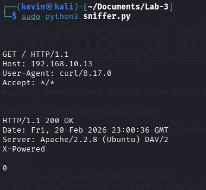
#### **Answer to Questions**:
1. **What does the decoded payload reveal about the HTTP request/response structure?**  
   *(Provide answer here.)*  
   The payload reveals that HTTP is a text based protocol that works in a request response format. The requests shows the method and the resource path. 
2. **Identify any HTTP request methods or response status codes captured. What do they indicate?**  
   *(Provide answer here.)*
   The captured traffic shows a GET request which is used by the client to request a resource from the server. The server then responded with a 200 OK message, which indicates the request was sucessful. 

---

### **Task 7: Parsing DNS Packets (Header Only)**
**Goal:** Parse DNS header fields (transaction ID, flags, counts) from UDP/53 traffic.

#### **Screenshot**:
*(Insert screenshot showing DNS header output for at least one query and one response.)*
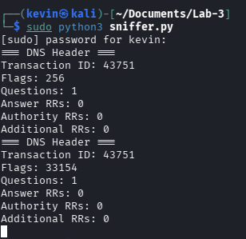
#### **Answer to Questions**:
1. **How does the transaction ID help match DNS queries to responses?**  
   *(Provide answer here.)*  
   The query and the response both share the same transaction ID, 43571. This is how the client knows which response to give based on the corresponding original query. 
2. **What do DNS flags broadly indicate about a message?**  
   *(Provide answer here.)*  
   The flags indicatethe nature of the DNS message. In the output of my sniffer the first packet has a flag value of 256, which means that it is a standard query with recursion desired. The second packet has a flag of 33154, which means that it is a response with recursion. Together these flags tell us that the first packet is a query and it got its desired response. 
3. **Why might DNS use TCP instead of UDP in some cases?**  
   *(Provide answer here.)*
   DNS uses UDP instead of TCP because it much faster and computationally lighter. DNS messages are small enough to fit into one packet but in cases of larger payloads, DNS might use TCP. 
---

### **Part 1 Summary and Analysis**
   *(Write 200–300 words covering: traffic patterns you observed, key learning points, implementation challenges, and how you resolved them.)* 
   
   Part 1 primarly focused on building a network sniffer from scratch using Python's raw socket library. Using this library we were able to capture and dissect packets layer by layer across multiple protcols such as Ipv4, TCP, UDP, ICMP, HTTP, and DNS. The traffic was generated from the Defense VM onto the target VM, while the sniffer was running on the attack VM. A key learning point for me was realizing taht each layer must be parsed in order. Firstly, the ethernet layer is parsed, then the IPv4 layer, so on and so on. The main challenege I had with this lab was getting the sniffer to print the outputs. For the longest time my sniffer was silent and it was not picking up any of the traffic I generated on the defense VM. I eventually worked around this by sheer luck when the sniffer randomly picking up the traffic after multiple restart attempts on the VM. Another challenge, was formatting the code correctly and making sure I was parsing the layers correctly.
   
---

## **Part 2: Sniffing with Scapy**

### **Task 1: Capturing Packets with Scapy (TCP-only warmup)**
**Goal:** Use Scapy to sniff TCP traffic and print MAC/IP/port information.

#### **Screenshot**:
*(Insert screenshot showing Scapy output for TCP packets, including MAC/IP/ports.)*
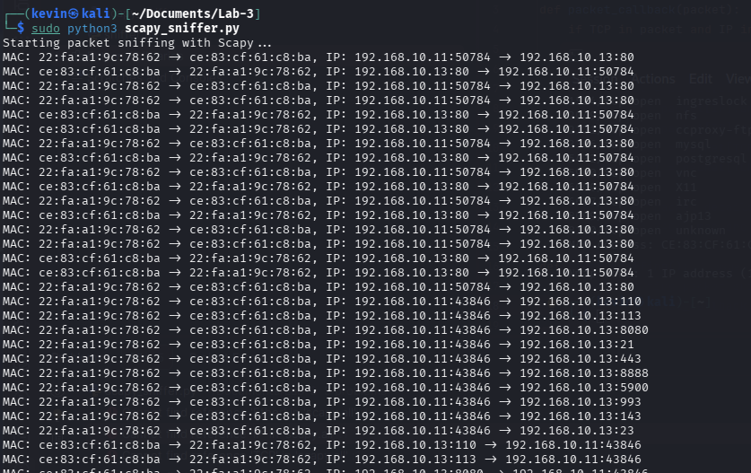

#### **Answer to Questions**:
*(If your lab handout includes questions here, answer them. Otherwise briefly describe what traffic you generated and what you observed.)*
I see the mac addresses of the source and destination and an arrow indicating which way the packets are flowing. The same with the IP packets. 
---

### **Task 2: Parsing Ethernet and IP Layers**
**Goal:** Extract Ethernet and IP fields using Scapy layers and print them.

#### **Screenshot**:
*(Insert screenshot showing parsed Ethernet + IP fields from Scapy.)*

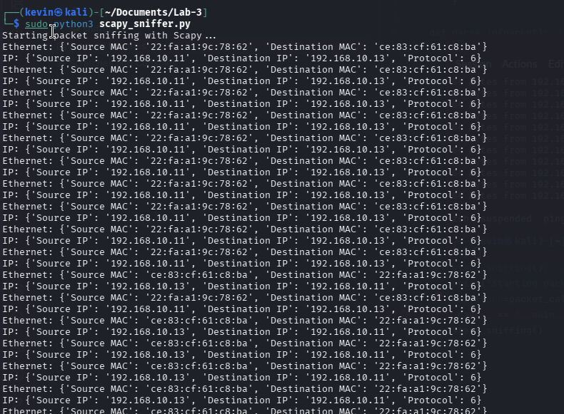

#### **Answer to Questions**:
1. **How does Scapy simplify the extraction of Ethernet and IP layer fields?**  
   *(Provide answer here.)*  
   Scapy removes the need to unpack the raw bytes using struct.unpack. Instead it automatically parses each layer and lets you access field directly which makes it much cleaner and easier to read. 
2. **What is the `packet[IP].proto` field, and how does it relate to TCP/UDP?**  
   *(Provide answer here.)*
   This field is a number in the ID header that idenfities which protocol is carried in the payload. 6 indicates TCP, 17 indicates UDP, 1 indicates ICMP. 

---

### **Task 3: Parsing Transport Layers (TCP/UDP)**
**Goal:** Parse TCP flags + ports and UDP ports + length.

#### **Screenshot**:
*(Insert screenshot showing TCP flags output and at least one UDP packet output.)*
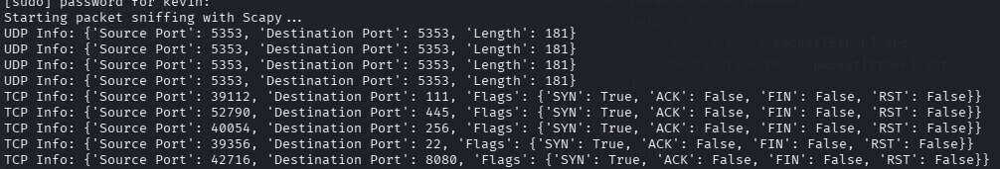

#### **Answer to Questions**:
1. **How do TCP flags help in identifying packet behavior?**  
   *(Provide answer here.)*  
   TCP flags indicate the purpose nad state of a packet. For example, a SYN flag indicates taht a connection is being initaited, an ACK flag means that adata has been received, a FIN flag signals that the connection is being closed. Using these flags, you can pinpoint where a packet is within the TCP lifecycle. 
2. **Why is the length field in UDP important, and how does it differ from TCP’s behavior?**  
   *(Provide answer here.)*  
   The length in the UDP packet specifies the total size of the UDF header and its payload in bytes. This is important because UDP has no method to track data boundaries or ordering. TCP does not need a dedicated length field because it uses numbers and flags to track exactly how much data has been sent and received. 
3. **What are the primary differences between TCP and UDP in terms of reliability and usage?**  
   *(Provide answer here.)*  
   TCP uses a connection oriented protocol that guarantees reliable ordered delivery of data using a 3 way handshake. UDP is connectionless and does not guarantee delivery or ordering which makes it very lightweight and computationally faster, however it lacks reliability unlike UDP. 
4. **Explain the logic behind `'ACK': flags & 0x10 != 0` (or similar) for testing whether a flag is set.**  
   *(Provide answer here.)*
   0x10 contains a 1 in the bit position for the ACK flag and doing an & operation between the two. If the result is non-zero then the bit was set which means the ACK flag is active.

---

### **Task 4: Parsing ICMP Packets**
**Goal:** Parse ICMP type/code/checksum using Scapy.

#### **Screenshot**:
*(Insert screenshot showing ICMP output from Scapy during ping traffic.)*

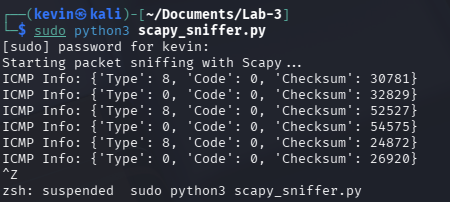

#### **Answer to Questions**:
1. **What is the purpose of ICMP packets in networking?**  
   *(Provide answer here.)*  
   ICMP packets is used to send error mesages and diagnostic information between network devices. For example, the ping command checks connectivity between devices. 
2. **How are ICMP type and code fields used to differentiate packet types?**  
   *(Provide answer here.)*  
   The type field indicates the general category of the packet (echo request, echo reply), and the code field is used to provide a more specific packet type (host unreachable, port unreachable, network unreachable). 
3. **What role does the checksum play in ICMP packets?**  
   *(Provide answer here.)*
   The checksum is an error detection mechanism that ensures the integrity of the ICMP header and data. The send computes the checksum from the packet contents before sending it and then the receiver computes it on arrival. If the two values that are computed do not match up, then the packet was corrupted in transit and it should be discarded. 
---

### **Task 5: Parsing HTTP Packets**
**Goal:** Extract and print HTTP payload (port 80) from TCP packets.

#### **Screenshot**:
*(Insert screenshot showing HTTP payload extracted by Scapy.)*
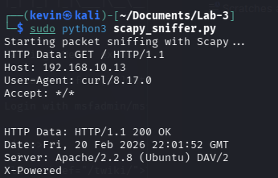
#### **Answer to Questions**:
1. **Why does HTTP operate on port 80 by default?**  
   *(Provide answer here.)*  
   Port 80 is the global standard assigned to HTTP by the IANA. Using a standard port helps clients and servers automatically know where to send and listen for HTTP data. 
2. **What common HTTP methods (e.g., GET, POST) did you identify?**  
   *(Provide answer here.)* 
    I mainly only see GET requests even when I tried logging in to the admin page, where I expected to see atleast 1 POST requests. I am also seeing a lot of 200 OK status codes. 
3. **What challenges might arise when decoding HTTP data in raw packet captures?**  
   *(Provide answer here.)*
   THe main challenge with large HTTP packets is when the responses are split across multiple TCP packets so you only see a part of the full payload. 

---

### **Task 6: Parsing DNS Packets**
**Goal:** Extract DNS fields (transaction ID, question/answer counts) using Scapy’s DNS layer.

#### **Screenshot**:
*(Insert screenshot showing DNS output from Scapy, including transaction ID and counts.)*

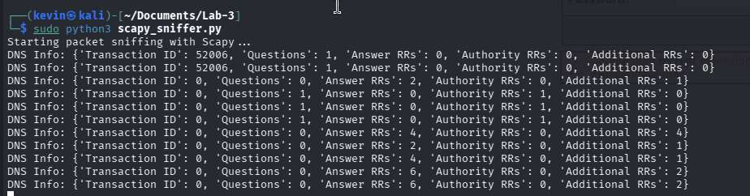

#### **Answer to Questions**:
1. **What is the significance of the transaction ID in DNS packets?**  
   *(Provide answer here.)*  
   The transaction ID is generated by the client when it sends a DNS query. The DNS server uses this ID to match each response back to the original query. This is needed since DNS uses UDP which means it is connectionless, so the ID is the only way to pair queries. 
2. **How do the flags in a DNS packet indicate query vs response?**  
   *(Provide answer here.)*  
   The flag describes the nature of the DNS message. The QR bit is the most important, which indicates whether the packet is a query or a response. 
3. **Why does DNS primarily use UDP instead of TCP, and when might it use TCP?**  
   *(Provide answer here.)*
   DNS uses UDP beacuse it is lightweight and fast. Since most DNS messages are small enough to fit into a single packet, the overhead from TCP is unncessary. It may switch to TCP when a response is too large to fit into a single packet so it may as well use TCP. 
---

### **Part 2 Summary and Analysis**
*(Write 200–300 words covering: traffic patterns observed, key learning points, challenges resolved, and a comparison of Scapy vs raw sockets—abstraction, ease, flexibility, and limitations.)*

Part 2 utilized the Scapy tool to build a packet sniffer that is capable of capturing and parsing multiple network protocols including TCP, UDP, ICMP, HTTP, and DNS. The traffic was generated from the defense VM to the MS-2 target VM using tools like curl and nmap. I observed numerous traffic patterns during testing where TCP traffic dominated majority of the noise during HTTP sessios and nmap scans. The 3 way handshake is clearly visible through the SYN and ACK tags. ICMP echo requests and reply pairs were captured during ping tests and DNS pairs were observed when I did nslookups against the MS-2 VM. The main takeaway from this part of the lab is to show the simplicity of Scapy. Scapy makes packet parsing so clean and easy compared to the raw socket approach in Part 1. Instead of manually unpacking bytes and calculating offsets, Scapy automatically dissects each layer and and queries simple attributes like IP or TCP. This makes the code much more readable, and much less complex. The main challenge I had with with this lab was the silence of the sniffer. I had a lot of trouble getting outputs from the sniffer for the longest time, I eventually got some outputs through sheer luck when the traffic randomly started getting picked up by my sniffer. 
