# **Lab 4 Report**
##### CSCI 5742: Cybersecurity Programming and Analytics, Spring 2026

**Name & Student ID**: Kevin Jacob, 109750578 

---

# **Part 1: Reconnaissance & Scanning (10 pts)**

### **Task 1: Host Discovery**
#### **Screenshot:**
*(Insert screenshot of `netdiscover -r 192.168.10.0/24` output)*
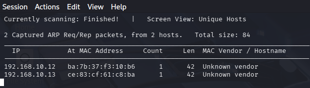
#### **Answers to Questions:**
1️⃣ What does `netdiscover` do, and what protocol does it use?  
*(Provide your answer here)*

Netdiscover discovers active hosts on a local netowrk by sneding out ARP requests and listening for replies. 

2️⃣ What is the IP address of Metasploitable-2 (M2) in your network?  
*(Provide the discovered IP address here)*

The IP of the MS-2 target Vm is 192.168.10.13

---

### **Task 2: Service Discovery (Nmap Scan)**
#### **Screenshot:**
*(Insert screenshot of `nmap -sS <Metasploitable-2-IP>` output)*
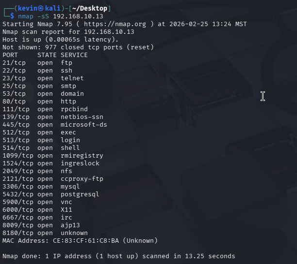
#### **Answers to Questions:**
3️⃣ Based on your scan results, list all open ports on M2.  
*(Provide your answer here)*
21,22,23,25,53,80,111,139,445,512,513,514,1099,1524,2049,2121,3306,5432,5900,6000,6667,8009,8180

4️⃣ What is the most dangerous open service on the target? Justify your answer.  
*(Provide your answer here)*

The most dangerous open service is port 1524. Port 1524 hosts a highly known backdoor, if tan attacker connects to this port, then they are instantly dropped into a shell with root access with no athentication required. 

---

### **Task 3: Detailed Service Version Discovery**
#### **Screenshot:**
*(Insert screenshot of `nmap -sS -sV <Metasploitable-2-IP>` output)*
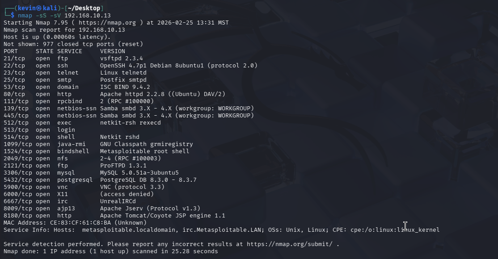

#### **Answers to Questions:**
5️⃣ What version of FTP is running on M2?  
*(Provide your answer here)*

vsftpd 2.3.4

6️⃣ Why is version detection important in penetration testing?  
*(Provide your answer here)*

Version detection is very critical in penetration testing because there are known vulnerabilities associated with particular versions of the software. An attacker can query vulnerability databases to target specific versions of the service. 

---

### **Task 4: Understanding Common Services**
#### **Answers to Questions:**
7️⃣ Explain the difference between FTP, SSH, and Telnet in your own words.  
*(Provide your answer here)*

FTP is for transfering files between systems, SSH gives you a secure way to access a remote computer's command line, Telnet is an unencrypted way to access a command line. 

8️⃣ Why is Telnet considered insecure compared to SSH?  
*(Provide your answer here)*

Telnet transmits all data including usernames, passwords, and commands in plain text. So if an attacker were to capture the packets on this network, then they would be able to easily read the traffic containing the credentials. 

---

### **Task 5: Checking for Default or Weak Credentials**
#### **Screenshots:**
*(Insert screenshot of FTP anonymous login attempt)* 
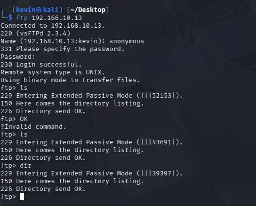
*(Insert screenshot of Telnet login attempt)*
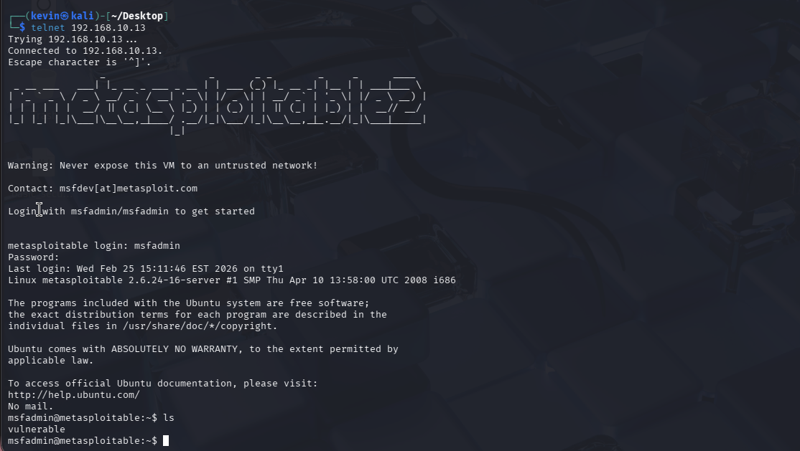

#### **Answers to Questions:**
9️⃣ Were you able to log in anonymously to FTP? What files are visible?  
*(Provide your answer here)*

Yes I was able to login to ftp. I tried to list the files and while the ftp shell said that it will display the directory but it turned up empty. 

🔟 Were you able to log into Telnet? Why is this a security risk?  
*(Provide your answer here)*
Yes I was able to. It also correctly listed the files in the directory. The main security risk is from the fact that the default credentials are widely known. As I mentioned before, telnet transmites all credentials and traffic as plaintext straight into the network. 

---

### **Task 6: Search for Exploits (Pre-Exploitation)**
#### **Screenshots:**
*(Insert screenshot of Metasploit `search vsftpd` output)*  
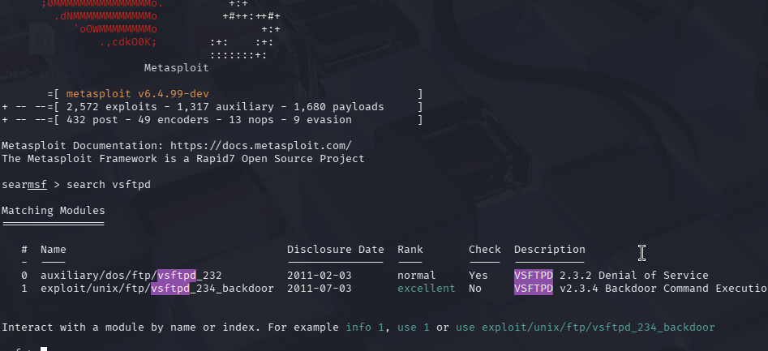
*(Insert screenshot of `searchsploit vsftpd 2.3.4` output)*
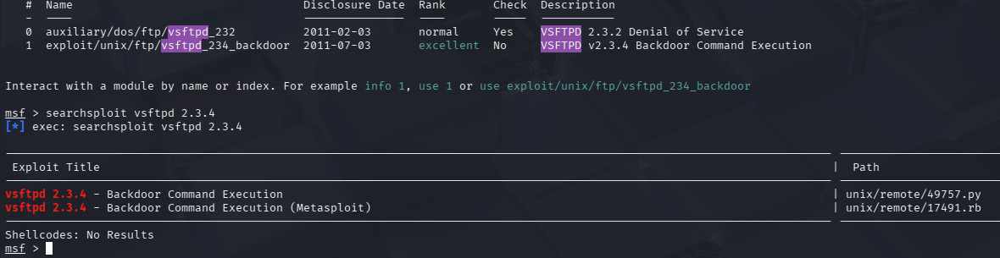
#### **Answers to Questions:**
1️⃣1️⃣ How many exploits are available for vsftpd 2.3.4?  
*(Provide your answer here)*
There are 2 exploits listed for that version. 
1️⃣2️⃣ How can a system administrator protect against such exploits?  
*(Provide your answer here)*

The easiest way to prevent these attacks is to make sure the software is always up to date. You can also deploy monitor tools that scan netowrk traffic to look out for the known vulnerabilities. 

---

# **Part 2: Exploiting VSFTPD 2.3.4 (20 pts)**

### **Task 1: Identify the VSFTPD 2.3.4 Service**
#### **Screenshot:**
*(Insert screenshot of `nmap -sV -p 21 <Metasploitable-2-IP>` output)*
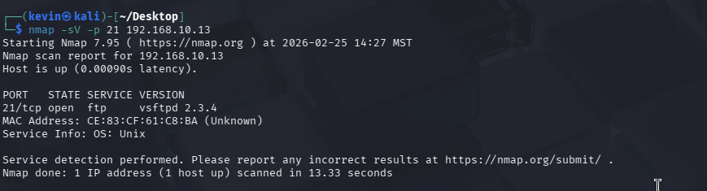
#### **Answers to Questions:**
1️⃣ What version of VSFTPD is running on M2?  
*(Provide your answer here)*
vsftpd 2.3.4

2️⃣ Why is VSFTPD 2.3.4 vulnerable?  
*(Provide your answer here)*

This is vulnerable because it contains a malicious backdoor. If an attacker attemps to log in using 
":)" as the username, then they will open a listening port on the server. Accessing this port will give the attacker root access. 

---

### **Task 2: Exploit VSFTPD 2.3.4 Using Metasploit**
#### **Screenshots:**
*(Insert screenshot of successful Metasploit exploit execution)*  

*(Insert screenshot showing session interaction + `whoami`)*
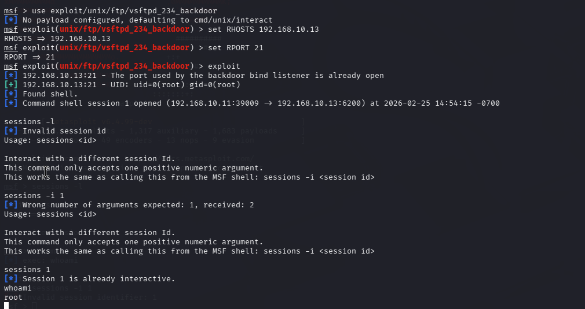
#### **Answers to Questions:**
3️⃣ What happens when the exploit runs successfully?  
*(Provide your answer here)*
When the explot runs, metaspoloit logs into the FTP server using the smiley face username. THis triggers the hidden backdoor and opens a listening port on port 6200. 

4️⃣ What privileges do you have after exploitation?  
*(Provide your answer here)*
I have root access as confirmed by the whoami command. 

---

### **Task 3: Analyze the Backdoor in Metasploit Code**
#### **Screenshot:**
*(Insert screenshot of the relevant code section from `vsftpd_234_backdoor.rb`)*
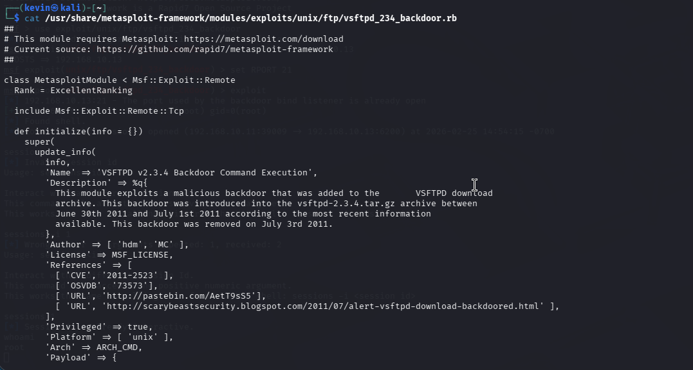
#### **Answers to Questions:**
5️⃣ What does `nsock = self.connect(false, {'RPORT' => 6200}) rescue nil` do?  
*(Provide your answer here)*
This line of code attemps to connect to the listening port at 6200. Resuce nil takes care of the error handling, if the connect fails it makes sure the script does not crash and just tries again. 
6️⃣ How does the `:)` username trigger the exploit?  
*(Provide your answer here)*

sock.put("USER #{rand_text_alphanumeric(rand(6)+1)}:)\r\n")

This line of code sneds the FTP user command and appends the smiley face to the end of a random alphanumeric string. Once the server reads the specific string of characters it activates the hidden code block that opens the listening shell on 6200. 

---

### **Task 4: Gaining a Shell Without Metasploit (Manual Exploitation)**
#### **Screenshots:**
*(Insert screenshot of `nc <M2-IP> 21` with `USER test:)`)*  
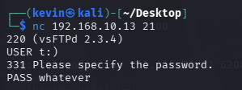
*(Insert screenshot of `nc <M2-IP> 6200` with `id` output)*
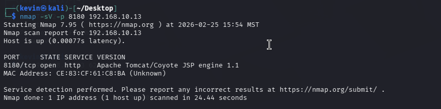
#### **Answers to Questions:**
7️⃣ Why does the backdoor shell grant root access?

*(Provide your answer here)*
The backdoor grants root access because the csftpd service itself runs as a root user. So when a process spawns a new shell, it automatically inherits the permissions of the parent process. 
8️⃣ How would you detect and prevent this attack on a real system?  
*(Provide your answer here)*

You could deploy an IDS to monitor network traffic specifically looking for the smiley face. Additionally, making sure the FTP service is always up to date would prevent the use of known vulnerabilities.  

---

# **Part 3: Exploiting Apache Tomcat Manager (15 pts)**

### **Task 1: Identify the Apache Tomcat Service**
#### **Screenshot:**
*(Insert screenshot of `nmap -sV -p 8180 <Metasploitable-2-IP>` output)*

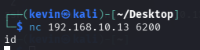
#### **Answer to Question:**
1️⃣ What version of Apache Tomcat is running on M2?  
*(Provide your answer here)*

Apache Tomcat/Coyote JSP engine 1.1

---

### **Task 2: Check for Weak Credentials**
#### **Screenshot:**
*(Insert screenshot of successful/failed Tomcat login attempt in browser)*
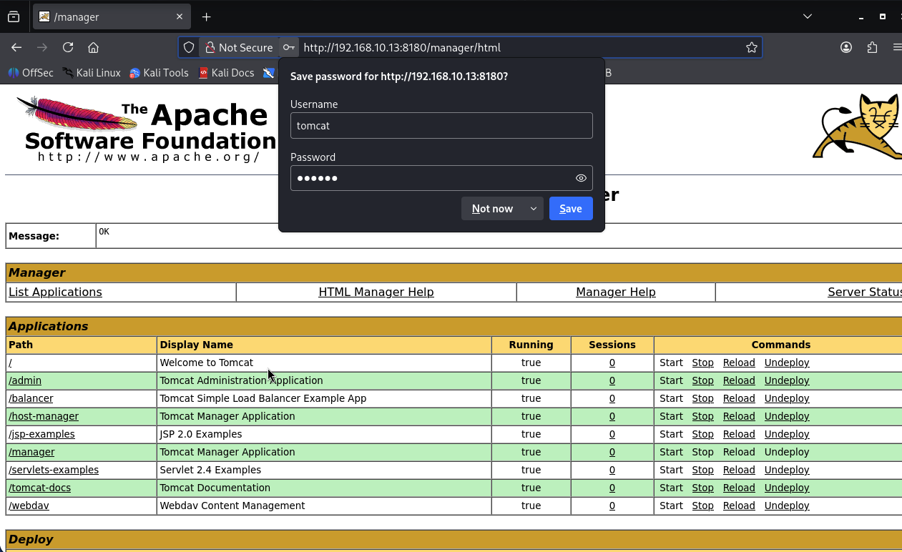
#### **Answer to Question:**
2️⃣ Were you able to log in using the default credentials?  
*(Provide your answer here)*

Yes I was able to login using tomcat and tomcat. 
---

### **Task 3: Exploit Default Tomcat Credentials Using Metasploit**
#### **Screenshots:**
*(Insert screenshot of Metasploit module setup + exploit output)*  
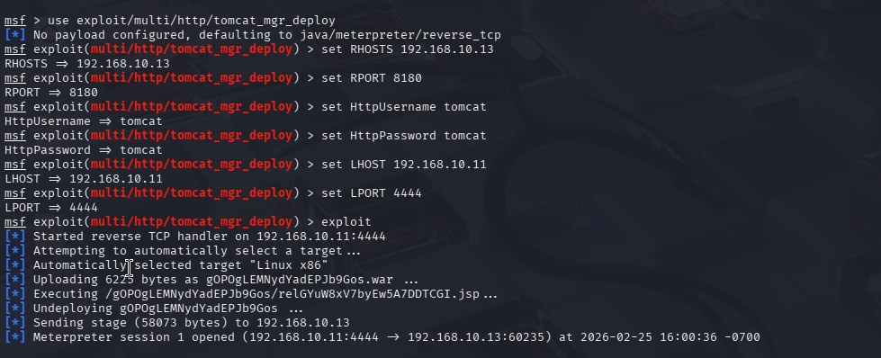
*(Insert screenshot showing session proof, e.g., `whoami`)*
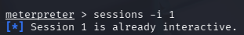

#### **Answers to Questions:**
3️⃣ What does the Tomcat Manager Deploy exploit do?  
*(Provide your answer here)*
The tomcat exploit takes advantage of the exposed manager interface and the known credentials. It logs into the tomcat service and automatically deploys a payload into the server. once the server executes the payload, it initates a reverse shell connection back to the attacker. 
4️⃣ What kind of access do you get after a successful exploit?  
*(Provide your answer here)*
You gain remote command execution, under the tomcat user. 

---

### **Task 4: Gaining a Reverse Shell**
#### **Screenshot:**
*(Insert screenshot of `sessions -l`, `sessions -i`, and `whoami`/`getuid`)*
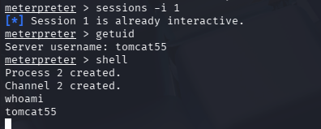

#### **Answers to Questions:**
5️⃣ What risks are associated with default credentials?  
*(Provide your answer here)*

Default credenetials are well known and give access to anyone who knows it without the proper authentication. 
6️⃣ How would you prevent this attack in a real-world environment?  
*(Provide your answer here)*

In order to prevent this from happening in the real world, you would immediately replace the default credentials. You would also add netowrk restrictions so that services are only accessed by internal trusted IP addresses. 

---

# **Part 4: Exploiting PostgreSQL (15 pts)**

### **Task 1: Identify the PostgreSQL Service**
#### **Screenshot:**
*(Insert screenshot of `nmap -sV -p 5432 <Metasploitable-2-IP>` output)*
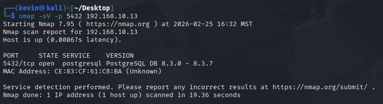
#### **Answers to Questions:**
1️⃣ What version of PostgreSQL is running on M2?  
*(Provide your answer here)*

PostgreSQL DB 8.3.0 - 8.3.7

2️⃣ Why is it important to check the version of a database service before attacking?  
*(Provide your answer here)*

It is important to check the version so that you are using the correct exploits. For instance, an exploit on version 8.3 might not exist on 8.4 and using a failed exploit may alert the target. Knowing the exact version allows you to search exploit databases and select the most effective payload that is guaranteed to work. 

---

### **Task 2: Check for Weak PostgreSQL Authentication**
#### **Screenshots:**
*(Insert screenshot of `psql -h <M2-IP> -U postgres` login attempt)*  

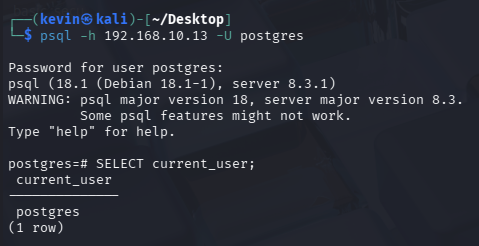
*(Insert screenshot of query outputs: `SELECT current_user;` and `SELECT rolname, rolsuper FROM pg_roles;`)*
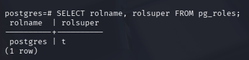
#### **Answers to Questions:**
3️⃣ Were you able to connect with default credentials?  
*(Provide your answer here)*
Yes I was able to use the default password to login.
4️⃣ What privileges does the `postgres` user have?  
*(Provide your answer here)*
The postgres has superuser priviliges as indicated by the rolsuper = t.

---

### **Task 3: Exploit PostgreSQL for Remote Code Execution**
#### **Screenshots:**
*(Insert screenshot of Metasploit module setup + exploit output)*  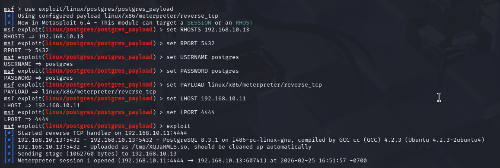
*(Insert screenshot showing session proof, e.g., `getuid`)*
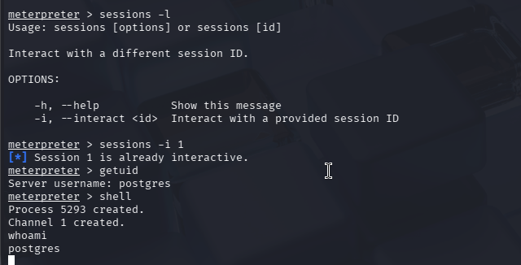

#### **Answer to Question:**
5️⃣ What happens when this exploit runs successfully?  
*(Provide your answer here)*
When the exploit runs, it puts me in remote connection in the meterpreter. In this I can activate a remote shell directly into the postgres server.

---

# **Part 5: Writing and Testing the VSFTPD 2.3.4 Exploit (40 pts)**

### **Task 1: Writing a Ruby Exploit for VSFTPD 2.3.4**
#### **Code Submission:**
*(Attach `vsftpd_exploit.rb` as a separate file.)*
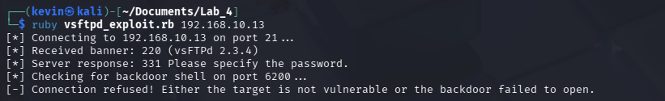
#### **Screenshots:**
*(Insert screenshot of failed (pre-update) run, and successful (post-update) run.)*
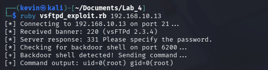

#### **Answers to Questions:**
1️⃣ What does `TCPSocket.new(target_ip, ftp_port)` do?  
*(Provide your answer here)*

This line of code creates a new TCP connection to the target, on a specific port.

2️⃣ Why does the exploit send `USER hacker:)`?  
*(Provide your answer here)*

The string is sent because the smiley face is the trigger for the backdoor. When the FTP server processes a username containing the smiley face it activates a hidden function that spawns a silent shell on port 6200.

3️⃣ What is the purpose of connecting to port 6200 after sending the malicious username?  
*(Provide your answer here)*

The purpose of connecting to port 6200 is so that you can access the root level shell that is spawned in that port. 

4️⃣ What was missing/incorrect in the starter Ruby code, and how did you fix it?  
*(Provide your answer here)*

The missing information was the port values of 21 and 6200. Initially, when I ran it without the port information the script would not even run and it would just error out. After fixing that, the script would run but I would receive an error that says the connection could not be established. Then I realized I was missing the password, so after adding that I was finally able to establih a successful connection. 

5️⃣ How can system administrators prevent or quickly detect such backdoor exploits?  
*(Provide your answer here)*

Admins could use a detection system that is specifically monitoring for traffic containing the smiley face. Furthermore, you could update the FTP service to be up to date and patch out the vulnerability itself. 

---

### **Task 2: Rewriting the Exploit in Python**
#### **Code Submission:**
*(Attach `vsftpd_exploit.py` as a separate file.)*

#### **Screenshot:**
*(Insert screenshot of the Python exploit execution.)*
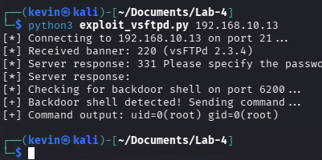
#### **Answers to Questions:**
1️⃣ What are the main differences between the Ruby and Python exploits?  
*(Provide your answer here)*
The ruby script uses higher level methods like puts and gets to send and receive data. These methods automatically handle strings. Python however, uses lwer level methods in the socket module. 
2️⃣ Which language was easier to use for writing this exploit? Why?  
*(Provide your answer here)*
Python should generally be easier since the socket module makes it very clear and readable what type of data is being transmitted. 
3️⃣ What are the advantages of using Metasploit vs. writing exploits manually?  
*(Provide your answer here)*
Metasploit is much faster and reliable in terms of payload delivery. Metasploit is also automated which allows you to swap out payloads easily. Manual exploits allow you to bypass automated security measures that would instantly recognize MMetasploit. 
4️⃣ What real-world security lessons did you learn from this vulnerability?  
*(Provide your answer here)*
I learned that verifying your services are up to date is crucial for security. Using outdated software leaves you vulnerable to known exploits such as the smiley face backdoor in the FTP server. It is important to have detection systems that are looking out for known exploits, and constantly monitoring ports that are known to have vulnerabilities. 