# **Lab 5 Report**

##### CSCI 5742: Cybersecurity Programming and Analytics, Spring 2026

**Name & Student ID**: Kevin Jacob, 109750578

---

# **Part 1: Reconnaissance & Web Scanning (10 pts + 2 bonus pts)**

## **Task 1: Discover Web Services (5 pts)**

#### **Screenshot:**
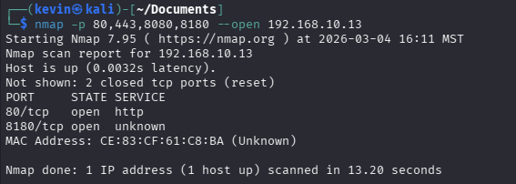
*(Insert screenshot of `nmap -p 80,443,8080,8180 --open <M2-IP>` output)*

#### **Answers to Questions:**

1. Which ports are hosting web services?
*(Provide your answer here)*
    The open ports are 80 and 8180
2. What web applications are running?
*(Provide your answer here)*
    Port 80 hosts the DVWA and the Multillidae APp, while 8180 hosts teh Tomcat Manager
---

## **Task 2: Web Directory Enumeration (5 pts)**

#### **Screenshots:**

*(Insert screenshot of `dirb http://<M2-IP>` output)*
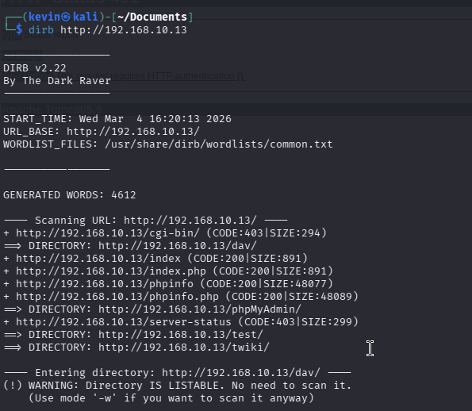
*(Insert screenshot of `dirb http://<M2-IP> -X .php` output)*
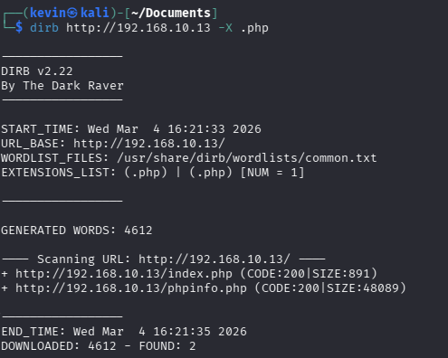
#### **Answers to Questions:**

3. List three important directories found by `dirb`.
*(Provide your answer here)*
http://192.168.10.13/dav/
http://192.168.10.13/phpMyAdmin/
http://192.168.10.13/dvwa/

4. Why is directory enumeration useful for web attacks?
*(Provide your answer here)*
Directory enumeration allows attackers to discover any hidden directories and files that are not publicly linked on the main website. This helps them plan an attack by being aware of sensistive endpoints like login pages, or admin pages that could be exploited. 

---

## **Task 3: Identify Technologies Used by the Web Apps (Bonus Exploration, 2 pts)**

#### **Screenshot:**

*(Insert screenshot of `whatweb http://<M2-IP>` output)*
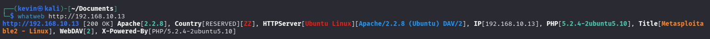
#### **Answer to Question:**

5. How could knowing the technology stack help an attacker?
*(Provide your answer here)*
By knowing the tech stack, an attacker could search konwn vulnerabilities that are associated with the exact versions. 
---
## **Task 4: Web Server Vulnerability & Misconfiguration Scan with Nikto**

#### **Screenshot:**

*(Insert screenshot of `nikto -h http://<M2-IP>` output)*
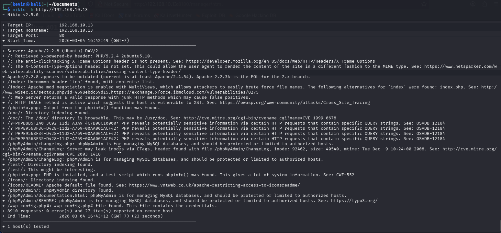
#### **Answer to Questions:**

6. List two findings Nikto reported.
According to nikto, the Apache version is out of date, and teh PHP test script was found, which could potentially give a lot of information. 

7. For one finding, explain how it could be leveraged in a real attack scenario (high level).
Using the PHP test script which runs phpinfo(), the attacker could read sensitive system config details including the exact PHP version. 

---

# **Part 2: SQL Injection (SQLi) (30 pts + 3 bonus pts)**

## **Task 1: Manually Exploit SQL Injection in DVWA (15 pts)**

#### **Screenshots:**

*(Insert screenshot showing SQLi authentication bypass / all user records displayed)*
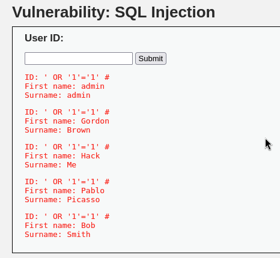
*(Insert screenshot showing extracted user credentials via UNION SELECT payload)*
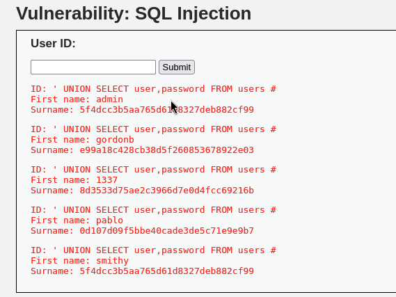

#### **Answers to Questions:**

8. What happens when you submit this input?
*(Provide your answer here)*
Submitting this input completes the previous SQL query that the server is expecting and starts our own queuery. WHen presented with the OR 1=1 the application dumps every single user record stored in the database.
9. Why does the server return valid results?
*(Provide your answer here)*
The server returns valid inputs because the payload is entering a query that always evaluates to True which returns all the rows in the database. 
---

## **Task 2: Automate SQL Injection with SQLmap (15 pts)**

#### **Screenshots:**

*(Insert screenshot showing captured PHPSESSID from Developer Tools)*
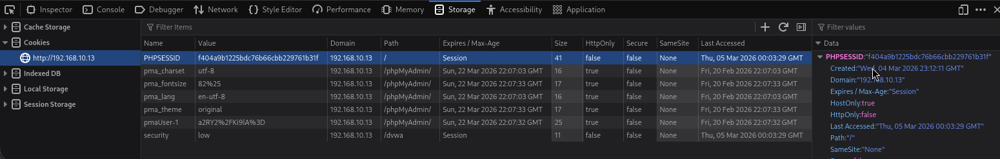
*(Insert screenshot of SQLmap output showing detected databases `--dbs`)*
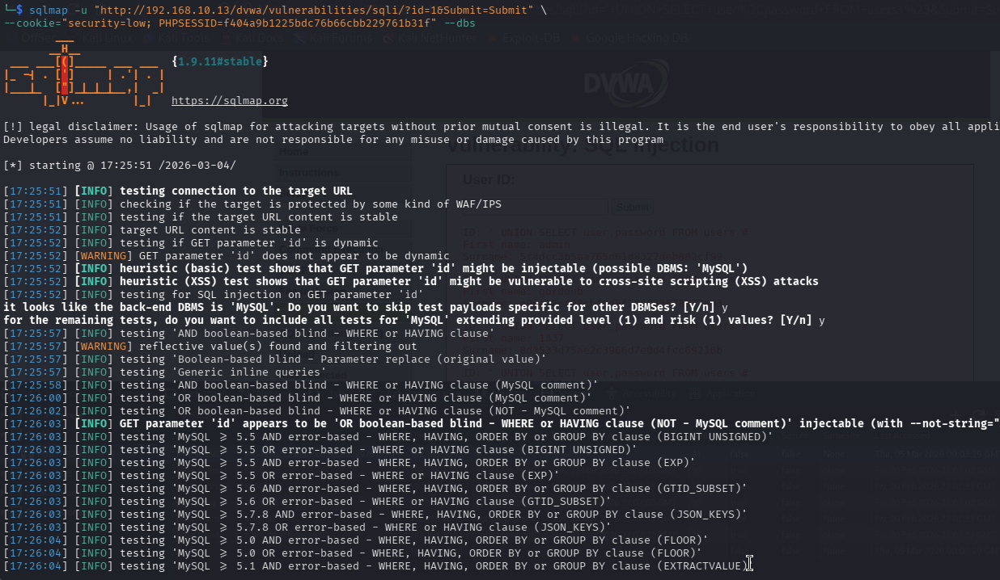
*(Insert screenshot of SQLmap output listing tables in `dvwa` database)*
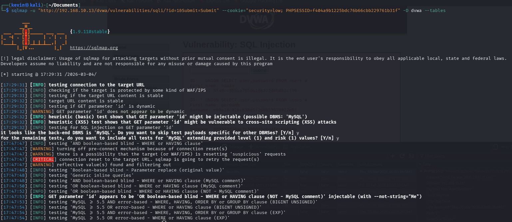
*(Insert screenshot of SQLmap output dumping the `users` table)*
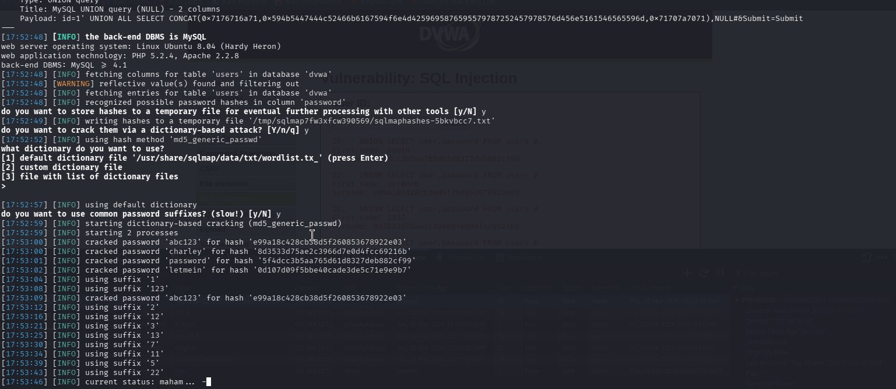
#### **Answers to Questions:**

id: f404a9b1225bdc76b66cbb229761b31f

10. What databases exist on the server?
*(Provide your answer here)*
MySQL, dvwa, users.
11. How can an attacker use dumped credentials to escalate an attack?
*(Provide your answer here)*
Once an attacker dumps the the user credentials, they can attempt to reuse the credentials across other services on the server. If the cracked password belongs to an admin, then the attacker gains full control over the application. 

---

## **Bonus: Crack the Password Hashes (3 pts)**

#### **Screenshots:**

*(Insert screenshot showing `hashid` or hash identification output)*
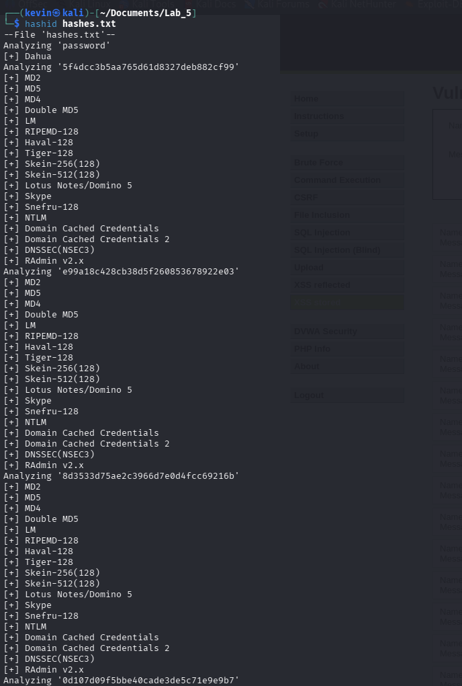
*(Insert screenshot showing John the Ripper results recovering plaintext passwords)*
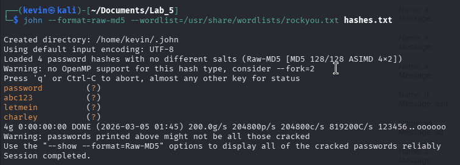
*(Optional notes: briefly mention which hashes were cracked and what they cracked to.)*
3 passwords were cracked and they became, 'abc123', 'letmein', and 'charley'

---

# **Part 3: Cross-Site Scripting (XSS) (30 pts)**

## **Task 1: Exploit Reflected XSS (10 pts)**

#### **Screenshots:**

*(Insert screenshot showing reflected XSS alert popup)*
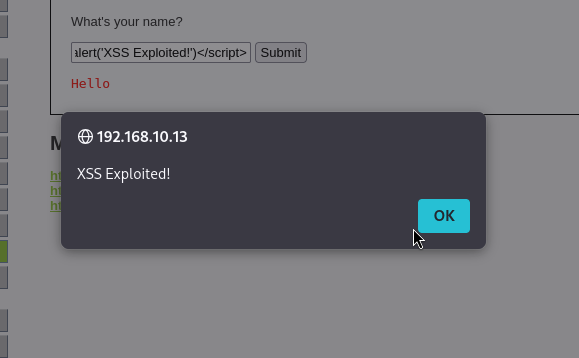
*(Insert screenshot showing cookie theft captured on Netcat listener)*
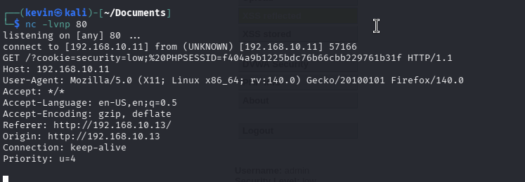

---

## **Task 2: Exploit Stored XSS (10 pts)**

#### **Screenshots:**

*(Insert screenshot showing stored XSS alert when page reloads)*
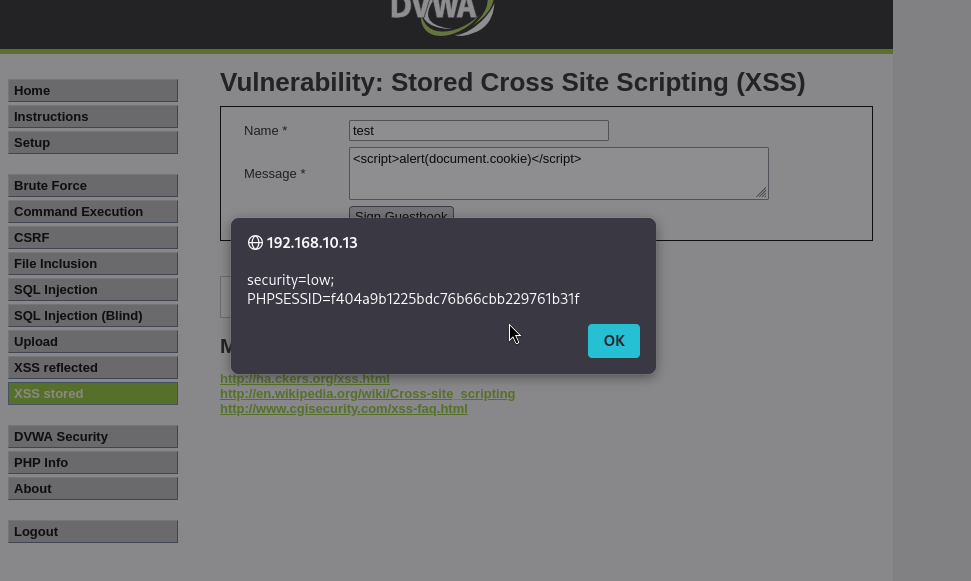
*(Insert screenshot of browser console or page source showing the stored script)*
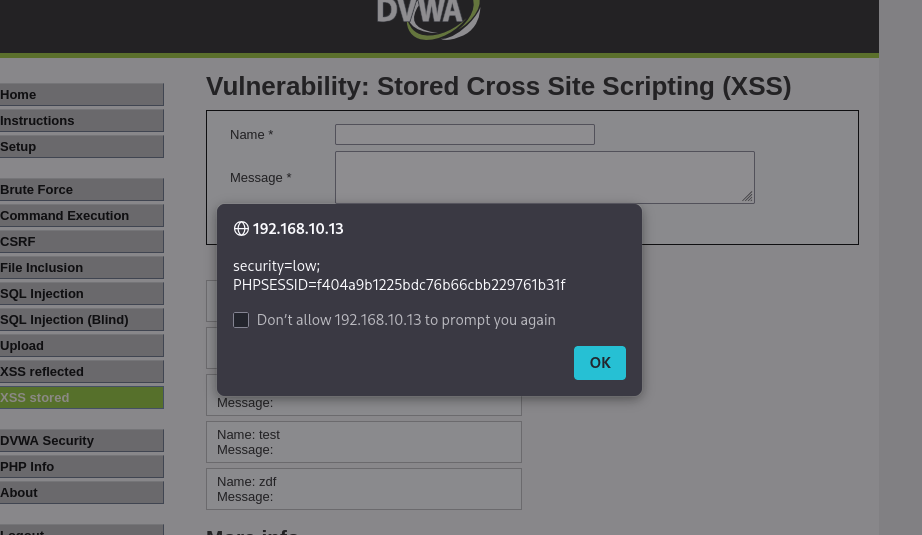
---

## **Task 3: Advanced Stored XSS: Multi-Step Cookie Theft (10 pts)**

#### **Screenshots:**

*(Insert screenshot showing multi-step payloads posted across multiple messages)*
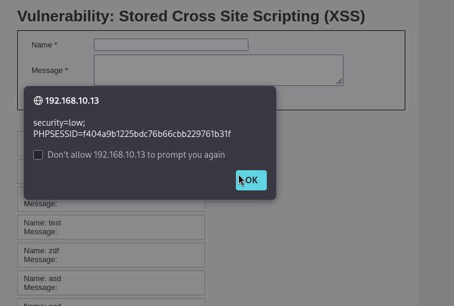
*(Insert screenshot showing stolen cookie captured in Netcat listener)*
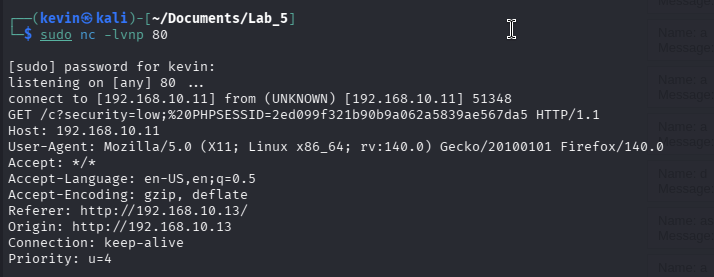
*(Insert screenshot showing verification in Developer Tools (PHPSESSID) matching captured value)*
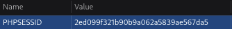

---

# **Part 4: Directory Traversal (Local File Inclusion - LFI) (15 pts)**

## **Task 1: Exploit Local File Inclusion (LFI) (15 pts)**

#### **Screenshot:**

*(Insert screenshot showing successful LFI displaying `/etc/passwd`)*
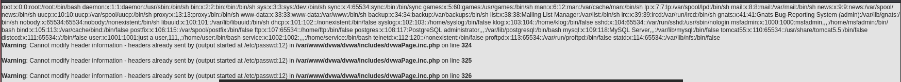
#### **Answer to Question:**

12. What did you find in `/etc/passwd`?
*(Provide your answer here)*
I found a raw linux configuration file, that reveals all the system's account. 
---

# **Part 5: Cross-Site Request Forgery (CSRF) (15 pts)**

## **Task 1: Perform a Basic CSRF Attack Using a Simple Link (15 pts)**

#### **Screenshots:**

*(Insert screenshot showing captured GET request in Developer Tools Network tab)*
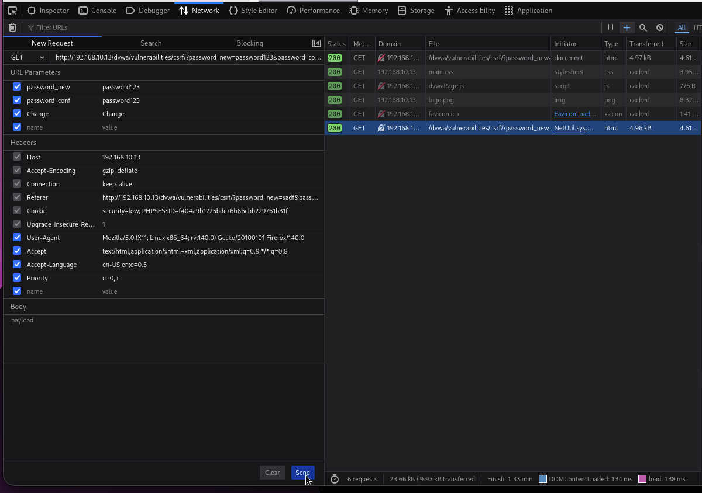
*(Insert screenshot showing CSRF attack successfully changing the password)*
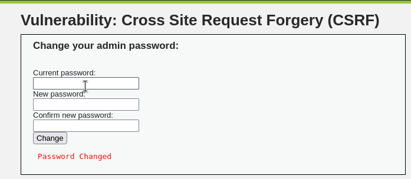
*(Insert screenshot showing login success using the new password, e.g., `hacked`)*
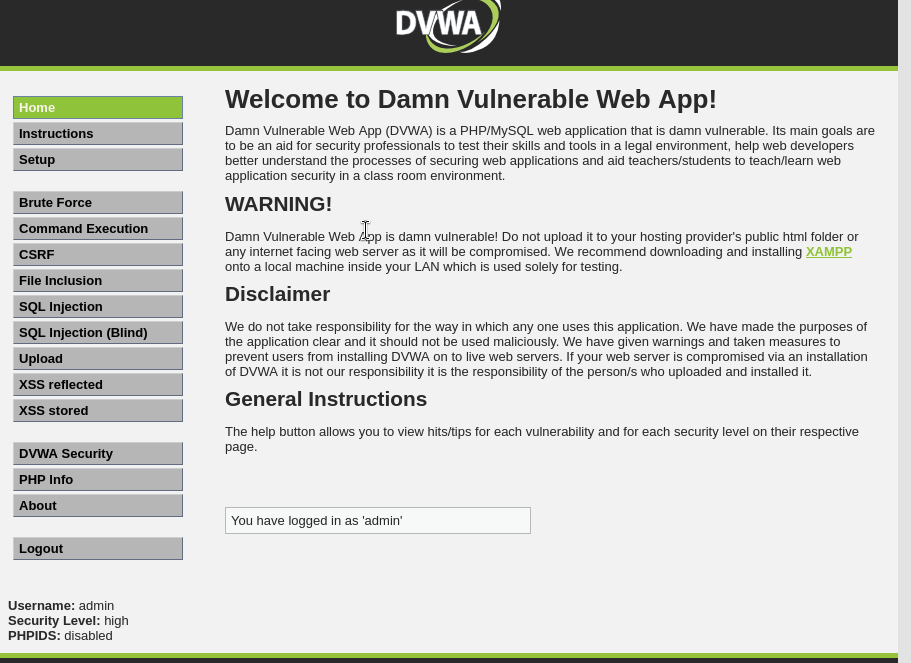

#### **Answers to Questions:**

13. Why is a GET request for password changes insecure?
*(Provide your answer here)*

Using a get request allows the data transfer to be intercepted in the browser itself since the sensitive data will be revealed in the network traffic. 

14. How does this attack work without JavaScript?
*(Provide your answer here)*
The attack utilizes basic HTML by crafting a tag that sends the GET request automatically since the change password process lacks a formal form submission.
15. How could DVWA prevent this attack?
*(Provide your answer here)*
The easiest way to prevent this should be to change the GET request to a POST request. Implementing CSRF tokens that are generated each time the password form is loaded, and if the token does not match upon submission, then the request should be denied. 

