# **Lab 6 Report**

##### CSCI 5742: Cybersecurity Programming and Analytics, Spring 2026

**Name & Student ID**: Kevin Jacob, 109750578

---

## **Task 1: Implement & Analyze Additional Vulnerabilities**  

1. **Commented Source Code**  
   - *(Paste or attach your commented `vulnerable_program.c` code here. Provide explanations for each vulnerability.)*  
<!-- #include <stdlib.h>
#include <stdio.h>
#include <string.h>
#include <time.h>
#include <limits.h>  // Required for integer limits

void overRun(void) {
    int *x = malloc(10 * sizeof(int));
    x[10] = 0;  // Buffer overrun
}

void randStringGen(int x, char* c) {
    srand(time(NULL));
    for (int i = 0; i < x - 1; ++i) {
        *c = 'A' + (rand() % 26);
        c++;
    }
    *c = '\0';
}

void bufferUnder(void) {
    char buffer[256];
    char *c = malloc(255 * sizeof(char));
    randStringGen(255, c);
    strcpy(buffer, c);  // Possible buffer overflow
    printf("%s\n", buffer);
    free(c);
}

void danglingPtr(void) {
    int *x;
    int *y = malloc(10 * sizeof(int));
    x = y;
    free(y);  // x is now a dangling pointer
    int t = x[2];  // Accessing freed memory
    printf("Dangling pointer value: %d\n", t);
}

void unInitializedPtr(void) {
    char *buffer;
    char *c = malloc(10 * sizeof(char));
    randStringGen(10, c);
    strcpy(buffer, c);  // Using an uninitialized pointer
    printf("%s\n", buffer);
    free(c);
    free(buffer);
}

void bufferOver(void) {
    char buffer[256];
    char *c = malloc(260 * sizeof(char));
    randStringGen(260, c);
    strcpy(buffer, c);  // Buffer overflow
    printf("%s\n", buffer);
    free(c);
}

// New: Integer Overflow Vulnerability
void integerOverflow(void) {
    int a = INT_MAX;  // Max signed int value
    int b = 1;
    int result = a + b;  // Causes overflow
    printf("Integer Overflow: %d + %d = %d\n", a, b, result);
}

int main(int argc, char**argv) {
    if (argc != 2) {
        return 0;
    }
    int x = atoi(argv[1]);  // Convert input to integer

    if (x == 1) {
        overRun();
    } else if (x == 2) {
        unInitializedPtr();
    } else if (x == 3) {
        danglingPtr();
    } else if (x == 4) {
        bufferUnder();
    } else if (x == 5) {
        bufferOver();
    } else if (x == 6) {
        integerOverflow();
    }

    return 0;
} -->
2. **Program Outputs**  
   - *(Insert 3+ screenshots of the program’s output for different inputs — e.g., `./vulnerable_program 1`, `./vulnerable_program 3`, and `./vulnerable_program 5`.)*  

   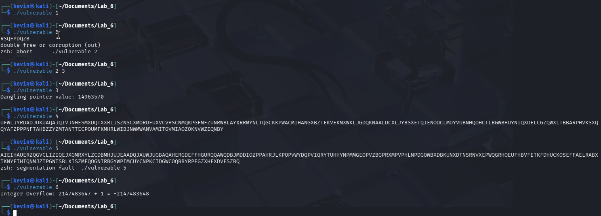

---

## **Task 2: Out-of-Bounds Write (Valgrind)**
### **Screenshots**  
1. *(Screenshot of running `./vulnerable_program 1` without Valgrind.)*  
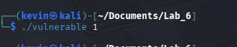
2. *(Screenshot of Valgrind output: `valgrind --tool=memcheck ./vulnerable_program 1`.)*
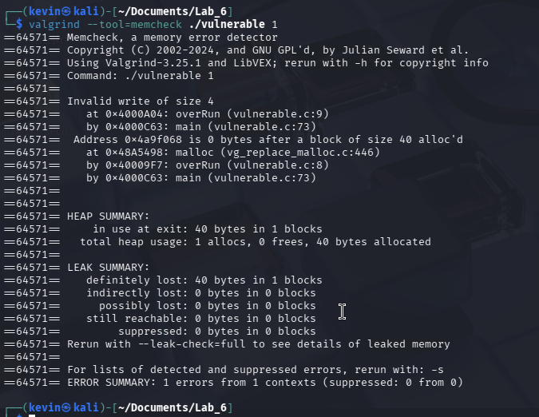
3. *(Screenshot of Valgrind with `--leak-check=full`.)*  
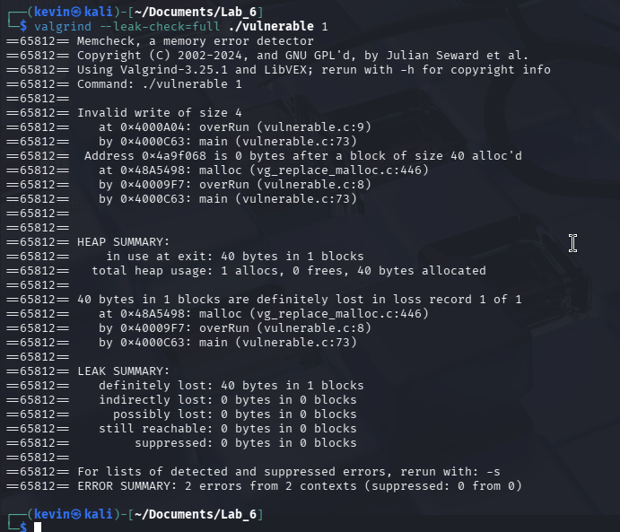
4. *(Screenshot after fixing the `overRun` function to confirm no more errors.)*  
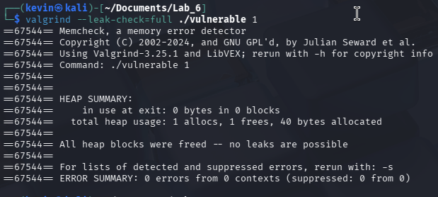

### **Answers to Questions**  
- **1.** Why does this invalid write error happen?  
  *(Answer here)*  
  It happens because the code attempts to write to the 10th index of the array but that memory does not exist 
- **2.** Why does Valgrind report an "invalid write of size 4"? What does `4` represent?  
  *(Answer here)*  
  IT represents the 4 bytes of memory used by a single int 
- **3.** What is an off-by-one error? Do you see this error in the `overRun` function?  
  *(Answer here)*  
  An off by one error happens whne a loop or index targets a position that is 1 index too far past the boundary
- **4.** What is a memory leak? Explain in your own words. Do you see a memory leak in the `overRun` function?  
  *(Answer here)*  
  A memory leak happens when an allocated piece of memory is not released once it is done being used. Overrun has a leak because the memory that is alloced is not freed. 
- **5.** Can errors like this occur in Java? Why or why not?  
  *(Answer here)*  
  No it cannot because Java uses automatic bounds checking and throws an exception instead of trying to write out of bounds. 
- **6.** Compare the Heap Summary from normal Valgrind output vs. `--leak-check=full`. What additional details are shown?  
  *(Answer here)*  
  It provides a leak summary that categorizes memory and points to the exact line where the lost memory was originally allocated. 

### **Updated Code for `overRun` Function**  
```c
/* Insert your corrected overRun function here. 
   Include inline comments explaining the fix. */
//    #include <stdlib.h>
// #include <stdio.h>
// #include <string.h>
// #include <time.h>
// #include <limits.h>  // Required for integer limits

// void overRun(void) {
//     int *x = malloc(10 * sizeof(int));

//     if (x == NULL) {return;}

//     x[9] = 0;  // Buffer overrun
//     free(x);
// }

// void randStringGen(int x, char* c) {
//     srand(time(NULL));
//     for (int i = 0; i < x - 1; ++i) {
//         *c = 'A' + (rand() % 26);
//         c++;
//     }
//     *c = '\0';
// }

// void bufferUnder(void) {
//     char buffer[256];
//     char *c = malloc(255 * sizeof(char));
//     randStringGen(255, c);
//     strcpy(buffer, c);  // Possible buffer overflow
//     printf("%s\n", buffer);
//     free(c);
// }

// void danglingPtr(void) {
//     int *x;
//     int *y = malloc(10 * sizeof(int));
//     x = y;
//     free(y);  // x is now a dangling pointer
//     int t = x[2];  // Accessing freed memory
//     printf("Dangling pointer value: %d\n", t);
// }

// void unInitializedPtr(void) {
//     char *buffer;
//     char *c = malloc(10 * sizeof(char));
//     randStringGen(10, c);
//     strcpy(buffer, c);  // Using an uninitialized pointer
//     printf("%s\n", buffer);
//     free(c);
//     free(buffer);
// }

// void bufferOver(void) {
//     char buffer[256];
//     char *c = malloc(260 * sizeof(char));
//     randStringGen(260, c);
//     strcpy(buffer, c);  // Buffer overflow
//     printf("%s\n", buffer);
//     free(c);
// }

// // New: Integer Overflow Vulnerability
// void integerOverflow(void) {
//     int a = INT_MAX;  // Max signed int value
//     int b = 1;
//     int result = a + b;  // Causes overflow
//     printf("Integer Overflow: %d + %d = %d\n", a, b, result);
// }

// int main(int argc, char**argv) {
//     if (argc != 2) {
//         return 0;
//     }
//     int x = atoi(argv[1]);  // Convert input to integer

//     if (x == 1) {
//         overRun();
//     } else if (x == 2) {
//         unInitializedPtr();
//     } else if (x == 3) {
//         danglingPtr();
//     } else if (x == 4) {
//         bufferUnder();
//     } else if (x == 5) {
//         bufferOver();
//     } else if (x == 6) {
//         integerOverflow();
//     }

//     return 0;
// }
// #include <stdlib.h>
// #include <stdio.h>
// #include <string.h>
// #include <time.h>
// #include <limits.h>  // Required for integer limits

// void overRun(void) {
//     int *x = malloc(10 * sizeof(int));

//     if (x == NULL) {return;}

//     x[9] = 0;  // Buffer overrun
//     free(x);
// }

// void randStringGen(int x, char* c) {
//     srand(time(NULL));
//     for (int i = 0; i < x - 1; ++i) {
//         *c = 'A' + (rand() % 26);
//         c++;
//     }
//     *c = '\0';
// }

// void bufferUnder(void) {
//     char buffer[256];
//     char *c = malloc(255 * sizeof(char));
//     randStringGen(255, c);
//     strcpy(buffer, c);  // Possible buffer overflow
//     printf("%s\n", buffer);
//     free(c);
// }

// void danglingPtr(void) {
//     int *x;
//     int *y = malloc(10 * sizeof(int));
//     x = y;
//     free(y);  // x is now a dangling pointer
//     int t = x[2];  // Accessing freed memory
//     printf("Dangling pointer value: %d\n", t);
// }

// void unInitializedPtr(void) {
//     char *buffer;
//     char *c = malloc(10 * sizeof(char));
//     randStringGen(10, c);
//     strcpy(buffer, c);  // Using an uninitialized pointer
//     printf("%s\n", buffer);
//     free(c);
//     free(buffer);
// }

// void bufferOver(void) {
//     char buffer[256];
//     char *c = malloc(260 * sizeof(char));
//     randStringGen(260, c);
//     strcpy(buffer, c);  // Buffer overflow
//     printf("%s\n", buffer);
//     free(c);
// }

// // New: Integer Overflow Vulnerability
// void integerOverflow(void) {
//     int a = INT_MAX;  // Max signed int value
//     int b = 1;
//     int result = a + b;  // Causes overflow
//     printf("Integer Overflow: %d + %d = %d\n", a, b, result);
// }

// int main(int argc, char**argv) {
//     if (argc != 2) {
//         return 0;
//     }
//     int x = atoi(argv[1]);  // Convert input to integer

//     if (x == 1) {
//         overRun();
//     } else if (x == 2) {
//         unInitializedPtr();
//     } else if (x == 3) {
//         danglingPtr();
//     } else if (x == 4) {
//         bufferUnder();
//     } else if (x == 5) {
//         bufferOver();
//     } else if (x == 6) {
//         integerOverflow();
//     }

//     return 0;
// }

```

---

## **Task 3: Uninitialized Pointer Analysis**  
### **Screenshots**  
1. *(Screenshot of `valgrind --tool=memcheck --leak-check=full ./vulnerable_program 2`.)*  

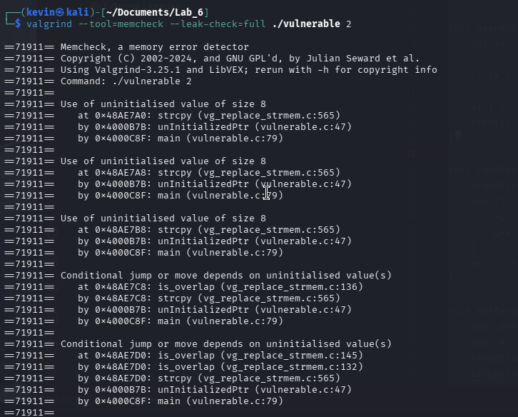

2. *(Screenshot with `--track-origins=yes` for more detail.)*  

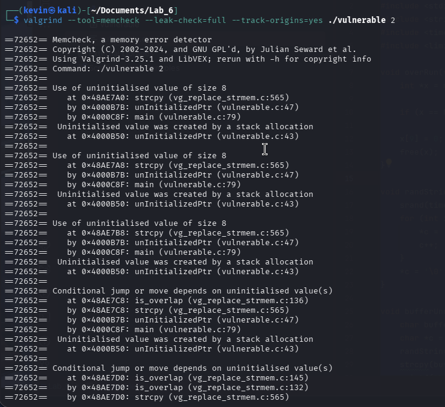

3. *(Screenshot of fixed function showing no more uninitialized pointer usage issues.)*  
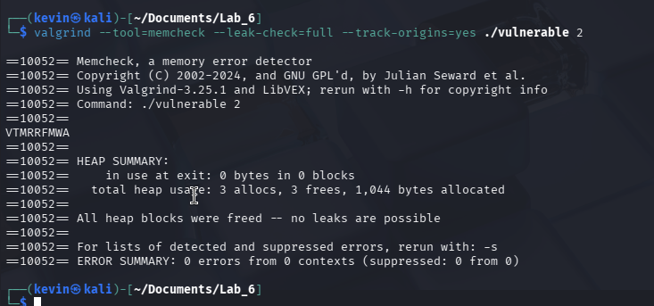

### **Answers to Questions**  
- **7.** Where is the memory problem occurring? What does Valgrind report?  
  *(Answer here)*  
  The memory problem occurs at the strcpy operation. Valgrind show is as a use of uninitialized value because the buffer pointer was declared but it was never assigned a valid memory address. 
- **8.** What is an uninitialized pointer? How could it be exploited?  
  *(Answer here)*  
  An uninitialized pointer contains a random garbage value from the stack, it could be xploited to overwite sensitive data. 
- **9.** What is the difference between a `NULL` pointer and an uninitialized pointer?  
  *(Answer here)*  
  A NULL pointer is set to 0 and it causes crash if it is used. An uninitialized pointer contains random data and has unpredictable behavior. 
- **10.** What specifically in the code do you believe caused the uninitialized pointer usage?  
  *(Answer here)*  
  THe char *buffer delcares a pointer but does not allocate memory for it. Then strcpy tries to write data to whatever random address buffer happens to contain
- **11.** What additional detail does `--track-origins=yes` provide?  
  *(Answer here)*  
  It allows valgrind to identify the specific line of code where the uninitialized variable was first created. This allows you to trace the error back to the source. 
- **12.** "Use of uninitialized value of size 8" — what does the `8` refer to?  
  *(Answer here)*  
  The 8 refers to the 8 bytes required to store a memory address.

### **Updated Code for `unInitializedPtr` Function**  
```c
/* Insert your corrected unInitializedPtr function here. 
   Include inline comments explaining the fix. 
   void unInitializedPtr(void) {
    char *buffer = malloc(10 * sizeof(char));
    
    // Safety check for memory allocation
    if (buffer == NULL) {
        return;
    }

    char *c = malloc(10 * sizeof(char));
    if (c == NULL) {
        free(buffer);
        return;
    }

    randStringGen(10, c);
    
    // Now that 'buffer' points to a valid memory block, strcpy is safe.
    strcpy(buffer, c);
    
    printf("%s\n", buffer);

    free(c);
    free(buffer); 
}
   */

   
   
```

---

## **Task 4: Dangling Pointer Analysis**  
### **Screenshots**  
1. *(Screenshot of `./vulnerable_program 3` without Valgrind — note behavior.)*  

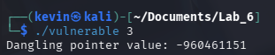

2. *(Screenshot of Valgrind output: `valgrind --tool=memcheck --leak-check=full --track-origins=yes ./vulnerable_program 3`.)*  

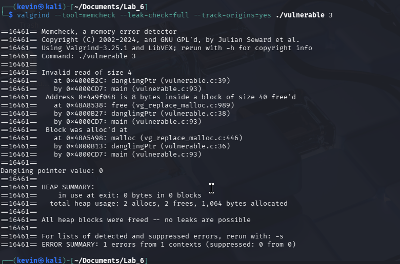

3. *(Screenshot after fixing `danglingPtr`, showing no error.)*  

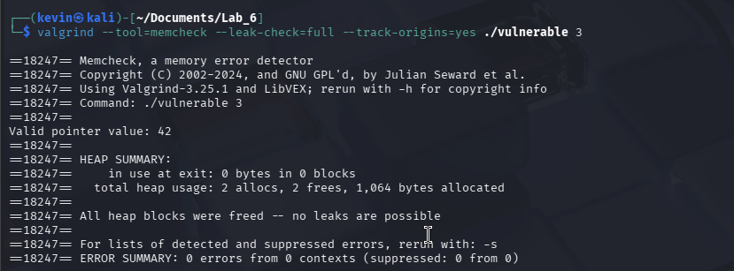

### **Answers to Questions**  
- **13.** What is the potential issue in the `danglingPtr` function?  
  *(Answer here)*  
  The issue lies in the attempted use of pointer x after the memory (y) has already been freed. 
- **14.** How could a dangling pointer be exploited?  
  *(Answer here)*  
  A dangling pointer points to memory the program no longer has. This can be used by an attacker to reallocate the memory to a different variablem and use that to read or corrupt new data. 
- **15.** What does Valgrind report about the freed memory usage?  
  *(Answer here)*  
  It reports an invalid read size of 4 since the memory does not exist anymore for the program to use. 
- **16.** Why does Valgrind possibly show no final "heap error" even though it’s a dangerous bug?  
  *(Answer here)*  
  Becuase all the memory that was allocated was freed, which means there is technically no leak. 
### **Updated Code for `danglingPtr` Function**  
```c
/* Insert your corrected danglingPtr function here. 
   Include inline comments explaining the fix. 
   void danglingPtr(void) {
    int *x;
    int *y = malloc(10 * sizeof(int));
    
    // Safety check for allocation
    if (y == NULL) {
        return;
    }

    x = y;

    Access the memory while it is still valid.
    x[2] = 42; 
    int t = x[2]; 
    printf("Valid pointer value: %d\n", t);

    // Free the memory only when you are completely finished with it.
    free(y); 

    // Set pointers to NULL after freeing to prevent accidental "use-after-free".
    y = NULL;
    x = NULL; 
}
   
   */
```

---

## **Task 5: Buffer Overflows Analysis**  
### **Screenshots**  
- **For `bufferUnder` (Input 4):**  
  1. *(Screenshot of Valgrind output with `./vulnerable_program 4`.)*  
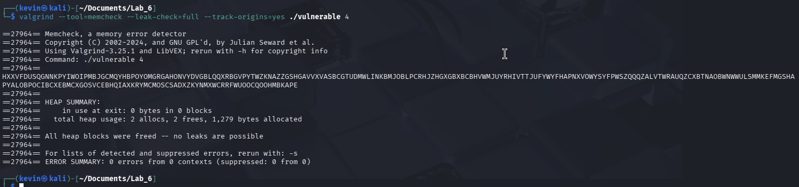
- **For `bufferOver` (Input 5):**  
  2. *(Screenshot of Valgrind output with `./vulnerable_program 5` — if any overflow detected.)*  
  

  3. *(Screenshot of AddressSanitizer detection using `./vulnerable_program2 5`.)*  

  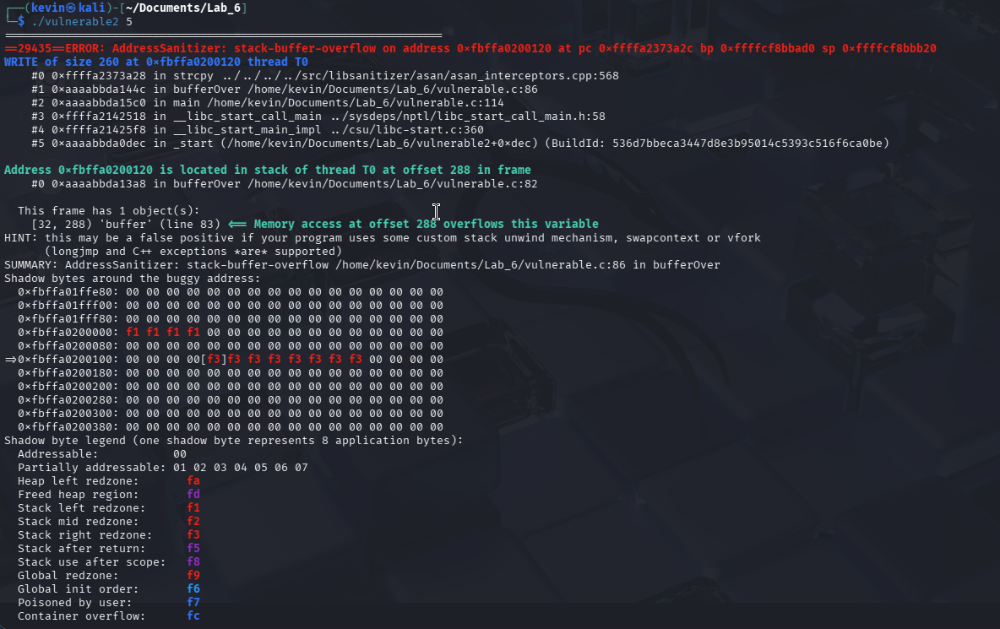

  4. *(Screenshot after fixing `bufferOver`, no errors remain.)*  
  

### **Answers to Questions**  
- **(Regarding `bufferUnder`, Input 4)**  
  - **15.** Do you see errors in the Valgrind output?  
    *(Answer here)*  
    No Valgrind does not report any errors. 
  - **16.** After reading the code, do you expect errors? Why/why not?  
    *(Answer here)*  
  No because the function generates a 255 character which should fit perfectly into the 256 buffer. 

- **(Regarding `bufferOver`, Input 5)**  
  - **17.** Do you expect an error here? Why?  
    *(Answer here)*  
    Yes because the code attempts to copy 260 characters into a buffer that only holds 256 bytes.  
  - **18.** Does Valgrind detect it? If so, what is reported?  
    *(Answer here)*  
    No valgrind usually does not detect buffer overflows
  - **19.** Why does Valgrind sometimes struggle to detect this kind of buffer overflow?
    *(Answer here)*  
    Valgrind primarily checks the heap memory and struggles to detect overflows which are usually stack based errors.


- **(Valgrind vs. Other Tools)**  
  - **20.** List two additional Valgrind tools besides `memcheck`.  
    *(Answer here)*  
    Massif, and helgrind
  - **21.** How could these other tools detect errors that `memcheck` misses?  
    *(Answer here)*  
    Massif is a heap profiles that identifies inefficient use of memory.
    Helgrind detects synchronization errors in multithreaded programs, wwhich are logical uses rather than just memory access violations. 

### **AddressSanitizer Findings**  
- **22.** What errors does AddressSanitizer report for input `5`?  
  *(Answer here)*  
  AddressSanitizer reports a buffer overflow error and crashes the program
- **23.** Where in the code does it say the error occurs?  
  *(Answer here)*  
  It says that the error occurs at the strcpy line within the bufferOver function
- **24.** How does AddressSanitizer compare to Valgrind in detecting buffer overflows?  
  *(Answer here)*  
  AddressSanitizer is much better at catching stack based errors like a buffer overflow because analyzes the code at compile time to place restrictive zones around the stack variables. 

### **Updated Code for `bufferOver` Function**  
```c
/* Insert your corrected bufferOver function here. 
   Include inline comments explaining the fix.
   
   void bufferOver(void) {
    // A statically-sized array on the stack
    char buffer[256];
    
    // Allocate 260 bytes in the heap
    char *c = malloc(260 * sizeof(char));
    if (c == NULL) {
        return;
    }

    // Generate a 260-character string
    randStringGen(260, c);

    // Use strncpy instead of strcpy to limit the copy size.
    // We use 255 to leave room for the null terminator ('\0').
    strncpy(buffer, c, sizeof(buffer) - 1);

    // Manually ensure the string is null-terminated.
    // strncpy does not append a null terminator if the limit is reached.
    buffer[255] = '\0';

    printf("%s\n", buffer);

    //  Free the heap memory to prevent a leak.
    free(c);
}*/
```

---

## **Task 6: Integer Overflow Analysis**  
### **Screenshots**  
1. *(Screenshot of `./vulnerable_program 6` showing normal run — note any incorrect result.)*  
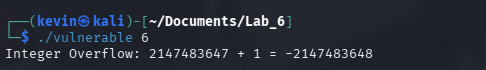
2. *(Screenshot of `valgrind --tool=memcheck ... ./vulnerable_program 6` showing whether it detects overflow.)*  

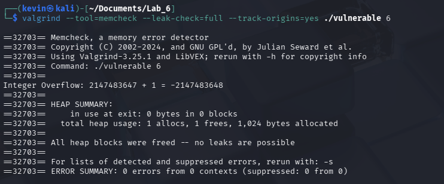

3. *(Screenshot of UBSan detection: `./vulnerable_program2 6`.)*  

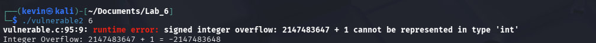
4. *(Screenshot of fixed function, showing no more overflow vulnerability.)* 

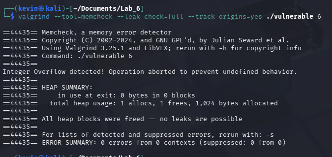


### **Answers to Questions**  
- **25.** Why does the overflow occur at `UINT_MAX + 1`?  
  *(Answer here)*  
  The issue occurs because adding 1 to the the max value of a signed integer causes the bits to wrap around and result in a negative number. 
- **26.** What are common security risks of integer overflows, and how might attackers exploit them?  
  *(Answer here)* 
  Integer overflows can cause logic errors and attackers can exploit them to bypass boundary checks. They can allocate a tiny buffer and copy a massive payload into it and trigger a buffer overflow. 
 - **27.** Does Valgrind report the integer overflow? If not, why?  
  *(Answer here)* 
    No it does not because it tracks memory erorrs, not logical errors
- **28.** Does UBSan report an error?  
  *(Answer here)*  
  Yes it does
- **29.** Where in the code does UBSan say the overflow occurs?  
  *(Answer here)*  
  It occurs at the line int result = a + b
- **30.** Compare UBSan’s detection to Valgrind’s.  
  *(Answer here)*  
  UBSan is specifically designed to catch mathematical and logical errors via a compile time scan. Valgrind would not be able to catch an error like this.

### **Updated Code for `integerOverflow` Function**  
```c
/* Insert your corrected integerOverflow function here. 
   Include inline comments explaining the fix. 
   
   void integerOverflow(void) {
    int a = INT_MAX;  // Max signed int value (typically 2,147,483,647)
    int b = 1;
    int result;

    // Implement a boundary check before performing the addition.
    // We check if 'a' is greater than (INT_MAX - b). 
    // If it is, adding 'b' to 'a' will definitely cause an overflow.
    if (a > INT_MAX - b) {
        printf("Integer Overflow detected! Operation aborted to prevent undefined behavior.\n");
    } else {
        result = a + b;
        printf("Result: %d\n", result);
    }
}*/
```

---

## **Task 7: Static Analysis with Flawfinder**  
### **Screenshots**  
1. *(Screenshot of `flawfinder vulnerable_program.c` output.)*  

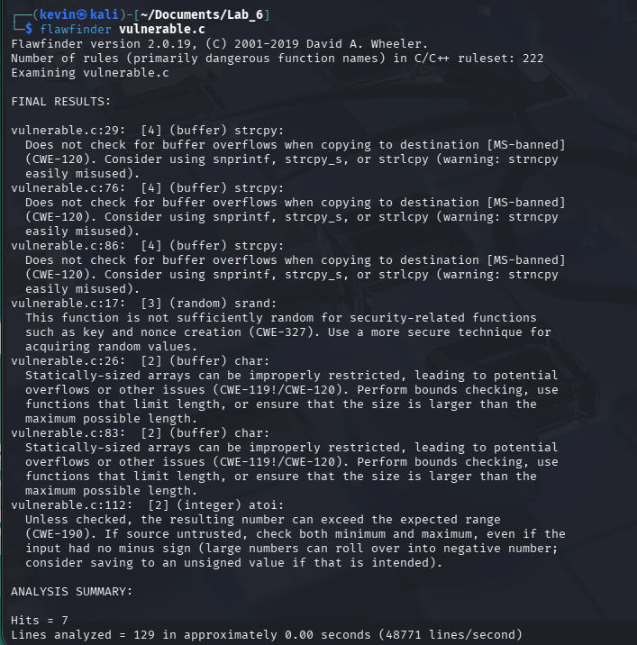

### **Answers to Questions**  
- **31.** Differentiate static vs. dynamic analysis of source code.  
  *(Answer here)*  
  Static analysis looks at the code without execution and identifies any potential errors. Dynamic analysis involvdes catching the issue at runtime.
- **32.** How do static analysis tools like Flawfinder differ from dynamic tools (Valgrind, AddressSanitizer)?  
  *(Answer here)*  
  Flawfinder is able to flag any functions that could cause any potential erorrs by simply viewing the raw text of the code. Valgrind and other dynamic tools require the code to be compiled in order to catch any errors. 

### **Flawfinder Vulnerabilities**  
- **33.** `strcpy` issues  
  - Location, risk level, CWE classification, and prevention.  
  *(Answers here)*  
  - Occurs under bufferUnder, unInitializedPtr, and bufferOver
  - High risk 
  - CWE-120
  - Use bounds checking functions instead
- **34.** `srand` usage (weak randomness)  
  - Why is it a concern, relevant CWE, safer alternatives.  
  *(Answers here)*  
  - randStringGen
  - It is a concern because using the current system time as a seed makes the randomly generated numbers highly predictable
  - CWE-337
  - Use cryptographically secure random number generators 
- **35.** Statically-sized arrays  
  - Where used, security risks, relevant CWE, safer approaches.  
  *(Answers here)*  
  - bufferUnder, bufferOver
  - If an input excdeeds the maximum size, it will overwrite adjacent memory
  - CWE-119
  - By dynamically allocating memory, or strictly enforcing boundary checks
*(Paste or summarize key parts of the Flawfinder output. Explain any false positives or unaddressed concerns.)*

---


# **Lab 6: Summary & Reflections**  

### **Key Takeaways from Lab 6**  
*(Summarize your main findings, what you learned, and any challenges faced during the lab.)*  

This lab explores the use of various analysis tools, both dynamic and static. Static analysis tools like flawfinder are effective for catching potential logical errors, and known vulnerabilities before the code is even compiled. Dynamic analysis tools require the execution of the program in order to catch any memory errors. Most memory corruption vulnerabilities originate from poor memory management and lack of boundary enforcement. Using bounded functions and enforcing strict checks before arithmetic operations, initializing all points to NULL, and releasing them after use drastically reduce any memory related vulnerabilities. 

