# **Lab 7 Report**

##### CSCI 5742: Cybersecurity Programming and Analytics, Spring 2026

**Name & Student ID**: Kevin Jacob, 109750578 

---

# **Task 1: IPTables Basics (10 pts)**

## **Step 1: Understanding IPTables Chains**

#### **Screenshot:**

*(Insert screenshot of `sudo iptables -L` output)*
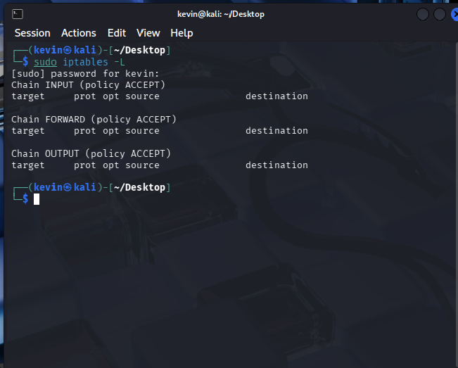
#### **Answers to Questions:**

1. In the output, IPTables has three built-in chains. Describe the purpose of each chain.
*(Provide your answer here)*

Input handles incoming network packets, output processes the outgoing network packets, and forward handles the packets that are simply passing through tem achine. 

2. Explain the difference between **DROP** and **REJECT**.
*(Provide your answer here)*

DROP silently discards the packet, whereas REJECT discards the packet but sends an error message back to the sender. 

3. Explain when each policy is typically used in a firewall configuration.
*(Provide your answer here)*

DROP is the standard for external facing firewalls, REJECT is typically used on trusted internal networks. 

---

## **Step 2: Testing Network Traffic Before Applying Rules**

#### **Screenshot:**

*(Insert screenshot of Wireshark capture showing ICMP request/reply traffic before applying firewall rules)*

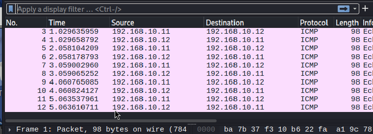
#### **Answer to Question:**

4. Analyze the captured traffic for a pair of PING requests and replies. Explain the ICMP **type** and **code** fields.
*(Provide your answer here)*

The ICMP packet from the attack VM has a type 8 and a code 0, indicating that it is a request packet. The packet from the Defense VM has a type 0 and a code 0, indicating that it is a reply packet. 

---

## **Step 3: Blocking Incoming Traffic on Defense VM**

#### **Screenshots:**

*(Insert screenshot of `iptables` chains after applying the REJECT rule)*

*(Insert screenshot of Wireshark capture after applying the REJECT rule)*
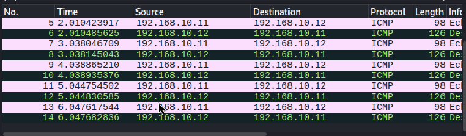

#### **Answers to Questions:**

5. Do you observe any successful pings?
*(Provide your answer here)*

No there are no successful pings after I applied the rule. 

6. What error message appears on the Attack VM, and why does it display **"Destination Port Unreachable"**?
*(Provide your answer here)*

From 192.168.10.12 icmp_seq=85 Destination Port Unreachable
Since I am using REJECT, the sender is notified that the packet was blocked. 

7. Analyze the captured traffic in Wireshark for a PING request and its corresponding reply. Describe any changes in packet behavior. Explain the changes observed in Defense VM's behavior toward PING requests.
*(Provide your answer here)*

The Defense VM now replies with a Destination unreachable packet. The firewall is shutting down the ping request at the network layer. 
---

## **Step 4: Testing DROP vs. REJECT**

#### **Screenshots:**

*(Insert screenshot of `iptables` chains after applying the DROP rule)*
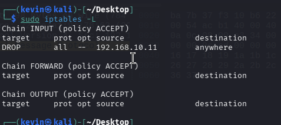
*(Insert screenshot of Wireshark capture showing behavior with DROP)*
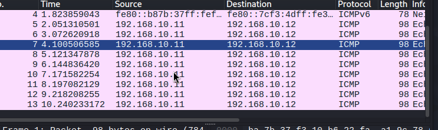

#### **Answers to Questions:**

8. How does the behavior differ between **DROP** and **REJECT**?
*(Provide your answer here)*

When I had a drop rule, the attack VM did not output anything while pinging the unreachable port. However, when I was using REJECT, I was getting constant error messages. 

9. Why might a firewall administrator choose one over the other?
*(Provide your answer here)*

DROP is almost always used for external traffic, whereas REJECT is used generally for internal trusted networks.

---

# **Task 2: Defending Against ICMP & Web Reconnaissance (10 pts)**

## **Step 1: Configuring ICMP Filtering**

#### **Screenshots:**

*(Insert screenshot of `iptables` chains for ICMP filtering)*

*(Insert screenshot of Wireshark capture for Scenario 1: Attack VM pings Defense VM)*
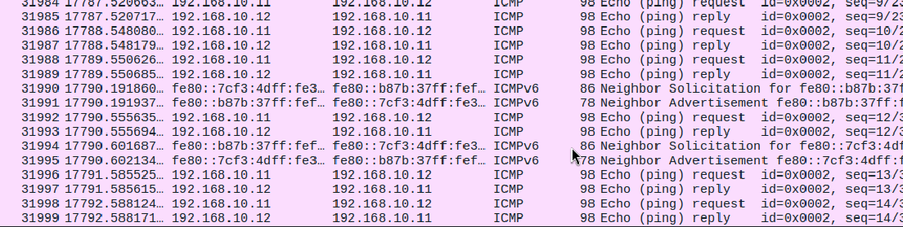
*(Insert screenshot of Wireshark capture for Scenario 2: Defense VM pings Attack VM)*
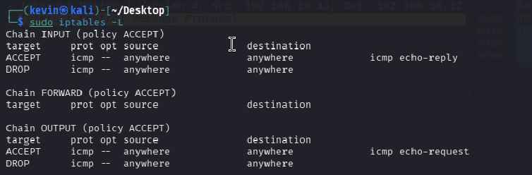

#### **Answers to Questions:**

10. Document your observations, focusing on ICMP traffic behavior in each scenario.
*(Provide your answer here)*

In scenario 1, the ping is successful and I see the incoming traffic on wireshark. however, in scenario 2 the ping fails and wireshark does not capture anything. 

11. How does filtering impact ICMP communication?
*(Provide your answer here)*

Filtering enforces strict directionality on network communication. The defense VM is only allowed to act as a responder but it cannot initiate any outgoing queuries. 

12. Explain the importance of rule order and why more specific rules (e.g. accept icmp-request) should be defined before broader ones (e.g., drop all icmp).
*(Provide your answer here)*

Iptables process rules from top to bottom, so as soon as a packet matches a rule the iptables executes that exaction. So for example, if you were to put a DROP rule for all icmp packets then every single icmp packet would be instantly discarded. 

---

## **Step 2: Reversing the Policy**

#### **Screenshots:**

*(Insert screenshot of updated `iptables` chains)*
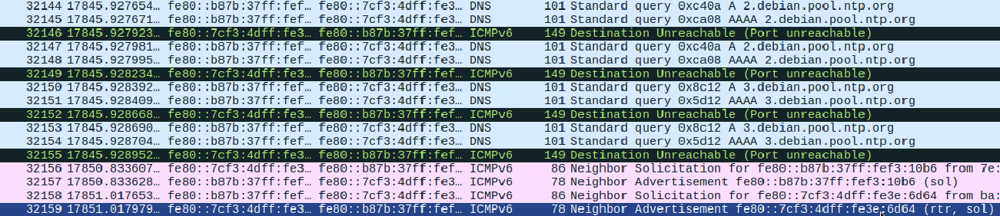
*(Insert screenshot of Wireshark capture for Scenario 1: Defense VM pings Attack VM)*
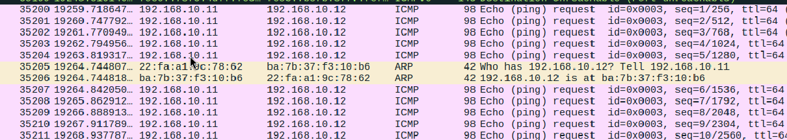
*(Insert screenshot of Wireshark capture for Scenario 2: Attack VM pings Defense VM)*
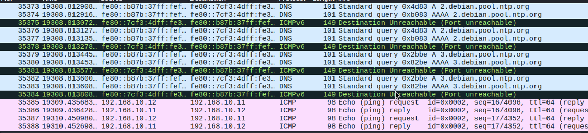

#### **Answers to Questions:**

13. What differences do you observe compared to the previous test? How does the Defense VM's new policy impact ICMP communication?
*(Provide your answer here)*

In scenario 1 the defense VM succesfully pings the attack VM. Scenario 2 now fails because the attack VM can no longer reach the defense VM successfully. This policy establishes an outgoing only connection. 

14. Explain the practical significance of this policy in real-world scenarios.
*(Provide your answer here)*

This is a common security baseline for servers and workstations. You are effectively reducing the attack surface by blocking incoming pings. 

---

## **Step 3: Turning Defense VM into a Web Server**

#### **Screenshots:**

*(Insert screenshot showing the web server on port 8000 running)*
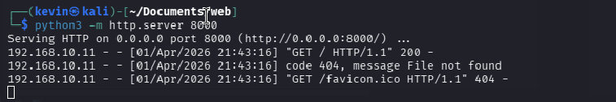
*(Insert screenshot showing the second web server on port 8001 running)*
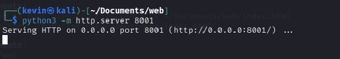
*(Insert screenshot of browser access from Attack VM to `http://<Defense-VM-IP>:8000`)*
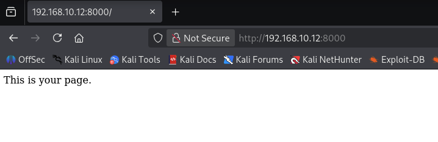
*(Insert screenshot of `nmap <Defense-VM-IP>` showing both ports 8000 and 8001 open)*
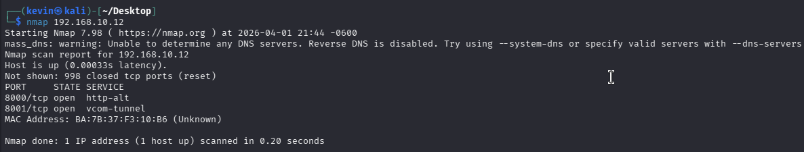

---

## **Step 4: Securing HTTP Traffic with IPTables**

#### **Screenshots:**

*(Insert screenshot of running web servers)*
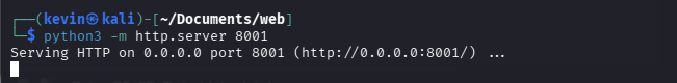
*(Insert screenshot of `iptables` chains allowing only port 8000)*
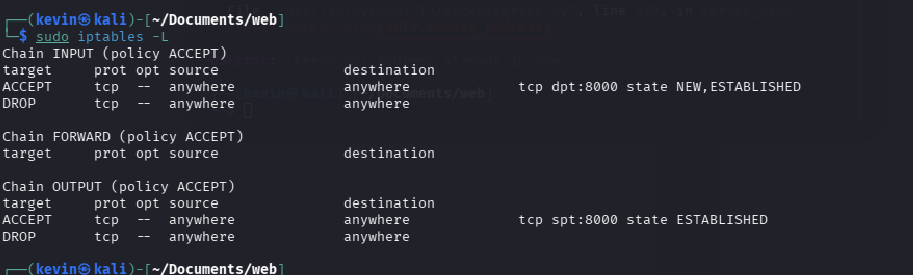
*(Insert screenshot of Wireshark capture for Scenario 1: access to port 8000)*
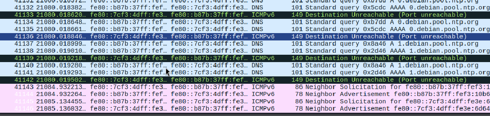
*(Insert screenshot of Wireshark capture for Scenario 2: access to port 8001)*
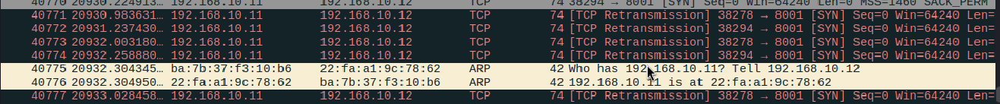
*(Insert screenshot of `nmap <Defense-VM-IP>` showing only port 8000 open)*
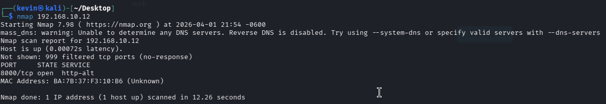
#### **Answers to Questions:**

15. Explain how `iptables -m state --state NEW,ESTABLISHED` functions and why it is crucial for filtering TCP traffic.
*(Provide your answer here)*

The -m state allows the firewall to track the connection state. New refers to the first packet of hte connection. ESTABLISHED refers to packets that are part of a connection the firewall has already seen in both directions. It is crucial because it allows the firewall to be stateful ensuring that only legitimate responses are allowed through. 

16. Why does the input rule for the allowed port (8000) specify `--state NEW,ESTABLISHED`, while the output rule only includes `--state ESTABLISHED`?
*(Provide your answer here)*

The input rule needs NEW to allow the attack VM to initiate the connection to the web server. The output rule only needs established because the server should only be responding to requests that have already been initialized. 

17. Based on Wireshark observations, what key differences do you notice when accessing port **8000** versus **8001**?
*(Provide your answer here)*

You will see a successful handshake on port 8000. On port 8001 however, you will see the Attack VM send a SYN packet but the defense VM will not provide a response. 

18. How does the firewall affect the TCP three-way handshake for allowed connections compared to blocked ones?
*(Provide your answer here)*

The firewall permits the initial SYN packet for allowed connections. In a blocked system, the firewall intercepts and dsicards the SYN packet immediately. 

---

# **Task 3: Rate Limiting & Network Reconnaissance Defense (20 pts)**

## **Step 1: Configuring Basic Rate Limiting**

#### **Screenshots:**

*(Insert screenshot of `iptables` chains with the rate-limiting rule)*
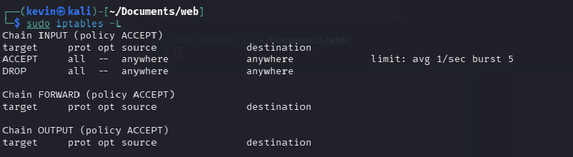
*(Insert screenshot of Wireshark traffic capture during `ping -i 0.1 <Defense-VM-IP>`)*
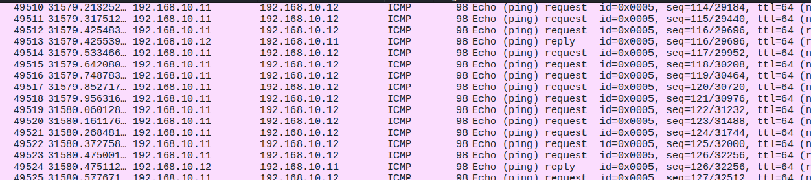

#### **Answers to Questions:**

19. Explain your observations regarding packet loss and how the rate limit affects traffic.
*(Provide your answer here)*

The  attack VM is sending 10 packets per second, and the defense VM is only letting some of them through. 

20. Does the rate limit completely block all ICMP pings? Why or why not?
*(Provide your answer here)*

No it does not block all pings, since the rule is ACCEPT, one ping per second will still go through. 

21. Calculate the theoretical and empirical rate of PING packet drops based on network traffic analysis.
*(Provide your answer here)*

At 10 packets/sec with a 1 packet/sec limit. The drop is 90%. 

22. Why is rate-limiting incoming traffic essential for network security and performance?
*(Provide your answer here)*

It prevents DDOS atacks by sending that a single attacker cannot overwhelm the server. 

23. What potential challenges or drawbacks could arise when implementing rate-limiting in a real-world network environment? How can these be mitigated?
*(Provide your answer here)*

It could accidentally block legitimate high traffic bursts.

---

## **Step 2: Testing with Nmap - Aggressive Scan (-T5)**

#### **Screenshots:**

*(Insert screenshot of `iptables` chains for this step)*
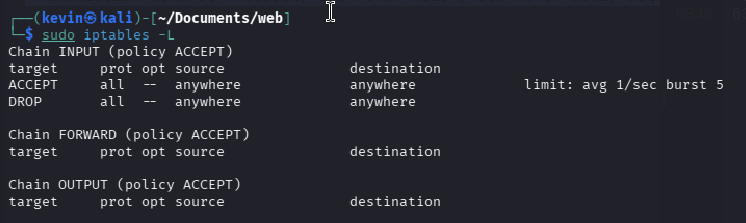
*(Insert screenshot of Wireshark capture during the aggressive Nmap scan)*
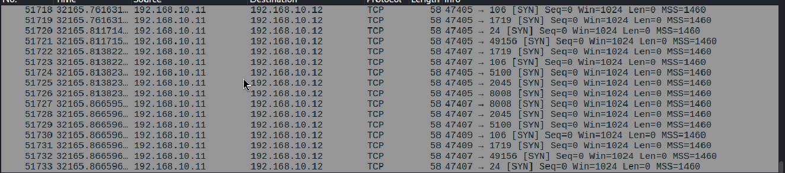
*(Optional: insert screenshot of `nmap -T5 <Defense-VM-IP>` output)*

#### **Answers to Questions:**

24. Does the scan complete successfully? If so, is the result accurate (does it correctly detect port 8000 as open)?
*(Provide your answer here)*

The scan failed.  

25. Based on observations, how does the scan rate affect the accuracy and detection of open ports?
*(Provide your answer here)*

A high scan rate would trigger th firewall's DROP policy leading to massive packet loss. This causes the scanning tool to miss responses. 

26. Referencing the Nmap Performance Guide, how do timing templates influence scan behavior and detection efficiency?
*(Provide your answer here)*

They adjust variables such as round trip time timeout, parallelism, and delay between probes. Higher templates prioritize speed by assuming a high bandwith, whereas lower templates prioritize evasion by waiting longer between tackets to trigger thresholds. 

27. Which Nmap timing profile(s) (`-T0` to `-T4`) could potentially bypass this rate-limiting rule? Justify your answer based on scan behavior and rate thresholds. What is the main drawback of choosing this/these profile(s)?
*(Provide your answer here)*

T0 and T1 are the most liekly to bypass the rule since they wait enough between each prode to avoid triggering the DROP policy. 

---

# **Task 4: Logging and Monitoring Firewall Activity (20 pts)**

## **Step 1: Configuring Firewall Rules to Allow Only HTTP Traffic (Port 8000)**

#### **Screenshots:**

*(Insert screenshot of `iptables` chains)*
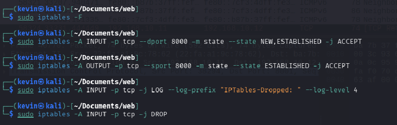
*(Insert screenshot of Wireshark capture for access to port 8000)*
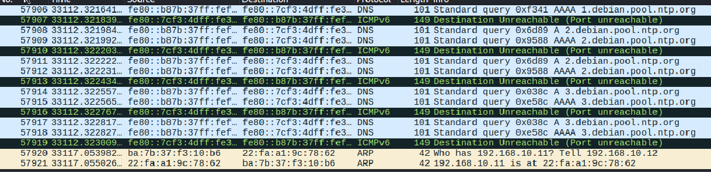
*(Insert screenshot of Wireshark capture for access to port 8001)*
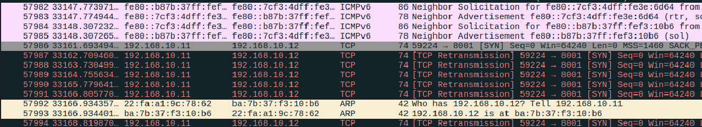
*(Insert screenshot of Wireshark capture for `nmap -p 1-100 <Defense-VM-IP>`)*
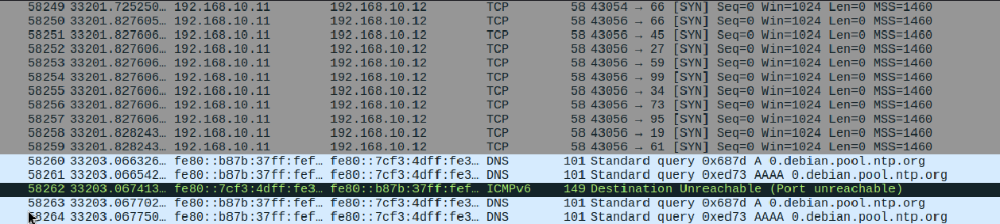

---

## **Step 2: Viewing and Analyzing Firewall Logs**

#### **Screenshot:**

*(Insert screenshot of `sudo dmesg | grep "IPTables-Dropped:"` or filtered output for port 8001)*

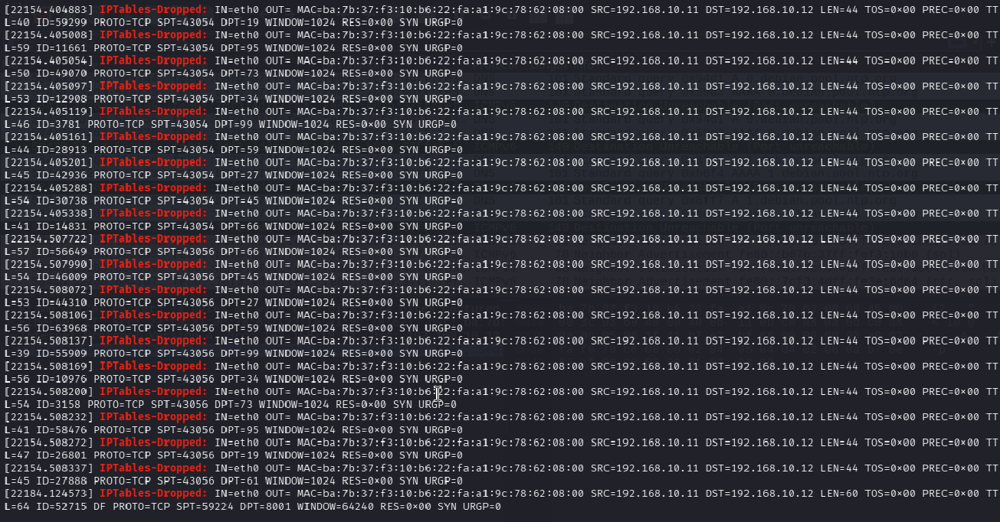

#### **Answers to Questions:**

28. What source IP addresses are attempting to connect?
*(Provide your answer here)*

The source IP is the attack VM, 192.168.10.11

29. What ports are being targeted?
*(Provide your answer here)*
The port numbers being targeted seem to happen in a random order, but they mostly stay within the 1-100 range. 
30. Modify the log search command to filter packets related to **port 8001**. How many entries are recorded in the logs?
*(Provide your answer here)*

There are 11 entries that target port 8001.

31. How does logging contribute to identifying and mitigating suspicious activity?
*(Provide your answer here)*

FIrewall logs create an audit trail that reveals information about the nature of the network traffic. Using this information you can determine which services or vulnerabilities they are trying to target. In order to mitigate this, admins can proactively update the firewall rules to permanently drop all traffic from the malicious IP once you have identified a pattern in the logs. 

---

# **Task 5: Filtering and Logging Network Attacks (40 pts)**

## **Step 1: Configuring Rate-Limiting and Logging for ICMP Floods**

#### **Screenshots:**

*(Insert screenshot of `iptables` chains)* 
*(Insert screenshot of Attack VM normal ping output)*
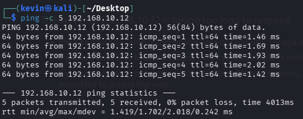
*(Insert screenshot of Attack VM flood ping output)*
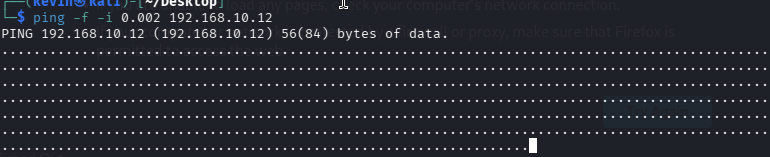
*(Insert screenshot of Wireshark traffic capture during the ICMP flood)*
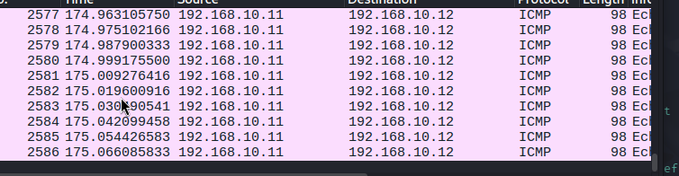
*(Insert screenshot of `dmesg` logs for `ICMP Flood Detected:`)*
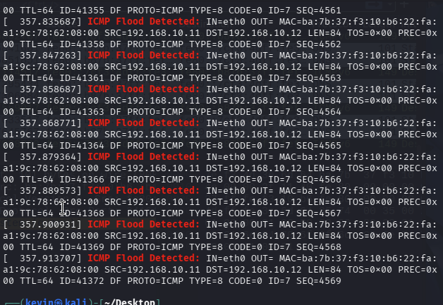

#### **Answers to Questions:**

32. How many ICMP packets were logged as exceeding the rate limit?
*(Provide your answer here)*

Almost all the packets were flagged and dropped. Since my command should technically send 500 packets per second, the firewall only allows 1 packet per second. 

33. How did the Defense VM handle the attack?
*(Provide your answer here)*

It stopped it and only accepted 1 packet per second even though the attack was designed to output 500 packets per second. 

34. How would attackers try to bypass this defense?
*(Provide your answer here)*

Since this rule currently only drops icmp traffic, an attacker could switch protocols and send a different packet type to flood the server's resources. 

---

## **Step 2: Detecting and Logging Regular Nmap Scans**

#### **Screenshots:**

*(Insert screenshot of `iptables` chains for Nmap scan detection)*
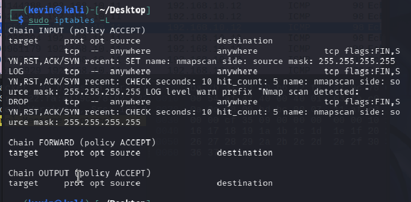
*(Insert screenshot of `nmap -sS -p 1-100 <Defense-VM-IP>` output on Attack VM)*
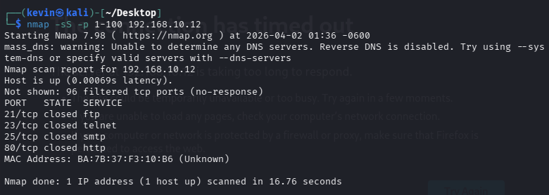
*(Insert screenshot of `dmesg` logs for `Nmap scan detected:`)*
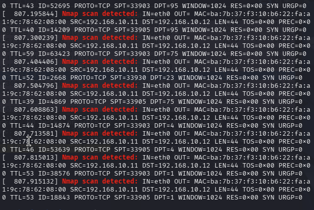
*(Insert screenshot of Wireshark traffic capture during the scan)*
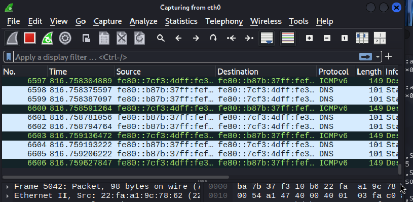

#### **Answers to Questions:**

35. How many scan attempts were logged as exceeding the threshold?
*(Provide your answer here)*

Since the firewall allows 5 packets, the other 95 packets were logged and dropped by the firewall.

36. Was the scan able to identify any open ports, or was it blocked?
*(Provide your answer here)*

The scan returned 4 specific closed ports and labelled the other 96 ports as "filtered"

37. How does rate-limiting SYN packets help prevent port scanning?
*(Provide your answer here)*

Port scanning requires rapidly sending SYN packets to map a network's attack surface. Rate limiting these packets destroys a scanners ability to do that. 

38. What modifications could an attacker use to bypass this detection mechanism?
*(Provide your answer here)*

An attack could simply use a T0 or T1 to wait longer than 10 seconds between each packet. 

---

## **Step 3: Testing Slow and Stealthy Nmap Scans**

#### **Screenshots:**

*(Insert screenshot of `iptables` chains for slow scan detection)*
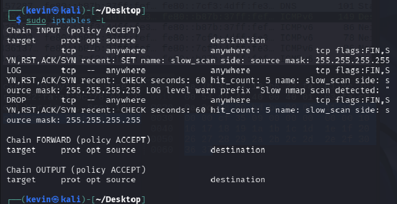
*(Insert screenshot of `nmap -sS -p 1-100 -T2 <Defense-VM-IP>` output on Attack VM)*
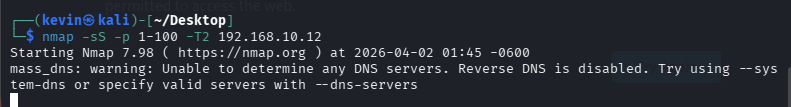
*(Insert screenshot of `dmesg` logs for `Slow Nmap scan detected:`)*
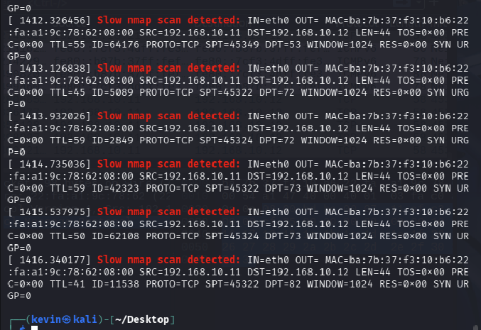

#### **Answers to Questions:**

39. How does the detection of a slow scan compare to a rapid scan?
*(Provide your answer here)*

Rapid scans trigger threshold rules almost instantly because hundreds of packets arrive in a few seconds. Detecting a slow scan requires the firewall to maintain a much longer tracking window. 

40. Was the slow scan still able to identify open ports?
*(Provide your answer here)*

It might sucessfully ping the first couple of ports it tries, but the rest will return as filtered. 

41. What modifications could an attacker use to further evade detection?
*(Provide your answer here)*

To bypass the rule I set, an attacker must send fewer than 5 packets per minute. 

42. How can defensive rules be improved to account for stealthier attacks?
*(Provide your answer here)*

Relying solely on IpTables rate limiting is difficult because you cannot track IP states indefinitely without exhausting server memory. To improve defenses, admins should implement IDS/IPS tools. These can analyze logs over much longer periods. 

---

## **Step 4: Detecting, Logging, and Filtering SSH Brute-Force Attacks**

#### **Screenshots:**

*(Insert screenshot of `iptables` chains for SSH brute-force detection)*
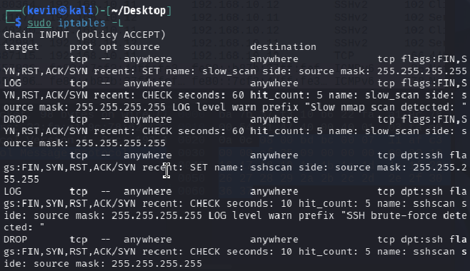
*(Insert screenshot of legitimate SSH output on Attack VM)*
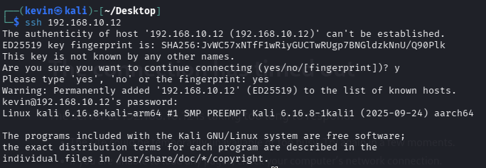
*(Insert screenshot of `nmap -p 22 --script=ssh-brute <Defense-VM-IP>` output on Attack VM)*
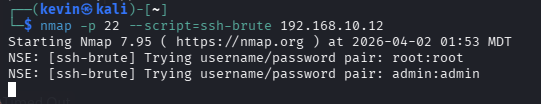
*(Insert screenshot of `dmesg` logs for `SSH brute-force detected:`)*
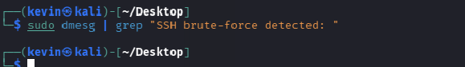

#### **Answers to Questions:**

43. How many SSH connection attempts were logged before the attacker was blocked?
*(Provide your answer here)*

An IP address is allowed 5 attempts before the threshhold is breached. 

44. Did the Defense VM successfully block further attempts after the threshold was exceeded?
*(Provide your answer here)*

Yes once the hitcount of 5 was reached within the time frame, the DROP rule was triggered and blocked all SSH attempts after. 

45. How might attackers attempt to bypass this defense mechanism?
*(Provide your answer here)*

They might build a script to only guess every 15 seconds. Since this is outside the 10 second window the counter would reset. 

46. What additional measures can enhance SSH security beyond rate-limiting?
*(Provide your answer here)*

You can disable password logins entirely and only rqeuire crytographic SSH keys. You can force users to log in with standard privileges and escalata via sudo. 

---

## **Step 5: Detecting, Logging, and Filtering SYN Flood Attacks**

#### **Screenshots:**

*(Insert screenshot of `iptables` chains for SYN flood detection)*
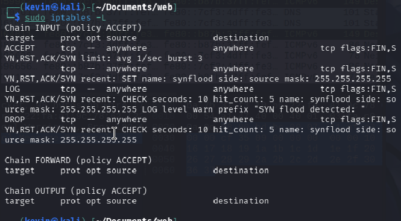
*(Insert screenshot of legitimate TCP connection output on Attack VM)*
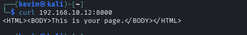
*(Insert screenshot of `hping3 --syn --flood <Defense-VM-IP>` output on Attack VM)*
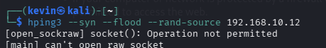
*(Insert screenshot of `hping3 --syn --flood --rand-source <Defense-VM-IP>` output on Attack VM)*

*(Insert screenshot of `dmesg` logs for `SYN flood detected:`)*
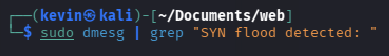

#### **Answers to Questions:**

47. How many SYN packets were logged before the Defense VM blocked further requests?
*(Provide your answer here)*

Based on the rule, only the 5 SYN packets are tracked before the threshold is breached. 

48. Did the Defense VM successfully mitigate the SYN flood attack while allowing normal connections?
*(Provide your answer here)*

Yes I believe so, the attack VM did not show any success. 

49. Why with `--rand-source`, the detection fails? Explain.
*(Provide your answer here)*

Since the source is random, every packet is sent with a differnet IP which should bypass the rule since hte firewall never sees 5 packets from the same IP. 

50. What alternative techniques could attackers use to evade this SYN flood protection?
*(Provide your answer here)*

A distributed DDOS attack, by using multiple machines each machine can send a low rate of SYN Packets which stay below the firewall's radar. But eventually the sheer volume of requests should overwhelm the server. 

51. What additional measures can be taken to improve SYN flood mitigation?
*(Provide your answer here)*

Using external services can absorb high volume attacks before they reach the local server. 

---

## **Step 6: Detecting, Logging, and Filtering High-Rate HTTP Attacks**

#### **Screenshots:**

*(Insert screenshot of `iptables` chains for HTTP flood detection)*
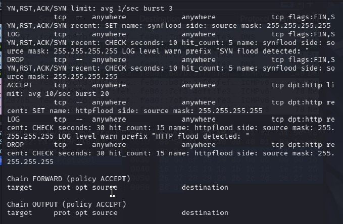
*(Insert screenshot of legitimate HTTP request output on Attack VM)*
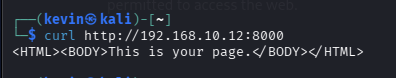
*(Insert screenshot of HTTP flood output on Attack VM)*
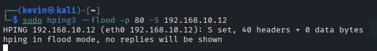
*(Insert screenshot of `dmesg` logs for `HTTP flood detected:`)*

#### **Answers to Questions:**

52. How many HTTP requests were logged before the Defense VM blocked further requests?
*(Provide your answer here)*

The first 15 requests were logged before the rest were dropped. 

53. Did the Defense VM successfully mitigate the HTTP flood while allowing normal web traffic?
*(Provide your answer here)*

Yes the curl request only generated a. few packets and since it was well within the threshold, the requests were loaded perfectly. 

54. What alternative techniques could attackers use to evade this HTTP flood detection?
*(Provide your answer here)*

An attacker could use slow attacks and send HTTP headers without triggering the rule. 

55. What additional measures can be taken to improve web server protection against HTTP-based DoS attacks?
*(Provide your answer here)*

You can use Web Application firewalls to inspect the actual content of the hTTP requests. 
