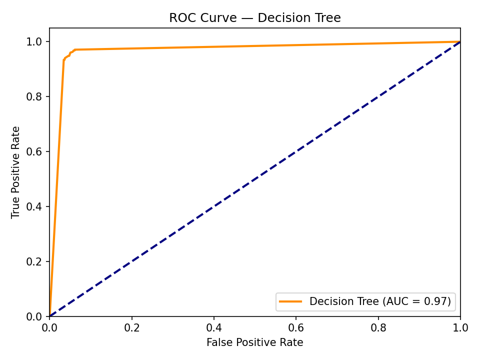
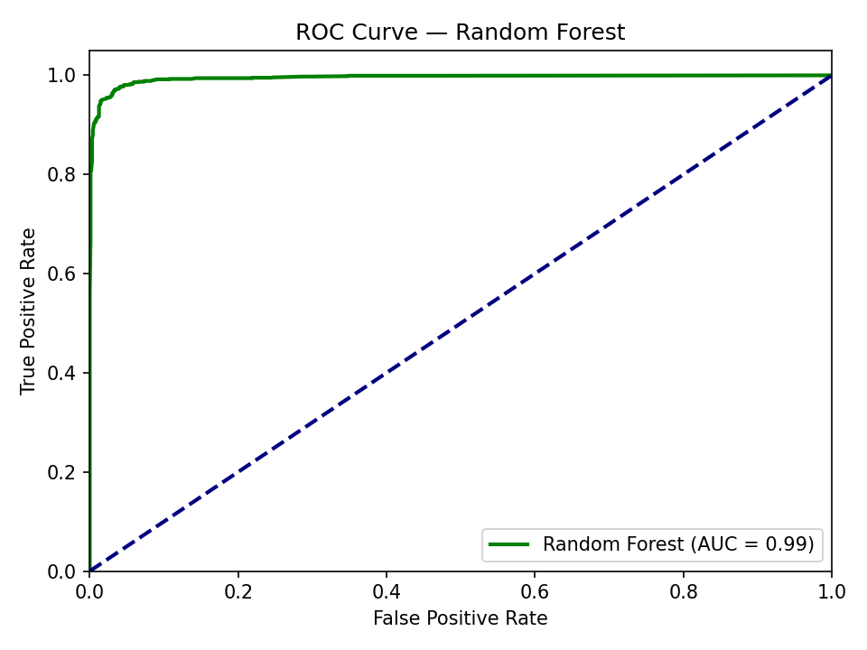
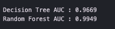
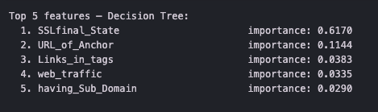
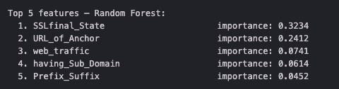
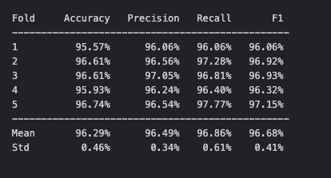

# **Lab 10 Report**  
##### CSCI 5742: Cybersecurity Programming and Analytics, Spring 2026  

**Name & Student ID**: Kevin Jacob, 109750578

---

# **Task 1: Dataset Investigation and Understanding Decision Trees (10 pts)**

---

## **🔹 Questions**:
1. Explain the feature "Redirecting using `//`".  

This features cehceks whether a double slash exists in the url path. Since this should only appear after the protocol (usually the 6th or 7th position depending on http or https), the existence of the double slash later in the URL is indicative of a phishing attack. 

2. Explain the feature "Domain registration length". 

This feature evaluates how far in advance a domain has been paid for. Because phishing websites usually have a short lifespan, phishers rarely pay for long term domain registration. So if the domain registration length is long, then it a sign of a trustworthy organization. 

3. Explain the feature "Subdomains and multiple subdomains".  
   - Provide an example of a suspicious domain.

This feature evaluates the number of subdomains in a URL by counting the number of dots in the URL. Since phishers often add multiple subdomains to trick users into thinking they are on a trusted website. 

For example, 1 dot is legtimate (excluding www.) since most urls will contain ".com"
3 dots is supicious such as secure.paypal.trick.steal.com will be marked as suspicious.

4. Identify the three most differentiating features and justify your choice.  

The 3 most differentiating features are:

   - SSLfinal_state: Legimiately weebsites almost always use valid hTTPS certifications from trusted issuers, whereas pphishing sites often use no SSL or untrusted certificates.

   - URL_of_anchor: Legit websites typically have anchor tags poiting to internal pages within the same domain, but in phishing websites, a high percentage of these are eitehr pointing to external or mismatched domains or they just have broken links that are just used to copy the overall layout without the functionality

   - web_traffic: Legit sites naturally ccumulate a lot of web traffic which gives them a high Alexa rank, but phishing websites obviously will not have the same amount of traffic which indicates that it is not the real thing 

5. Explain the concept of information gain in Decision Trees.

   Information gain telsl you how much a given feature reduces the entropy of a dataset, so when building the model the decision tree calculates the information gain for every possible feature to see which ones are the best to use when differentiating between phishing websites from legitimate ones. The tree selects the feature that provides the highest information gain to act as the root node, then recursively repreats this process for each branch. By maximizing the info gain at each step the algorithm ensures that it takes the most valuable data. 

---

# **Task 2: Python Environment Setup and Module Explanations (10 pts)**

---

## **🔹 Questions**:
1. What is the `scikit-learn` module and what is its role in this lab?  

   Scikit is crucial for the training of the ML model, it is an open source ML library built for python. It gives you easy tools for predictive data analysis and modeling. This lab we used it to access pre built models like the DecisionTreeClassifier. It is used to evaluate our models using built in metrics like accuracy precision, recall, F1 score, etc. 

2. What is the `numpy` module and how is it used for data analysis?

   Numpy is the core library for scientific computing python, it provides high performance support for large multi dimensional arrays and matrics. Numpy is used to load the CSV dataset into a 2d matrix, slice the inputs and labels, and apply conditions for threshold tuning.   

---

# **Task 3: Loading the Dataset and Creating Training/Test Splits (10 pts)**

---

## **🔹 Questions**:
1. What should you put in place of the missing `training_size` calculation?  

   training_size = (len(inputs) // cv_fold_n) * (cv_fold_n - 1)

   To correctly calculate an 80% trianing size based on a 5 gold split, this is the code that should be used since this perfectly assigns 8844 samples for training and 2211 for training. 

2. Explain why calculating training size correctly is important.

   Training size correctly ensures that the model is trained on the right proportion of the data so that it avoids overfitting or underfitting. Using the formula above guarantees a clean 80/20 split. 

---

# **Task 4: Training the Decision Tree Classifier and Evaluating Accuracy (10 pts)**

---

## **🔹 Questions**:
1. Explain the differences between Accuracy, Precision, and Recall.  

   Accuracy is the porportion of all predictions that were correct. Precision measures the percentage of websites that the model predicted as phishing that turned out to actually be phishing websites. Recall measures how many of the websites in the dataset are all actually phishing websites. 

2. In what situations is Precision more important than Accuracy? Give a phishing detection example.

   Precision is more important when the cost of false positives is high, so when incorrectly flagging a legit website causes significant harm to the user. For example, consider a corporate email security gateway that automatically blocks URLs. If precision is low, many legitimate business URLs will be blocked, disrupting employee workflows, blocking access to important resources, and generating a high volume of complaints. In this scenario, it is better to let a few phishing sites through than to constantly block legitimate ones, making precision the more critical metric to optimize.

---

# **Task 5: Adding Precision, Recall, and F1-Score Evaluations (10 pts)**

---

## **🔹 Deliverables**:
- Paste your code section that calculates Precision, Recall, and F1-Score.

   from sklearn.metrics import precision_score, recall_score, f1_score

   dt_precision = 100.0 * precision_score(test_lbl, dt_predictions)
   dt_recall    = 100.0 * recall_score(test_lbl, dt_predictions)
   dt_f1        = 100.0 * f1_score(test_lbl, dt_predictions)

   print(f"Precision : {dt_precision:.2f}%")
   print(f"Recall    : {dt_recall:.2f}%")
   print(f"F1-Score  : {dt_f1:.2f}%")

## **🔹 Questions**:
1. Why is F1-Score preferred on imbalanced datasets?  

   When a dataset has more samples of one class when compared to another, accuracy becomes a misleading metric. In this situation F-1 score combines both precision and recall to give a much more holistic and information view of the model. 

2. How can Precision and Recall improve phishing detection evaluation?

   Accuracy alone cannot distinguish between two very different failure modes. A model with high accuracy might achieve this by being very good at classifying legitimate sites while missing many phishing sites. Preicision tells us how trustworthy the model's phishing alerts are while recall tells us how many phishing sites the model actually cathces. So if precision is low then analysts waste time investigating false alarms, if recall is low then that means that dangerous sites are getting close. Accuracy cannot give us the insight that the other two metrics do. 

---

# **Task 6: Randomized Train/Test Split Using `train_test_split` (10 pts)**

---

## **🔹 Step 1 Questions**:
1. What does `train_test_split` do?  

   train_test_split randomly shuffles the dataset and splits it into a training set and a testing set (80-20 split) using a single function call. It takes the feature array and label array as inputs and returns four arrays: training features, testing features, trainig labels, and testing labels. 

2. What does the `train_size=0.8` parameter mean?  

   This means that 80% of the dataset will be allocated to training, while 20% remains to be used as the testing set. 

3. What is the purpose of `random_state=40`?

   This seeds the RNG used for shuffling. By fixing a seed the exact same split is produced every time the code is run. Without this fixed seed each run of the code would give a different split making the reuslts not reproducible. 

## **🔹 Step 2 Questions**:
- Provide a table comparing performance metrics **before** and **after** random splitting.  

   | Metric | Fold Split (before) | Random Split (after) |
| :--- | :--- | :--- |
| **Accuracy** | 89.73% | 95.57% |
| **Precision** | 92.04% | 96.06% |
| **Recall** | 89.27% | 96.06% |
| **F1-Score** | 90.63% | 96.06% |

- Did model performance change after using random splits?  

   Yes all four metrics improved after switching to a random split. 

- Why does random splitting give a better evaluation?

   Having a random split ensures that allocating the dataset for trainig and testing is free of any ordering bias that the dataset might have. For example if all the phishing samples tend to be towards the end of the dataset, then the model is being trained on very minimal phishing samples. Having a random split ensures that the model gets the most fair view of all the samples. 

---

# **Task 7: Training and Comparing Random Forest and Decision Tree Classifiers (10 pts)**

---

## **🔹 Questions**:
1. What is a Random Forest classifier? Briefly explain its operation.  
2. Table comparing Decision Tree vs Random Forest metrics:  

| Classifier    | Accuracy | Precision | Recall | F1-Score |
| ------------- | -------- | --------- | ------ | -------- |
| Decision Tree |   95.57% |  96.06%   | 96.06% |  96.06%  |
| Random Forest | 96.92%   |  96.82%   | 97.75% |  97.28%  |

3. Which classifier has higher overall accuracy? 

   The random forest model has a higher accuracy when compared to the decision tree. 

4. Which classifier has better recall?  

   Random forest came out on top in terms of recall.

5. Why might Random Forests outperform a single Decision Tree?

   A single decision tree is very prone to overfitting since it can memorize the trainig data and performs worse on the unseen testing data. The random forest model mitigates this through averaging. The result is a model with lower variance and better generalization. In my results Random forest tends to outperform Decision tree in every category. 

---

# **Task 8: ROC Curve and AUC Analysis for Classifier Performance (10 pts)**

---

## **🔹 Questions**:
1. Copy/paste your ROC AUC values for Decision Tree and Random Forest.  

   Decision Tree AUC : 0.9669
   Random Forest AUC : 0.9949

2. Which classifier has a higher AUC?  

   The random forest has the higher AUC when compared to the decision tree. 

3. Based on ROC and AUC, which model would you choose for phishing detection? Justify.

   I would choose the Random forest since it is clearly the better choice for phishing detection based on both the ROC and the AUC values. This means that it maintains high true positive rates while minimizing the false positives across all threshold settings. 

## **🔹 Required Screenshots**:
- Decision Tree ROC Curve plot  

- Random Forest ROC Curve plot  

- Console showing AUC values

---

# **Task 9: Threshold Tuning and Performance Analysis (10 pts)**

---

## **🔹 Questions**:
- Provide a table summarizing metrics at different thresholds:

| Threshold | Accuracy (%) | Precision (%) | Recall (%) | F1-Score (%) |
| --------- | ------------ | ------------- | ---------- | ------------ |
| 0.4       |   96.47           |       95.62        |    98.23        |      96.91        |
| 0.5       |  96.88            |     96.74          |      97.75      |     97.24         |
| 0.6       |       96.83       |     97.19          |      97.19      |     97.19         |
| 0.7       |       96.43       |      97.71         |      95.90      |     96.80         |

- Which threshold achieved the highest accuracy?  

   Threshold of 0.5 achieved the highest accuracy

- Which threshold achieved the best recall?  

   Threshold of 0.4 has the highest recall. 

- Discuss the trade-offs when lowering or raising the threshold.

   As your lower the threshold, the classifier becomes more sensitive and will flag a website with less confidence which catches more actual phishing websites, but also incorrectly flags a lot more legitimate sites. Raising the threshold has the opposite effect where it will only flag a website as phishing when it is absolutely certain that it is a phishing website, meaning a lot more phishing websites will go through undetected. The trick is to find the best middle group where you maximize positive classifications and minimize false positives. 

---

# **Task 10: Feature Importance Analysis (10 pts)**

---

## **🔹 Questions**:
1. List the top three most important features for the Decision Tree.  

   The top three most important features are SSLfinal_state, Url_of_anchor, and links_in_tags.

2. List the top three most important features for the Random Forest.  

   The top tree most important features are are SSLfinal_state, Url_of_anchor, and web_traffic. 

3. Discuss:  
   - Do the two classifiers agree on the important features?  

      They agreed for the most part, but they differed on the final most important feature where Decision tree chose links_in_tags, and Random forest chose web_traffic. 

   - Why might feature importance rankings differ between models?

      A single decision tree makes greedy choices at each split, so once it picks SSLfinal_state as the root node, the reamining features are all evaluated on an already partitioned set. This causes the tree to heavily concetrate the importance of a few top features and assign relatively little importance to features that become relevant only in certain subtrees. 

      The Random Forest distributes importance more evenly across features because each tree sees a different random subset of features at each split and is trained on a different bootstrap sample. Features that are strong in certain subsets of the data like web_traffic to get more opportunities to demonstrate their value across the forest. This leads to a more balanced importance distribution and is part of why the Random Forest generalizes better.

## **🔹 Required Screenshots**:
- Screenshot showing Decision Tree feature importance output  

- Screenshot showing Random Forest feature importance output

---

# **Bonus Section (Optional)**

---

## **Bonus Task 1: 5-Fold Cross-Validation**

- Implementation explanation  

The dataset was loaded in full and shuffled with the KFOld function using a split value of 5. For each of the 5 folds, the DecisionTreeClassifier was trained on 4 folds and evaluated on the last fold. 

- Table with per-fold metrics (Accuracy, Precision, Recall)  

- Final averages and standard deviations

My code printed out the values this question asked for, so I just attached a screenshot. Hope that is ok!
---

## **Bonus Task 2: DummyClassifier and Logistic Regression Comparison**

- Metrics for DummyClassifier and Logistic Regression  

DummyClassifier: Acc=56.26% Prec=56.26% Rec=100.00% F1=72.01%

Logistic Regression: Acc=92.54% Prec=92.85% Rec=93.97% F1=93.41%

- Short paragraph explaining the importance of baseline comparisons

The DummyClassifer useing the most_frequent strategy almost always predicts the majorty class. The 100% recall is misleading since it labels everything as phishing so it never misses one but it also has no ability to identify legimiate sites. The regression model performs very well confirming that the phishing detection can be detected by even a linear model. However, the Decision tree and the Random Forest models both clearly outperform the linear approach. 

---

## **Bonus Task 3: Overfitting Reflection**

- Short paragraph addressing:
  1. Evidence of overfitting in your Decision Tree?  

   The decision tree shows evidence of overfitting since it achieved 99.08% accuracy on training data but only go a 95% accuracy on the test set. This proves that it started to memorize patterns in the training data.

  2. Hyperparameters to tune against overfitting?  

   To minimize the overfitting you can tune the max_depth to limit the tree from overgrowing, you can require a minimum number of samples before a node can be split which lets you avoid splits based on very small groups. 

  3. How overfitting could harm phishing detection performance on unseen data?

   In phishing detection overfitting would be very harmful because phishing techniques are constnatly evolving, so if a model starts to memorize its training data, then it can never adapt to new technique. 

