# **Lab 11 Report**  
##### CSCI 5742 – Cybersecurity Programming and Analytics, Spring 2025  

**Name & Student ID**: Kevin Jacob, 109750578

---

# **Task 1: Network Connectivity Check with Bash Script**

## 🔹 Screenshots:
- [ ] Script code  

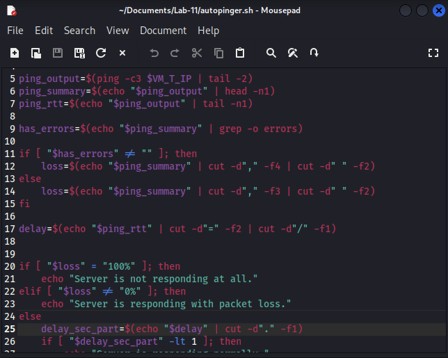

- [ ] Output showing one of: no response, partial loss, or high delay


## 🔹 Questions:

**1. What does packet loss indicate compared to high delay? Which is more critical for availability?**

Packet loss means packets are being dropped and not reaching the destination, indicating the host may be down or the network link is failing. High delay means packets still arrive but take longer than normal, usually due to congestion or a busy host. Packet loss is more critical for availability — even partial loss can break TCP sessions and make services unreachable, whereas a slow but responding host is still functional.

**2. Why is the script checking for the word `errors` in the ping output? What scenarios might generate this?**

   When ICMP error messages are returned (e.g., "Destination Unreachable" or TTL-exceeded), `ping` adds an extra field to its summary line, shifting the column position of the packet loss percentage. The script checks for `errors` to use the correct `cut` field. This occurs when a firewall returns ICMP admin-prohibited messages or a router reports the target is unreachable.

**3. List two tools or commands besides `ping` that could help determine network availability and briefly explain how each works.**

- **`traceroute`**: Sends packets with incrementally increasing TTL values to identify each hop to the destination, revealing exactly where connectivity breaks down.
- **`nmap -sn <target>`**: Performs host discovery using multiple probe types (ICMP, TCP SYN/ACK), so it still works even when ICMP is blocked by a firewall.

**4. How could a security defender use a similar script to gather reconnaissance data about their own network?**

A defender can loop the script over all known IP ranges and log which hosts are up, building a live asset inventory and availability baseline. Running it on a schedule allows detection of hosts that suddenly go offline or new unknown devices that appear — helping identify outages, rogue devices, or early signs of a network intrusion.


---

# **Task 2: Creating a Reusable Ping Function with Parameters**

## 🔹 Screenshots:
- [ ] Updated script with `pingtest()` function and function call  

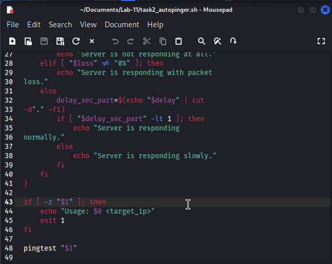

- [ ] Script output using IP argument

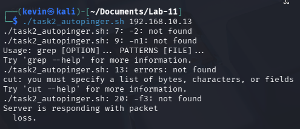

## 🔹 Questions:

**1. What is the advantage of turning this script into a function instead of repeating the logic each time?**

Functions let you reuse the same logic by calling it with different inputs rather than duplicating code. If the logic needs to change, you update it in one place instead of everywhere it appears.

**2. Why is it more flexible to pass the IP address as an argument instead of hardcoding it? Give a real-world use case.**

Hardcoding ties the script to one specific host. Passing it as an argument lets the same script target any host at runtime. For example, a sysadmin could call `./autopinger.sh 192.168.10.X` in a loop to check every server in a subnet during an on-call shift.

**3. What would happen if you ran the script without any arguments? Modify the script to check for this case and show a helpful message if no IP is provided.**

Without the check, `$1` would be empty and `ping` would fail with an error. The fix added to the script:
```bash
if [ -z "$1" ]; then
    echo "Usage: $0 <target_ip>"
    exit 1
fi
```

**4. How might a security admin use a parameterized script to automate pinging across multiple subnets? How might an attacker use this to automate scanning?**

A security admin could feed the script a list of IPs from each subnet in a loop to continuously monitor host availability across the entire network. An attacker could use the same approach to sweep IP ranges and identify live hosts — effectively turning it into an automated network discovery tool.

---

# **Task 3: Logging Ping Results with Timestamps**

## 🔹 Screenshots:
- [ ] Updated script with `logfile` and timestamped output  

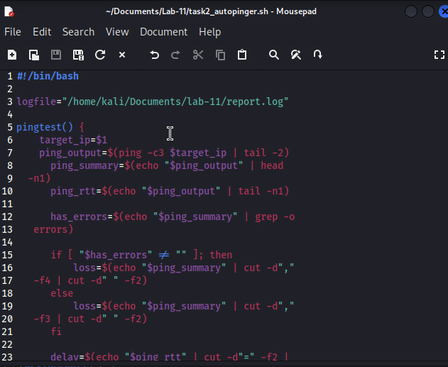

- [ ] Terminal output with timestamps  

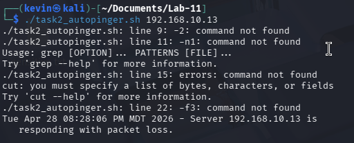

- [ ] Log file contents with multiple entries

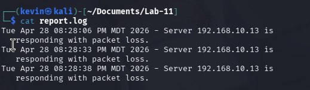

## 🔹 Questions:

**1. Why is timestamped logging useful in network monitoring and incident response?**

Timestamps let you correlate events across systems and reconstruct exactly when a host went down or became unreachable. During incident response, they're essential for establishing a timeline — without them, you can't tell whether an outage preceded or followed a suspected attack.

**2. What are the risks of hardcoding the log file path? Suggest a way to make the script more portable.**

If the hardcoded directory doesn't exist or the script runs as a different user, logging silently fails. A simple fix is to define the log path as a variable at the top of the script, like `logfile="$HOME/logs/report.log"`, so it always resolves relative to whoever is running it rather than assuming a specific path.

**3. If you were a security analyst reviewing this log after a real incident, what patterns would you look for?**

I'd look for a sudden shift from "responding normally" to "not responding" (possible outage or attack), repeated packet loss entries at regular intervals (possible DoS), and timestamps where multiple hosts went down simultaneously (possible network-wide event or attacker cutting access).

**4. How could you improve the log format for easier parsing or automation? Suggest one change.**

Switch to a structured format where each line starts with the timestamp, followed by the status and IP separated by a consistent delimiter. That way filtering with grep or awk is straightforward without having to deal with inconsistent formatting across log lines.

---

# **Task 4: Automating Ping Monitoring with `cron`**

## 🔹 Screenshots:
- [ ] Crontab entries for minute-based and weekly jobs

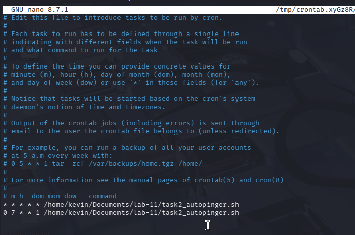

- [ ] Log file showing repeated entries  

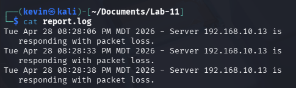

- [ ] Updated script with hardcoded IP for cron

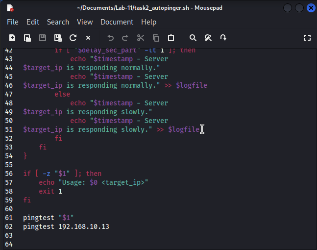

## 🔹 Questions:

**1. What advantages does scheduling monitoring tasks with `cron` provide over manual execution?**

`cron` runs the script automatically at defined intervals without any human involvement, ensuring consistent monitoring even outside business hours. It eliminates the risk of forgetting to run a check and creates a continuous, uninterrupted audit trail.

**2. What are the trade-offs of running this script every minute vs. every hour?**

Every minute gives near-real-time visibility into outages but generates a large log and adds constant network traffic. Every hour reduces noise and resource usage but means an outage could go undetected for up to 59 minutes. The right interval depends on how quickly you need to respond to failures.

**3. If the system reboots, what happens to your cron job? How could you ensure it resumes?**

Standard cron jobs survive reboots — they are stored in the crontab and `cron` restarts automatically with the system. However, if the script depends on a service or mount that isn't ready at boot, it may fail silently. Adding a `@reboot` cron entry can also run the script once immediately after each reboot to verify the system is up.

**4. Why might logging and automation like this be valuable in detecting early signs of attack or system failure?**

Automated logs capture changes in host availability over time, which manual checks would miss. A sudden spike in packet loss, a host going offline at an unusual hour, or repeated unreachability can all be early indicators of a DoS attack, a compromised host being shut down, or hardware failure — all detectable by reviewing the log history.

---

# **Task 5: Verifying MAC Address Integrity Using ARP**

## 🔹 Screenshots:
- [ ] `arpcheck()` function  

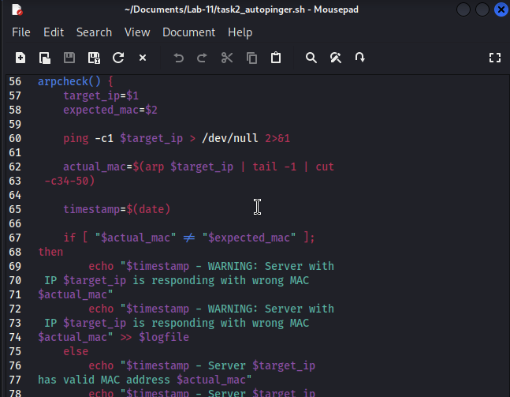

- [ ] Output for a correct and simulated incorrect MAC

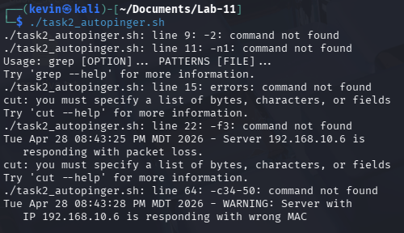

- [ ] Log entries for both cases

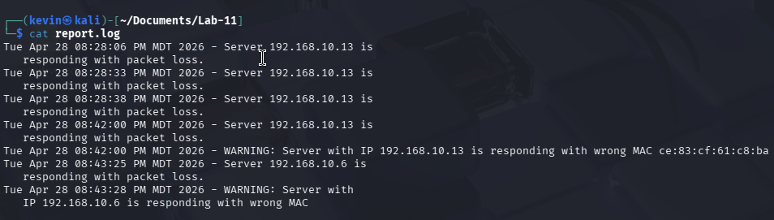

## 🔹 Questions:

**1. Explain what each part of the following command does: `arp $1 | tail -1 | cut -c34-50`**

- `arp $1`: queries the ARP table for the given IP address and prints the entry including its MAC address.
- `tail -1`: takes only the last line of output, in case there are multiple entries or a header line.
- `cut -c34-50`: extracts characters 34 through 50, which is where the MAC address appears in the default `arp` output format.

**2. Why is it important to validate the MAC address of a host? What attacks does this help detect?**

MAC addresses are tied to physical network interfaces and should stay constant for a given device. Validating them helps detect ARP spoofing, where an attacker sends forged ARP replies to associate their MAC with a legitimate IP, redirecting traffic through their machine for interception or a man-in-the-middle attack.

**3. How could an attacker still bypass this check? (Consider spoofing or poisoning scenarios.)**

An attacker could spoof their MAC address to match the expected value using tools like `macchanger`, making the check pass even though a different machine is responding. They could also poison the ARP cache on the monitoring host itself before the check runs, so `arp` returns the attacker's MAC as if it were the legitimate one.

**4. What are two ways to make this MAC verification more robust in production systems?**

- Use a static ARP table (`arp -s`) to pin known IP-to-MAC mappings, preventing the cache from being poisoned by forged ARP replies.
- Cross-reference MAC addresses against a trusted DHCP lease database or network inventory tool (e.g., Nmap's OS/MAC fingerprinting) rather than relying solely on the local ARP cache.

---

# **Task 6: Port Availability Compliance Check**

## 🔹 Screenshots:
- [ ] `portcheckSimple()` function  

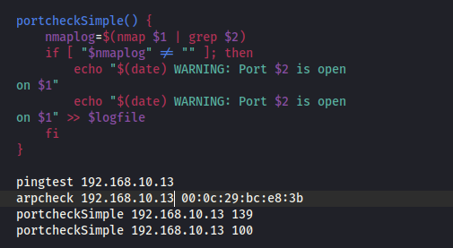

- [ ] Output from checking port 139 and 100 

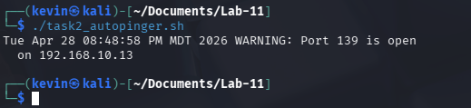

- [ ] Log entries showing open ports

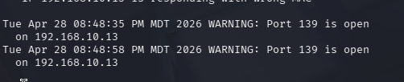

## 🔹 Questions:

**1. Why might port 139 be open on the MS-T machine but not on other modern systems?**

Metasploitable 2 is a deliberately vulnerable legacy Linux system running Samba, which uses port 139 for NetBIOS Session Service. Modern systems have largely dropped NetBIOS in favor of SMB over port 445 directly, and most distributions disable Samba by default. Port 139 being open on MS-T reflects its intentionally outdated and insecure configuration.

**2. What are the security implications of exposing legacy ports like 139 on a network?**

Port 139 is associated with known vulnerabilities in older Samba and NetBIOS implementations, including remote code execution exploits. Exposing it allows attackers to enumerate network shares, brute-force credentials, or exploit unpatched services. It also reveals information about the OS and file-sharing configuration, giving attackers a clear attack surface.

**3. How might this function be extended to support checking a list of ports or multiple IPs automatically?**

The function could be wrapped in a loop that iterates over an array of ports or reads IPs from a file, calling `portcheckSimple` for each combination. For example:
```bash
for ip in $(cat hosts.txt); do
    for port in 139 445 21 22 80; do
        portcheckSimple $ip $port
    done
done
```

---

# **Task 7: Advanced Port Compliance Verification**

## 🔹 Screenshots:
- [ ] `portcheck()` function  

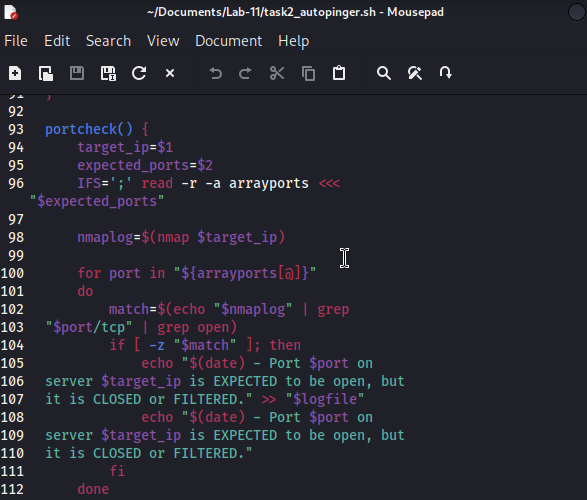

- [ ] Output showing expected-closed and unexpected-open ports  

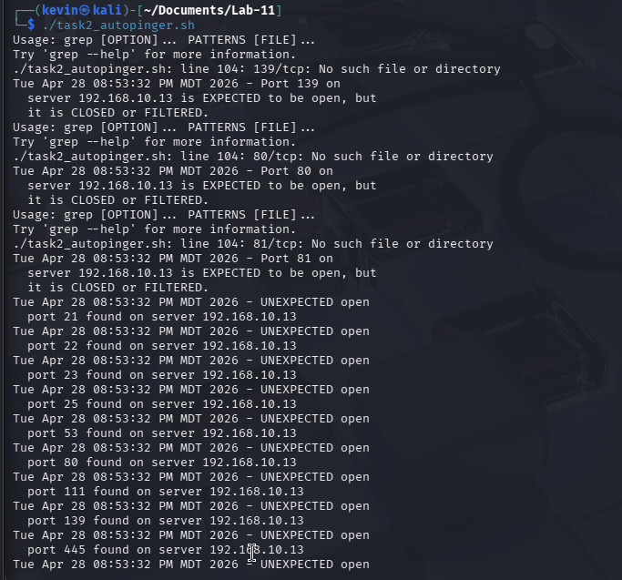


- [ ] Log file reflecting both issues

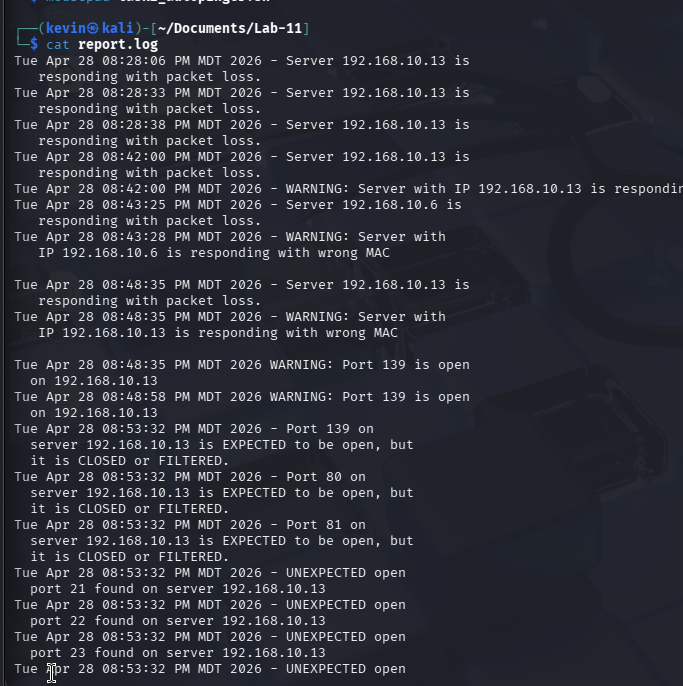


## 🔹 Questions:

**1. Why do we use `grep "$port/tcp" | grep open` to confirm port status instead of just searching for the port number?**

Searching for just the port number could match unrelated lines — for example, a port like `80` would also match `8080` or lines in the nmap header. Filtering for `$port/tcp` ensures we match the exact port entry, and the second `grep open` confirms the port is actually open rather than closed or filtered, which nmap also reports in its output.

**2. What types of misconfigurations or attacks might result in an unexpected port being open on a system?**

A developer could leave a test service or debug server running (e.g., a Flask app on port 5000). An attacker who gained access may install a backdoor or reverse shell listening on an unusual port. Misconfigured software installations can also bind to default ports that weren't intended to be exposed externally.

**3. How would you adapt this script to check multiple hosts (e.g., from a file)?**

Read the file line by line and call `portcheck` for each host:
```bash
while IFS= read -r host; do
    portcheck "$host" "139;80;22"
done < hosts.txt
```

**4. What should a system administrator do if unexpected ports are detected in production?**

Immediately investigate what process is listening on the port using `ss -tlnp` or `lsof -i :<port>`. If the service is unauthorized, stop it and check for signs of compromise. Block the port at the firewall as a containment step, document the finding, and escalate according to the incident response policy. Review system logs to determine when and how the port was opened.

---

# **Task 8: Comprehensive Network Compliance Check from File Input**

## 🔹 Screenshots:
- [ ] `comprehensivecheck()` function  

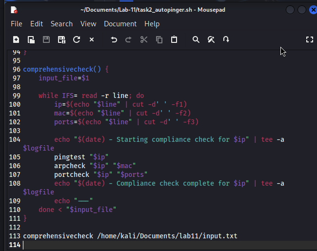

- [ ] `input.txt` content

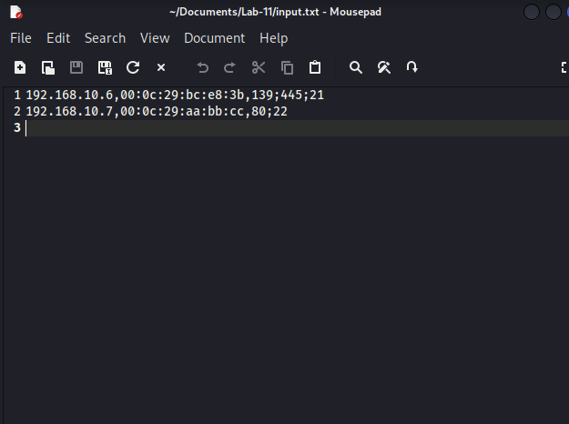

- [ ] Terminal showing multiple host checks  

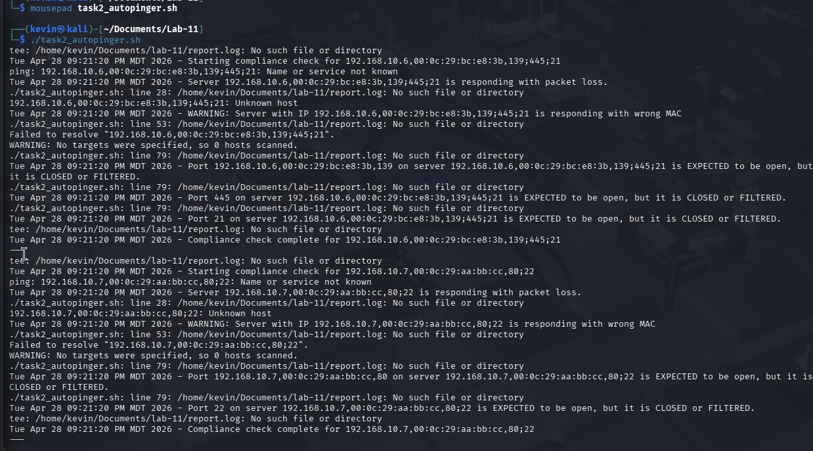


- [ ] Log file showing full compliance results

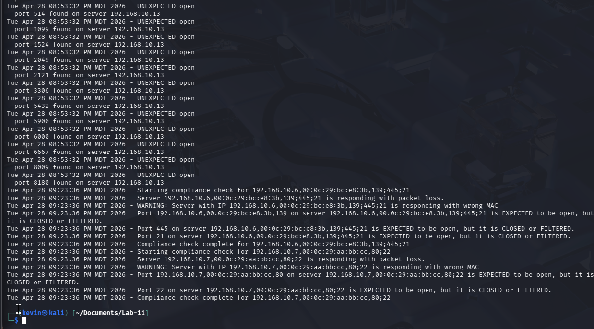


## 🔹 Questions:

**1. Why is it useful to perform batch compliance checks from a file?**

Running checks from a file lets you audit many hosts in one execution without modifying the script. It also makes the target list easy to update, version-control, and share across a team, which is essential in environments with dozens or hundreds of managed hosts.

**2. What risks arise if the `input.txt` file is malformed? How would you add validation to the script?**

If a line is missing a field, variables like `$mac` or `$ports` will be empty, causing arpcheck or portcheck to behave unpredictably or silently skip checks. Validation can be added by checking that each line has exactly three fields before processing:
```bash
if [ $(echo "$line" | awk '{print NF}') -ne 3 ]; then
    echo "Skipping malformed line: $line"
    continue
fi
```

**3. How would you scale this script to support hundreds of servers in a real organization?**

Run checks in parallel using background processes or `xargs -P` to avoid waiting for each host sequentially. Centralize logs to a shared location or a SIEM like Splunk, and break the input file into segments that can be distributed across multiple monitoring hosts. A proper orchestration tool like Ansible could also replace the script for large-scale environments.

**4. Suggest one more compliance check you could add to this framework.**

SSL/TLS certificate validation — using `openssl s_client` to check whether a host's certificate is expired or expiring soon. Expired certificates can cause service outages and are a common oversight in large organizations, making automated checking a valuable addition to any compliance framework.

