# **Lab 9 Report**

##### CSCI 5742: Cybersecurity Programming and Analytics, Spring 2026

**Name & Student ID**: Kevin Jacob, 109750578

---

# **Task 1: Snort Setup and Basic Alerting (20 pts)**

## **Step 1: Install, Configure, and Run Snort 3**

#### **Screenshots:**

*(Insert screenshot of successful Snort startup showing configuration validation.)*

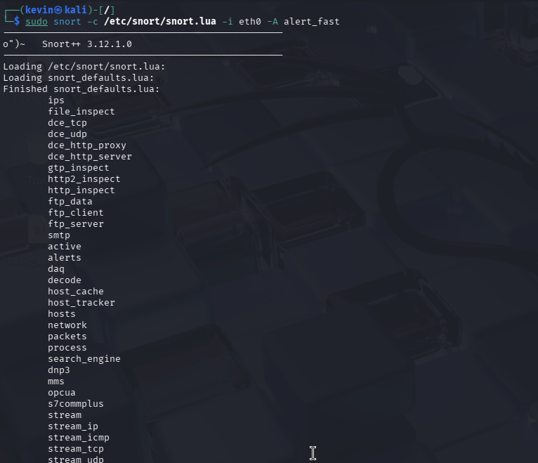

*(Insert screenshot of `snort.lua` showing `HOME_NET = '192.168.10.0/24'`.)*

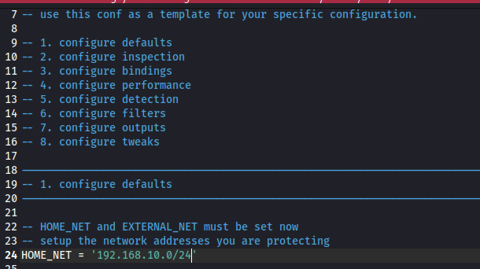

#### **Answers to Questions:**

1. How many rules were loaded when Snort started? What does that number tell you about the configuration?
*(Provide your answer here.)*

It says 866 rules loaded. THis tells me that Snort successfully parsed the lua file, and was able to locate its default directories. 

2. Did Snort report any warnings or errors during startup? If yes, what do they indicate?
*(Provide your answer here.)*

Not it did not report any errors, however, I did not get the validated configuration message and I just got an inconclusive response. 

3. What interface did Snort bind to, and was it the expected one? Why is selecting the correct interface important for an IDS?
*(Provide your answer here.)*

Snort bound to the eth0 inferace which is what was intended based on the startup command. Selecting the correct interface is crucial because an IDS can only inspect traffic that it is spefically listening for. If it is on the wrong interface, then it will be completely blind to the malicious traffic that we are generating.

4. What output mode is Snort using? Briefly compare `alert_fast`, `alert_full`, and other alert output options.
*(Provide your answer here.)*

The snort is using alert_fast mode. Fast prints a concise summary of the alert, full is much more verbose and prints the full packet headers. 
---

## **Step 2: Enable Built-in Intrusion Detection and Simulate a Port Scan**

#### **Screenshots:**

*(Insert screenshot of Snort console output showing scan-related alerts.)*

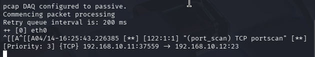

*(Insert screenshot of Wireshark showing SYN scan traffic from VM-A to VM-T.)*

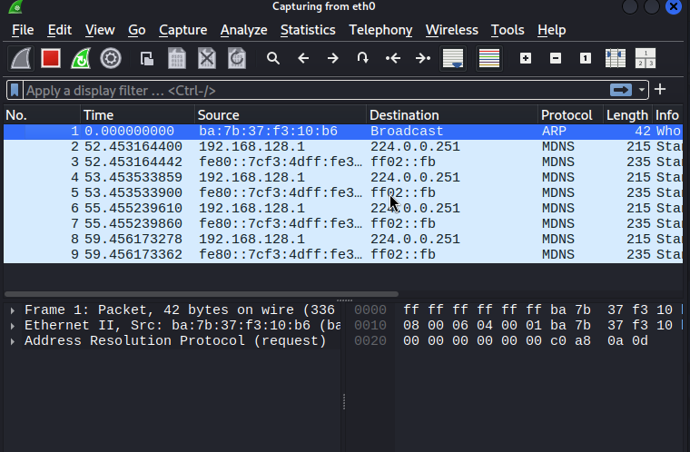

#### **Answers to Questions:**

5. What types of scan activity did Snort detect from the Nmap scan? Quote or summarize the alert messages.
*(Provide your answer here.)*

My snort terminal shows that there is an ongoing TCP scan that it picked up, it also shows where the source of the scan is and what IP it is listening to. 

6. Which ports or protocols were probed by Nmap? Identify a few and explain their significance.
*(Provide your answer here.)*

According to the nmap results, the scan fallged 1000 ports and found all of them to be closed. We can see probes against commpon forts like 21, 22, and 80. 

7. Why is promiscuous mode important in this lab? How does it help Snort detect traffic that might otherwise be missed?
*(Provide your answer here.)*

Promisc mode forces the interface to capcutre all traffic travelling across the network regardless of source or destination. Without promisc mode being enabled, snort would be blind to attacks happening between other machines on the network. 

8. Compare Snort alerts and Wireshark output. What extra insight does Wireshark provide that Snort alerts alone do not?
*(Provide your answer here.)*

Snort summarizes the network traffic, whereas wireshark shows full packet level details. 

---

# **Task 2: Custom Rule Writing for ICMP, FIN, NULL, and Xmas Scan Detection (20 pts)**

## **Step 1: Configure Snort to Load `local.rules`**

#### **Screenshot:**

*(Insert screenshot of the `ips` block in `snort.lua` showing `include /etc/snort/rules/local.rules`.)*

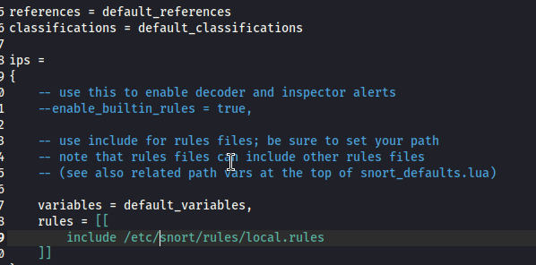

#### **Notes:**

*(Document any syntax checks, validation messages, or troubleshooting you encountered while enabling `local.rules`.)*

---

## **Step 2: Add a Custom ICMP Echo Request Rule**

#### **Screenshots:**

*(Insert screenshot of `local.rules` showing the ICMP echo request rule.)*

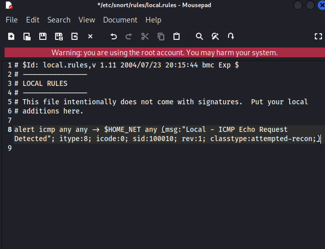

*(Insert screenshot of Snort alert output for the ICMP echo request detection.)*

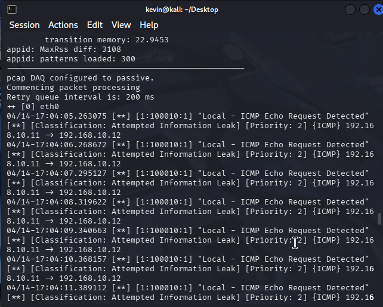

---

## **Step 3: Add FIN, NULL, and Xmas Scan Rules**

#### **Screenshots:**

*(Insert screenshot of `local.rules` showing the FIN, NULL, and Xmas rules.)*

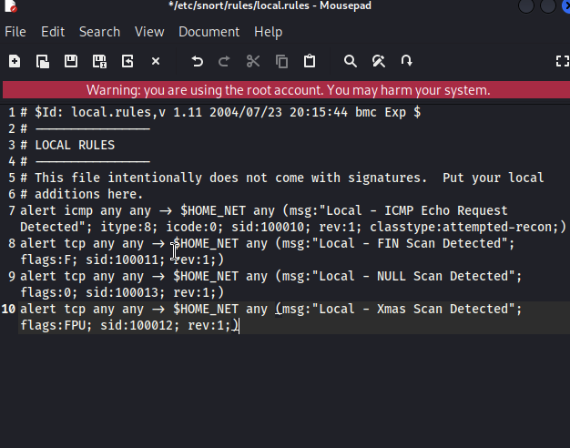

*(Insert screenshot of Snort alerts showing the FIN, NULL, and Xmas detections.)*

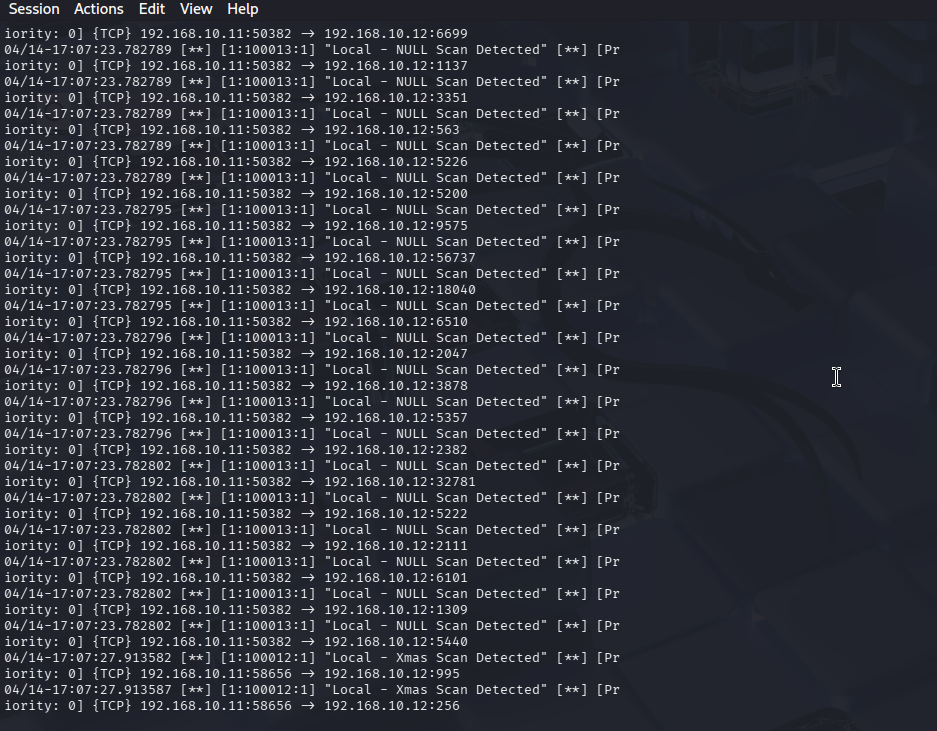

---

## **Step 4: Confirm TCP Flag Behavior with Wireshark**

#### **Screenshots:**

*(Insert Wireshark screenshot of one FIN scan packet.)*

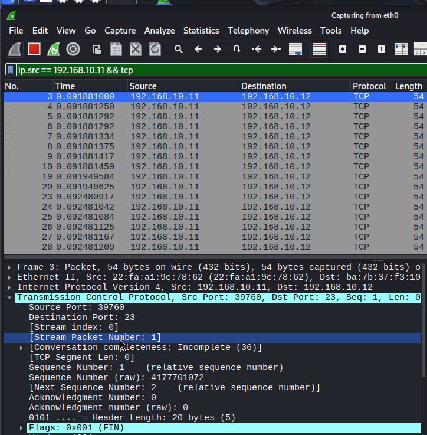

*(Insert Wireshark screenshot of one NULL scan packet.)*

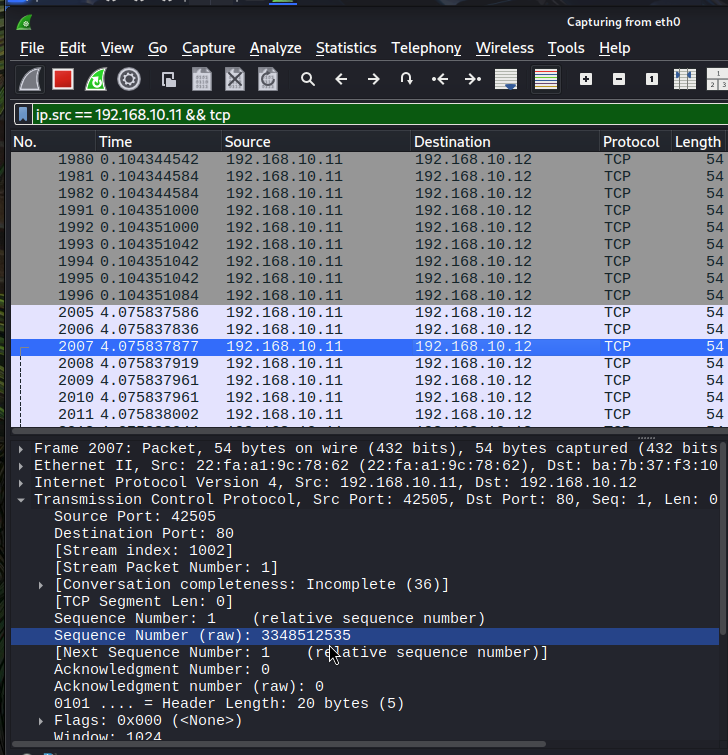

*(Insert Wireshark screenshot of one Xmas scan packet.)*

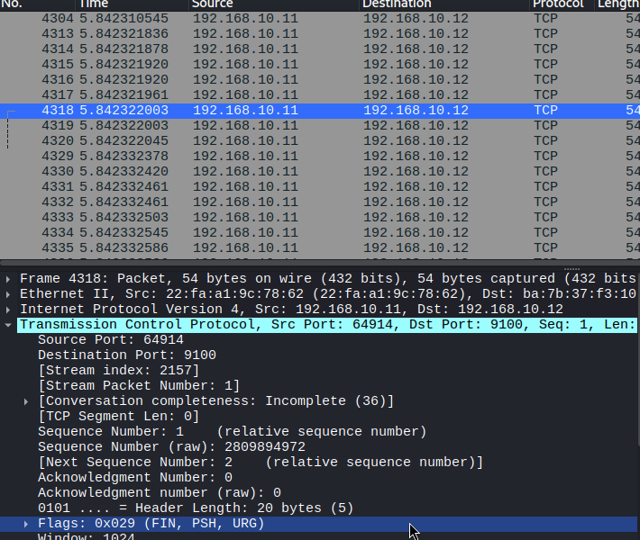

#### **Answers to Questions:**

9. Why are FIN, NULL, and Xmas scans considered stealthier than normal TCP scans?
*(Provide your answer here.)*

Normal TCP scans initiate a 3 way handshake which is very noisy and easily logged by firewalls. FIN, NULL, and XMAS scans are stealthier because they send packets with non standard flag combinations that completely bypass the handshake process.j

10. What do the flag patterns `F`, `0`, and `FPU` mean in these rules?
*(Provide your answer here.)*

F means the FIN flag is set, O means it is a NULL scan, and FPU means its a XMAS scan, which means that the FIN, PSH, and URG flags are all set. 

11. Compare Snort detection with Wireshark analysis. Did Snort summarize behavior differently than what you saw in the raw packets?
*(Provide your answer here.)*

Yes they serve different purposes. While Snort abtracts all of the raw packet data and summarizes it into a single high level alert, Wireshark provides a more packet by packet view showing tghe exact TCP flags, MAC addresses. 

12. Which `classtype` would you assign to the FIN, NULL, and Xmas rules, and why?
*(Provide your answer here.)*

The most appropriate classtype is attempted-recon since these scans used malformed packets and do not inherently damage the system. The sole purpose of these scans is information gathering to map out open ports. 

---

# **Task 3: FTP Intrusion and Brute-Force Detection (20 pts)**

## **Step 1: Enable FTP Inspectors**

#### **Screenshot:**

*(Insert screenshot of `snort.lua` showing `ftp_server`, `ftp_client`, and `ftp_data` configuration.)*

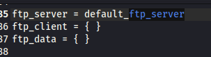

---

## **Step 2: Add FTP Detection Rules**

#### **Screenshot:**

*(Insert screenshot of `local.rules` showing the FTP connection, failed-login, and brute-force rules.)*

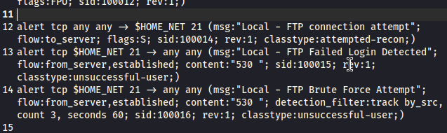

---

## **Step 3: Test FTP Login and Brute-Force Detection**

#### **Screenshots:**

*(Insert screenshot of Snort alert for an FTP connection attempt.)*

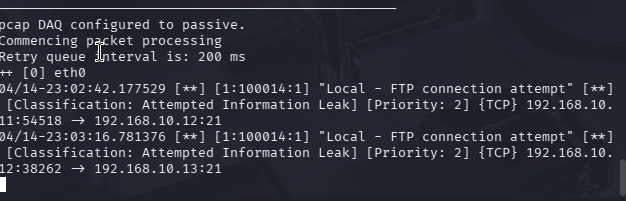

*(Insert screenshot of Snort alert for an FTP failed login.)*

*(Insert screenshot of Snort alert for FTP brute-force detection.)*

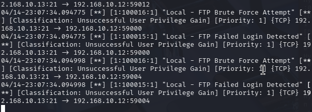

#### **Answers to Questions:**

13. What does the FTP response code `"530 "` indicate, and why is it useful for detection?
*(Provide your answer here.)*

A 530 code indicates that the user is not logged in and is the standard reponse for when a user provides an invalid username or password. It is very useful for detection because it provides a highly reliable signature to track failed login attempts. 

14. Why is `flow:from_server,established` necessary for failed-login detection?
*(Provide your answer here.)*

The flow keyboard ensures that snort only inspects traffic going in the correct direction and state. From server is necessary because the 530 error code is generated by the FTP server in response to the client. The established parameter ensures that snort only inspects packets belonging to a fully completed TCP connection. 

15. Explain how `detection_filter:track by_src, count 3, seconds 60;` works.
*(Provide your answer here.)*

Track by src tells snort to keep a separate tally for each unique attacker IP. Count 3 sets the threshold to three occurrences. Seconds 60 sets the time window to 60 seconds. Essentially, this means that this alert will only trigger if a single source IP generates 3 or more failed login attempts within a 60 second window. 

16. How does `detection_filter` help reduce alert fatigue?
*(Provide your answer here.)*

Detection filter groups the rapid fire events together. Without this, a tool like hydra would test a 1000 word password list and generated 1000 individual failed login alerts in the span of a few seconds. 

17. If this were a production deployment, how would you improve these FTP rules?
*(Provide your answer here.)*

Initially, I would add a corresponding rule to detect a succesful login immediately following a string of invalid errors which would indicate a successful brute-force compromise. 

---

# **Task 4: Sensitive Data Exfiltration Detection via FTP (20 pts)**

## **Step 1: Simulate Sensitive File Exposure**

#### **Screenshots:**

*(Insert screenshot showing creation of `sensitive.txt` on VM-T.)*

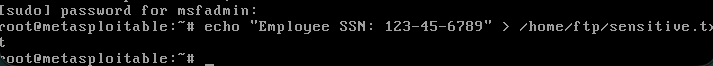

*(Insert screenshot showing the FTP retrieval of `sensitive.txt` from VM-A.)*

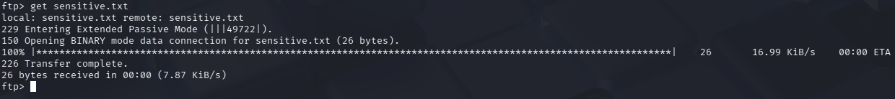

---

## **Step 2: Create a Snort Rule for SSN Detection**

#### **Screenshot:**

*(Insert screenshot of `local.rules` showing the SSN detection rule.)*

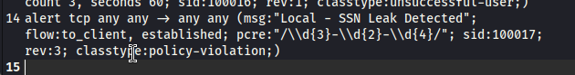

---

## **Step 3: Validate the Detection**

#### **Screenshots:**

*(Insert screenshot of Snort alert triggered by the SSN leak rule.)*

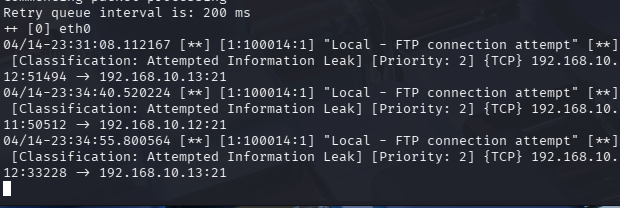

*(Insert screenshot of Wireshark showing the SSN pattern in transferred data.)*

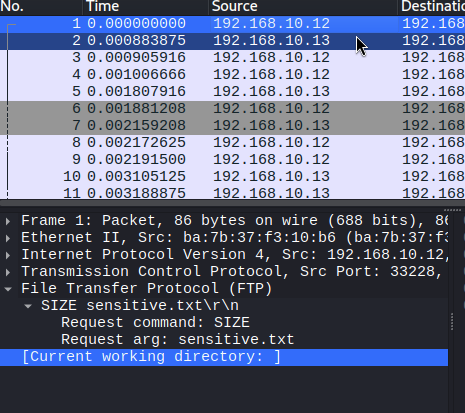

#### **Answers to Questions:**

18. Why is a regex (`pcre`) used here instead of simple content matching?
*(Provide your answer here.)*

Since SSNs are unique, we cannot hardcode every possible SSN into a rule, using the PCRE regex looks for the structural pattern of a SSN which is 3 digits, 2 difits, then 4 digits. 

19. Why is FTP dangerous for transmitting sensitive data such as Social Security Numbers?
*(Provide your answer here.)*

FTP is a completely plaintext protocol and it does not use any encryption. This means that everything sent across the network is available to view in plaintext. Anyone with a packet sniffer like wireshark can intercept and read the sensitive data. 

20. How could an attacker abuse anonymous FTP access in a real-world environment?
*(Provide your answer here.)*

Anynymous FTP access allows anyone to connect to the server without needing valid credentials. If a server is misconfigured with read access, then an attacker could freely browser and download sensitive files. 

21. How would detection change if the traffic were protected by SSH, FTPS, or SFTP instead of plaintext FTP?
*(Provide your answer here.)*

If the traffic were protected by an encrypted protocol like SSH, then snort would no longer be able to read the payload of the packets. The PCRE regex recognition would completely fail because the payload would be scrambled. To detect something over these encrypted channels, defenders must rely on detecting behavioral patterns. 

---

# **Task 5: SYN Flood Detection and Alert Thresholding (20 pts)**

## **Step 1: Create a SYN Flood Detection Rule**

#### **Screenshot:**

*(Insert screenshot of `local.rules` showing the SYN flood rule.)*

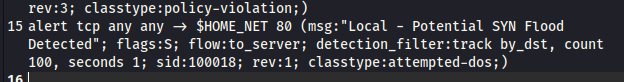

---

## **Step 2: Add an `event_filter` to Limit Duplicate Alerts**

#### **Screenshot:**

*(Insert screenshot of `snort.lua` showing the `event_filter` configuration.)*

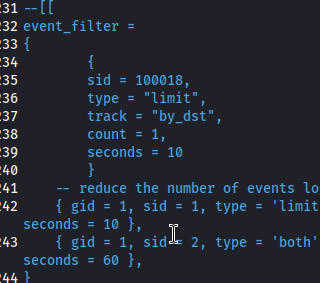

---

## **Step 3: Simulate a SYN Flood**

#### **Screenshot:**

*(Insert screenshot of the `hping3` command or evidence of the flood traffic generation.)*

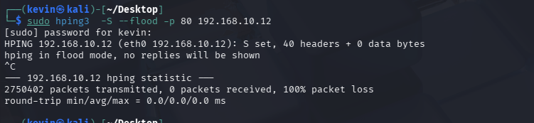

---

## **Step 4: Monitor Alerts and Analyze the Result**

#### **Screenshot:**

*(Insert screenshot of Snort console output showing the SYN flood alert.)*

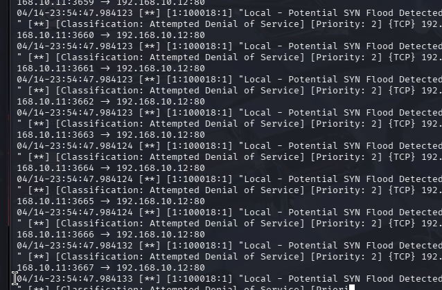

#### **Answers to Questions:**

22. Why is `detection_filter` important in this rule instead of alerting on every packet?
*(Provide your answer here.)*

Every TCP connection begins with a standard SYN packet, so if the rule alerted on every SYN packet, then it would trigger massive false positives. The detection filter is crucial because it establishes a threshold that only alerts with the rate of SYN packets exceeds normal levels. 

23. Why is `event_filter` important? What happens if you omit it during a flood?
*(Provide your answer here.)*

While detection filter ditcates when a rule triggers, event filter limits how often the console logs the event. Without event filter a sustained SYN flood could generate thousands of dpulicate alerts per minute. 

24. How would `--rand-source` affect Snort's detection of the SYN flood?
*(Provide your answer here.)*

Rand source could bypass teh threshold by constantly changing the attackers apparent IP address. 

25. Why can Snort detect this activity but not directly stop the flood by itself?
*(Provide your answer here.)*

Snort is running as a passive IDS which essentially receives copies of the network traffic to analyze on the side. Since it does not sit between the attacker and the target, it has not way to drop or block the packets. 

26. How could a firewall or IPS complement Snort to mitigate SYN flood traffic more effectively?
*(Provide your answer here.)*

An IPS would sit directly in the network traffic. When an IDS like Snort detects the flood, it can forward the alert to the IPS which can then dynamically update its lists to block offending IP addresses. Alternatively, if Snort ewre deployed in IPS mode, it could actively drop or rate limit the malicious SYN packets. 

